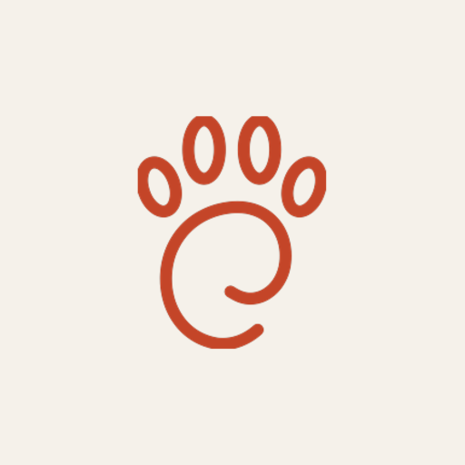
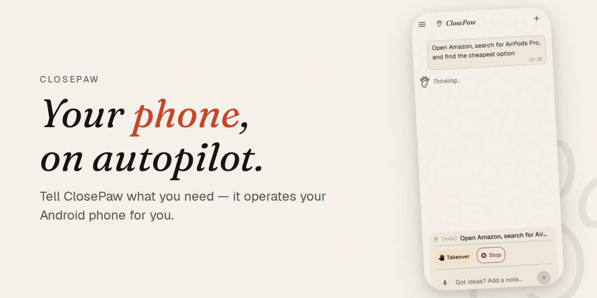
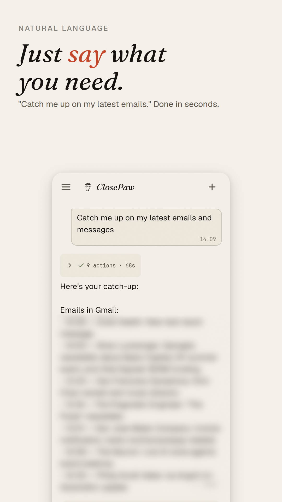
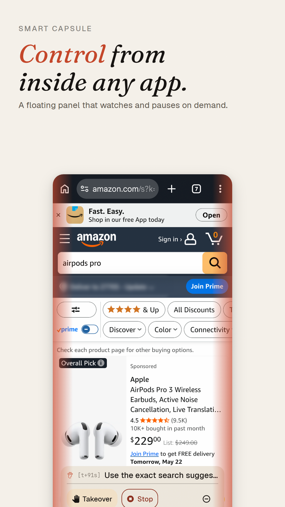
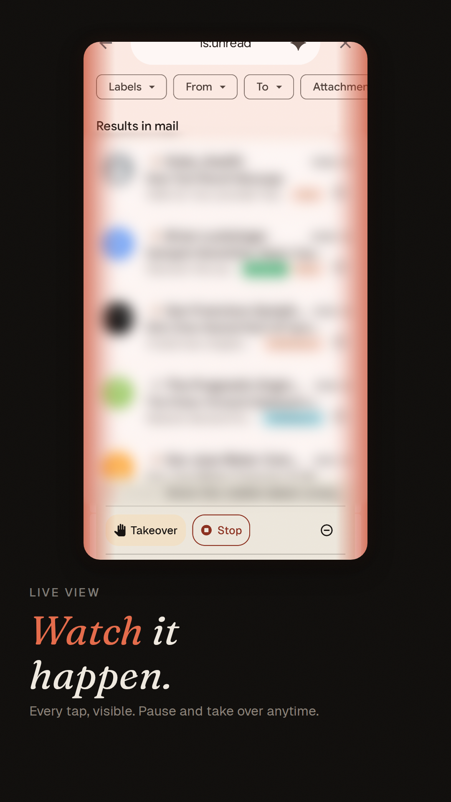
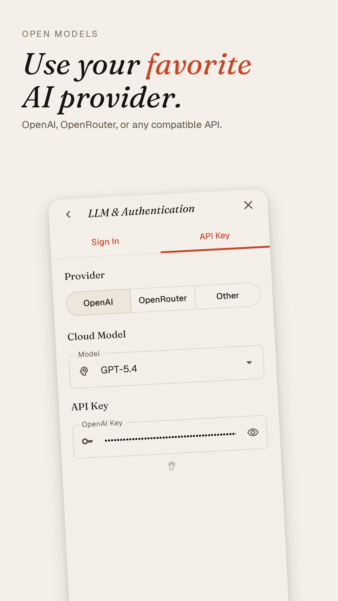

<h1 align="center">
  <br/>
  ClosePaw
</h1>

<p align="center">
  <a href="LICENSE"></a>
  
  
  
</p>

<p align="center">
  
</p>

**A phone-use agent in your pocket — always close.**

ClosePaw is an open-source **agent harness for Android**. Give it a natural-language task ("book a table for two at the ramen place near me", "summarize the new Slack threads, then mute the noisy channel") and it operates your phone like you would — via Android's accessibility service, or in the background on a virtual display (with Shizuku).

## ✨ Features

- 🗣️ **Just say what you need.** Type or speak — *"find the cheapest AirPods Pro"*, *"summarize unread Slack threads and mute the noisy channel."* ClosePaw operates the app like you would.
- 🫧 **Smart Capsule.** A floating overlay that follows the agent across apps while it works. Watch every step, pause, take over, or send a quick note — without leaving whatever app you're in. Voice dictation built in.
- 👀 **Watch every step, pause anytime.** Tap circles and swipe lines show exactly what the agent is doing. Pause, take over, or stop in one tap.
- 📱 **On your phone, with your real accounts.** No laptop tethered over ADB, no cloud emulator with empty logins — ClosePaw runs locally against the apps you're already signed into.
- 🪟 **Doesn't take your phone hostage.** Optional background mode lets the agent work on a virtual screen while you keep scrolling, texting, or watching video. *(Needs [Shizuku](https://shizuku.rikka.app/).)*
- 🔓 **Use any AI.** Bring your own — OpenAI key, sign in with ChatGPT/Codex, OpenRouter, or any OpenAI-compatible endpoint. No vendor lock-in.
- 🛡️ **Safe by default.** Banking, authenticator, and crypto-wallet apps are hard-blocked — no setting can override. Unfamiliar apps prompt for per-app approval (always-allow / session-only / deny). Screens marked `FLAG_SECURE` are invisible to the agent's perception by design.
- 🔐 **Private by design.** No telemetry, no third-party analytics. Traces stay on device. Apache 2.0.

## 📸 See it in action

<p align="center">
  
  &nbsp;
  
  &nbsp;
  
  &nbsp;
  
</p>

<p align="center"><sub><em>Natural-language input · Smart Capsule overlay · Action visualizer · Bring-your-own LLM</em></sub></p>

## 🔧 Under the hood

> [!TIP]
> **Why ClosePaw, when there are already "phone-use agents" out there?**
> Most open-source phone-use agents today either need a **computer tethered over ADB** to drive a phone, or run inside a **cloud virtual phone** that doesn't have *your* accounts logged in. ClosePaw runs **on your actual phone**, against your actual apps — Gmail, Slack, your shopping app, your group chats — with your real sessions. No laptop. No cloud sandbox. No re-logging-in.

- 🧠 **A full on-device agent harness, in the making.** Built in Kotlin, native to Android. ReAct loop, no external orchestrator. The pieces:
  - 🔩 **Primitive toolset** — `mobile_action` (tap, type, swipe/scroll), `open_app` + `system_button` for navigation, and `todo` + `scratchpad` as in-session working memory for long-horizon tasks.
  - 🌿 **Subagents via `delegate_task`** — spin off a subagent for delegation in long-range complicated tasks, clean handoff with summary message.
  - 💾 **Long-term memory** *(preliminary)* — markdown files at user / device / per-app scope; the agent appends via `remember_experience`.
  - 📚 **Skills** *(preliminary, two kinds)*:
    - **agent-skills** — [agentskills.io](http://agentskills.io)-format skills, progressively loaded on-demand by the agent. Today bundled with the app; a discovery engine is in progress.
    - **app-skills** — ClosePaw-unique design. Per-package `SKILL.md` files that teach the agent how to operate specific apps. Auto-loaded whenever that app is in the foreground.
- 🛠️ **Advanced agent-first tools.** Programmatic escapes from tap-and-swipe:
  - 🐚 **`shell`** — Android toybox file commands (`ls` / `cat` / `grep` / `head` / `mv` / `cp`). One command per call; no pipes / redirects / command substitution. No setup.
  - 🐧 **`termux_shell`** — full Linux toolchain on the device: `python` / `git` / `curl` / `jq`, plus anything you `pkg install`. Needs [Termux](https://github.com/termux/termux-app).
  - 🌐 **`browser_script`** — JS automation against real Chrome via Chrome DevTools Protocol; loops, branches, and retries happen inside one tool call. Needs Chrome + [Shizuku](https://shizuku.rikka.app/).
- 🪟 **Virtual display platform.** Hybrid background sessions via Shizuku — the agent operates a parallel Android display so the foreground stays yours.
- 🔌 **Pluggable LLM layer.** OpenAI-compatible API is the contract. ChatGPT/Codex OAuth flow built in. First-class: OpenAI, OpenRouter; or any OpenAI-compatible endpoint via the *Other* slot (Anthropic, Groq, Together, your own proxy).
- 👁️ **Pluggable perception.** Accessibility tree by default; optional point-in-time screenshots in screenshot/hybrid modes.
- 🔍 **Inspectable traces.** Every session writes LLM calls, tool calls, and perception snapshots to on-device storage; pull with `adb` for inspection.
- 🔁 **Eval-driven agent-harness autotune loop.** Run an AndroidWorld task suite (`eval/`) against the agent; an autotune harness analyzes failures, proposes prompt / tool / skill fixes, and re-runs.

## 📦 Install

### Prerequisites

- An Android device or emulator running **API 31+** (Android 12 or later)
- An **OpenAI** or **OpenRouter** API key — or sign in with your ChatGPT account via OAuth — or any OpenAI-compatible endpoint (base URL + key) configured under *Other*
- *(Optional, for Power Tools)* [Shizuku](https://shizuku.rikka.app/) and/or [Termux from F-Droid](https://f-droid.org/packages/com.termux/)

### Install the app

**Recommended — signed release APK.** Download the latest APK from [GitHub Releases](https://github.com/imoonkey/closepaw/releases) and open it on your device to install.

> [!TIP]
> **Help us ship to the Play Store sooner.** Google requires **12 closed testers active for 14 days** before we can promote to production. Become an authorized tester by joining the [closed-testing Google Group](https://groups.google.com/g/closepaw-closed-testers), then [join/install on Android](https://play.google.com/store/apps/details?id=ai.closepaw) or [join on the web](https://play.google.com/apps/testing/ai.closepaw). Please stay opted in for the full 14 days.

**Or build from source.** Useful if you want to hack on it or run the latest unreleased changes.

```bash
git clone https://github.com/imoonkey/closepaw.git
cd closepaw
./gradlew assembleDebug
adb install app/build/outputs/apk/debug/app-debug.apk
```

> Requires JDK 17 and the Android SDK.

### Setup

**On first launch, an onboarding wizard walks you through everything in order — recommended.** It covers:

1. Enable the **Accessibility** service so ClosePaw can read screens and dispatch taps
2. Grant **Display over other apps** for the Smart Capsule overlay
3. Disable **Battery optimization** so long-running tasks don't get killed
4. Configure your **LLM** — paste an API key, **Sign in with ChatGPT/Codex**, or set up an OpenAI-compatible endpoint
5. Run a quick **demo task** to confirm everything works end-to-end

Then type a task on the home screen. The **Smart Capsule** overlay will follow the agent across apps so you can watch every step, pause, take over, or chime in from wherever you are.

**Skipped onboarding, or want to change something later?** All the same controls live under **Settings** — accessibility / overlay / battery toggles, LLM credentials and provider switcher, and the Power Tools opt-ins below.

### 🔋 Optional: Power Tools

ClosePaw gets noticeably more capable when you opt in to two optional integrations. Neither is required.

> [!NOTE]
> **Shizuku** — unlocks the **virtual display platform** (the agent works in the background while you keep using your phone) and the **`browser_script`** tool. Follow the [Shizuku setup guide](https://shizuku.rikka.app/guide/setup/), then re-open ClosePaw → Settings → enable *Virtual display*.

> [!NOTE]
> **Termux** (install from [F-Droid](https://f-droid.org/packages/com.termux/), *not* the Play Store version — it's outdated) — unlocks the **`termux_shell`** tool. After install, open Termux once, run `pkg install termux-api`, then enable the bridge in ClosePaw Settings. Details: [`doc/main/app/termux_shell.md`](doc/main/app/termux_shell.md).

## 🏗️ Architecture

High-level layers:

- **Agent loop** — ReAct turn engine, optional `delegate_task` subagent delegation, todo + scratchpad state, cross-session memory
- **Tools** — UI primitives (`mobile_action`, `open_app`, `system_button`); working memory & control (`todo`, `scratchpad`, `remember_experience`, `delegate_task`, `activate_skill`); advanced (`shell`, `termux_shell` needs Termux, `browser_script` needs Shizuku)
- **Platforms** — `AccessibilityPlatform` for normal use, `VirtualDisplayPlatform` (Shizuku) for hybrid background sessions
- **LLM** — pluggable clients (OpenAI / OpenRouter / OpenAI-compatible "Other"), OAuth flow for ChatGPT sign-in, model catalog, retry infrastructure

Full design docs live under [`doc/main/`](doc/main/README.md). Start there for the agent loop, tool protocol contracts, and platform abstraction.

> [!NOTE]
> **On-device inference:** the codebase ships an `LFMLLMClient` (Liquid AI Leap SDK) path, but it's not exposed in the UI yet — on-device models are still too slow to be practically useful for a multi-turn agent loop. See [`doc/main/infra/llm.md`](doc/main/infra/llm.md).

## 🔒 Permissions & Privacy

The Android accessibility service is genuinely powerful access — it lets ClosePaw read on-screen content and dispatch taps and gestures on your behalf. Please understand what you're granting before enabling it.

<!-- TODO(publish-privacy-policy): replace this paragraph with a link to the hosted Privacy Policy once published. -->
A formal Privacy Policy will be linked here. In the meantime:

- The accessibility service is used **only** to perceive on-screen content and execute the actions required by the task you typed.
- LLM requests go directly to whichever provider **you** configured — ClosePaw has no server in the loop.
- The microphone is only active while you're actively dictating via the Smart Capsule.
- **No third-party analytics or telemetry.**
- Session traces and debug logs (which may include screenshots and the text you typed) are written **only to on-device storage** and can be cleared from Settings at any time.

## 🤝 Contributing

<!-- TODO(publish-contributing): link CONTRIBUTING.md once it lands. -->
A `CONTRIBUTING.md` is on the way. Until then: open an issue to discuss non-trivial changes, follow Conventional Commits (`feat:`, `fix:`, `refactor:`, `docs:`, `test:`), and run `./gradlew clean assembleDebug lint test` before opening a PR.

Good first contributions: new tools (look at how `termux_shell` and `browser_script` are wired up), additional LLM providers, perception improvements, and Smart Capsule UX polish.

### Dev tools tour

- **[`doc/`](doc/)** — docs hub. [`doc/main/`](doc/main/) for architecture (start at the [README](doc/main/README.md), then drill into `agent/`, `infra/`, `ui/`); [`doc/dev/`](doc/dev/) for build / debug / test workflow; [`doc/release/`](doc/release/) for signing, Play Store, and privacy materials.
- **[`eval/`](eval/) and [`inspection_tool/`](inspection_tool/)** — Python eval harness (AndroidWorld bridge) and FastAPI replay viewer for `debug-output/` traces. See each folder's README.
- **Project agent skills** in [`.claude/skills/`](.claude/skills/) — ClosePaw-specific workflows for AI coding agents. The improvement pipeline nests three layers by scope of evidence:
  - **`/cog-tune`** — *one session*. Analyze a single trace, classify the root cause as cognition or execution, propose fixes.
  - **`/autotune`** — *one batch*. Run a curated AndroidWorld task set, apply the same diagnose-and-fix across all failures in the batch.
  - **`/autotune-loop`** — *many batches*. Orchestrate `/autotune` rounds unattended until convergence.

  Two fix paths fork off the diagnosis: **`/prompt-tune`** applies cognition-class fixes across prompts / tool descriptions / app-skills (respecting layer ownership); **`/action-debug`** isolates execution-class failures at the action layer (baseline vs accessibility-service path). **`/ux-visual-debug`** is orthogonal — end-to-end UX QA via ADB, when the question is interaction quality rather than agent reasoning.

  Both [`CLAUDE.md`](CLAUDE.md) and [`.claude/`](.claude/) are symlinked to their `AGENTS.md` / `GEMINI.md` / `.cursorrules` / `.codex/` / `.agents/` counterparts — the same skills and conventions work for most AI coding agents.

## 🛡️ Security

Found a vulnerability? Please **do not** open a public issue. See [SECURITY.md](SECURITY.md) for the private disclosure process.

## ⚠️ Disclaimer

ClosePaw is an autonomous AI agent that takes real actions on your phone — taps, swipes, typing, sending messages, completing purchases. **AI agents make mistakes.** They misread screens, misinterpret instructions, send things to the wrong person, or persist past the intended goal. ClosePaw ships guardrails (per-app approval, hard-blocked sensitive apps, pause / takeover from the Smart Capsule), but no guardrail is perfect. **Watch what the agent does on anything that touches money, communication, or anything irreversible — and take over the moment something looks off.**

This is open-source software provided **as-is** under the [Apache 2.0 License](LICENSE) (Sections 7–8: no warranties, no liability). You assume all risk and responsibility for actions the agent takes on your behalf.

## 📜 License

Licensed under the [Apache License, Version 2.0](LICENSE). See [NOTICE](NOTICE) for attribution and the bundled [open-source license inventory](app/src/main/assets/open_source_licenses.json) for third-party components.
