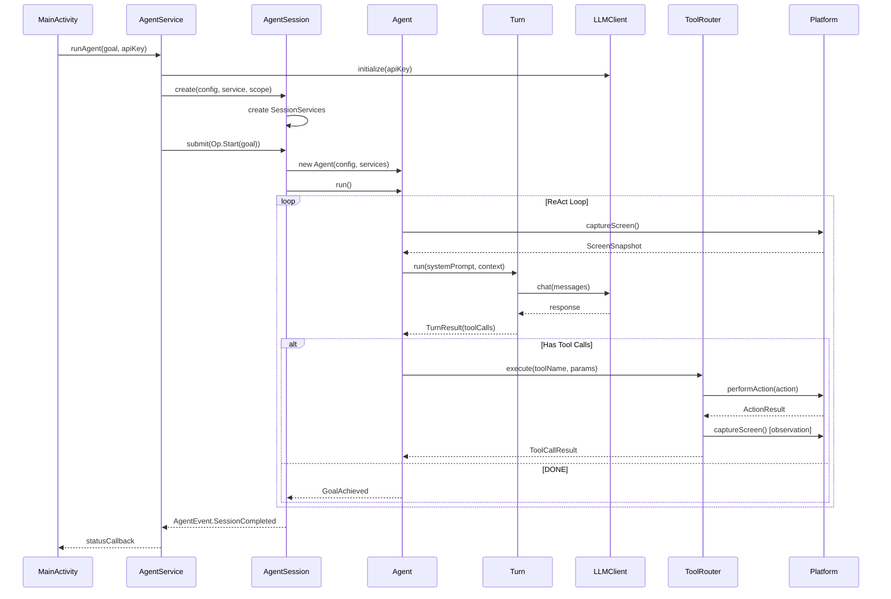
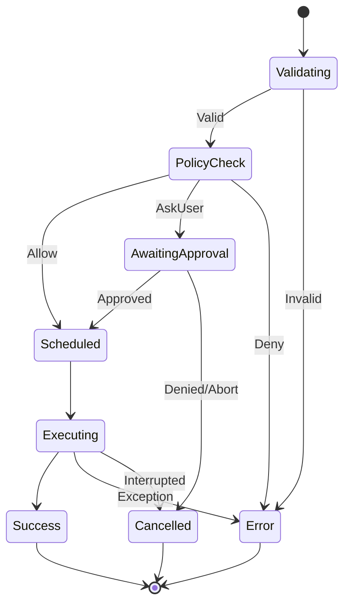

# Android Agent Infrastructure Summary

> **Last Updated**: January 16, 2026 (V2 Architecture)
>
> This document is the primary reference for understanding the Android Agent infrastructure architecture.

## Table of Contents

1. [Design Philosophy](#design-philosophy)
2. [Architecture Overview](#architecture-overview)
3. [Package Structure](#package-structure)
4. [Core Components](#core-components)
5. [Data Flow](#data-flow)
6. [Tool System](#tool-system)
7. [Related Documents](#related-documents)

---

## Design Philosophy

### Guiding Principles

The V2 architecture is built on these principles, learned from analyzing Codex, labmat, and OpenHands:

| Principle | Description |
|-----------|-------------|
| **Single ReAct Agent** | One agent running Perceive → Think → Act → Observe loop. No multi-agent complexity. |
| **Thin Session Layer** | Session manages lifecycle only. All intelligence lives in the Agent. |
| **Op/Event Protocol** | Clean separation between UI intent (Op) and agent state (Event). |
| **Tools with Observation** | Every tool execution captures post-action screen state. |
| **Service-Oriented DI** | `SessionServices` provides all dependencies to the agent. |

### What We Removed from V1

The V1 multi-agent orchestration (Manager, Executor, Reflector) was replaced with a single ReAct agent:

```
V1: User → Session → Orchestration → Manager → Executor → Reflector → Platform
V2: User → Session → Agent → Platform
```

**Rationale**: The multi-agent approach added complexity without proportional benefit. A single agent with proper tool instructions and post-action observation achieves the same goals more reliably.

---

## Architecture Overview

### High-Level Architecture

```
┌─────────────────────────────────────────────────────────────────┐
│                        Android Application                       │
├─────────────────────────────────────────────────────────────────┤
│  ┌──────────────┐                                               │
│  │ MainActivity │ ◄──────────────────────────────────────────┐  │
│  └──────┬───────┘                                            │  │
│         │ runAgent(goal, apiKey)                             │  │
│         ▼                                                    │  │
│  ┌──────────────────┐                                        │  │
│  │  AgentService    │ ◄─ AccessibilityService                │  │
│  │  (Entry Point)   │                                        │  │
│  └──────┬───────────┘                                        │  │
│         │ creates                                            │  │
│         ▼                                                    │  │
│  ┌──────────────────┐        ┌──────────────────┐           │  │
│  │  AgentSession    │───────►│  SessionServices │           │  │
│  │  (Lifecycle)     │        │  (Dependencies)  │           │  │
│  └──────┬───────────┘        └────────┬─────────┘           │  │
│         │ starts                      │                      │  │
│         ▼                             │ provides             │  │
│  ┌──────────────────┐                 │                      │  │
│  │     Agent        │ ◄───────────────┘                      │  │
│  │  (ReAct Loop)    │                                        │  │
│  └──────┬───────────┘                                        │  │
│         │ executes tools via                                 │  │
│         ▼                                                    │  │
│  ┌──────────────────┐        ┌──────────────────┐           │  │
│  │   ToolRouter     │───────►│  AndroidPlatform │           │  │
│  │  (State Machine) │        │  (Accessibility) │           │  │
│  └──────────────────┘        └──────────────────┘           │  │
│                                                              │  │
│  Events (AgentEvent) ────────────────────────────────────────┘  │
└─────────────────────────────────────────────────────────────────┘
```

### ReAct Loop

The agent executes a classic ReAct (Reasoning + Acting) loop:

```
┌─────────────────────────────────────────────────────────────────┐
│                         ReAct Loop                               │
│                                                                  │
│   ┌──────────┐     ┌──────────┐     ┌──────────┐     ┌────────┐│
│   │ PERCEIVE │────►│  THINK   │────►│   ACT    │────►│OBSERVE ││
│   │ (Screen) │     │  (LLM)   │     │  (Tool)  │     │(Screen)││
│   └──────────┘     └──────────┘     └──────────┘     └────┬───┘│
│        ▲                                                  │    │
│        └──────────────────────────────────────────────────┘    │
│                         (Loop until DONE)                       │
└─────────────────────────────────────────────────────────────────┘
```

---

## Package Structure

```
com.moonkey.androidagent/
├── agent/                 # Core agent logic
│   ├── Agent.kt          # ReAct loop executor
│   ├── AgentConfig.kt    # Agent configuration
│   ├── AgentSource.kt    # Primary/SubAgent enum (future)
│   └── Turn.kt           # Single LLM turn
│
├── data/                  # External services
│   ├── llm/
│   │   ├── ChatMessage.kt
│   │   └── LLMClient.kt  # OpenAI API wrapper
│   └── perception/
│       └── Perceptor.kt  # Screen → ScreenSnapshot
│
├── domain/models/         # Shared data models
│   └── Models.kt         # ScreenSnapshot, PerceptionElement
│
├── infra/                 # Infrastructure services
│   ├── history/
│   │   └── HistoryManager.kt  # Conversation history
│   ├── policy/
│   │   └── PolicyEngine.kt    # Tool approval policy
│   ├── registry/
│   │   └── ToolRegistry.kt    # Tool discovery
│   └── tools/
│       ├── ToolSpec.kt        # Tool interface
│       ├── ToolRouter.kt      # Execution state machine
│       ├── ToolCallState.kt   # State definitions
│       └── ToolCallResult.kt  # Result types
│
├── platform/              # Android abstraction
│   ├── AndroidPlatform.kt     # Interface
│   ├── AccessibilityPlatform.kt  # Implementation
│   ├── UIAction.kt            # Action types
│   └── ActionResult.kt        # Result types
│
├── protocol/              # Communication contract
│   ├── Op.kt             # Operations (UI → Agent)
│   ├── AgentEvent.kt     # Events (Agent → UI)
│   ├── SessionState.kt   # State machine
│   ├── ApprovalTypes.kt  # Approval enums
│   ├── AgentError.kt     # Error types
│   └── SessionId.kt      # ID value class
│
├── session/               # Session management
│   ├── AgentSession.kt   # Lifecycle manager
│   └── SessionServices.kt # Dependency injection
│
├── service/               # Android services
│   └── OverlayManager.kt # Floating UI
│
├── tools/                 # Tool implementations
│   ├── base/
│   │   └── BaseTool.kt   # Abstract base
│   └── impl/
│       ├── ClickTool.kt
│       ├── TypeTool.kt
│       ├── ScrollTool.kt
│       ├── SwipeTool.kt
│       ├── BackTool.kt   # Also contains HomeTool
│       └── WaitTool.kt
│
├── AgentService.kt        # AccessibilityService entry
└── MainActivity.kt        # UI entry point
```

---

## Core Components

### 1. Agent (`agent/Agent.kt`)

The brain of the system. Executes the ReAct loop until goal achieved or stopped.

**Key Responsibilities:**
- Run the Perceive → Think → Act → Observe cycle
- Manage turn count and stop conditions
- Emit events for UI updates
- Handle pause/resume/stop lifecycle

**Code Reference:** `agent/Agent.kt:run()` (main loop), `agent/Agent.kt:executeTurn()` (single turn)

### 2. Turn (`agent/Turn.kt`)

Encapsulates a single LLM call with tool parsing.

**Key Responsibilities:**
- Build messages from history + current context
- Include tool instructions in system prompt
- Parse LLM response for `tool` blocks
- Detect completion markers ("DONE:")

**Tool Call Format:**
```
```tool
{"name": "click", "arguments": {"element_index": 5}}
```‍
```

**Code Reference:** `agent/Turn.kt:run()`, `agent/Turn.kt:parseResponse()`

### 3. AgentSession (`session/AgentSession.kt`)

Thin lifecycle manager. Does NOT contain agent logic.

**Key Responsibilities:**
- Process Operations (Op) from UI
- Emit Events (AgentEvent) to UI
- Manage session state transitions
- Create and start Agent

**Code Reference:** `session/AgentSession.kt:submit()`, `session/AgentSession.kt:startAgent()`

### 4. SessionServices (`session/SessionServices.kt`)

Dependency injection container for all session-scoped services.

**Services Provided:**
| Service | Purpose |
|---------|---------|
| `toolRegistry` | Tool discovery and schema generation |
| `toolRouter` | Tool execution with state machine |
| `historyManager` | Conversation history management |
| `policyEngine` | Tool approval decisions |
| `platform` | Android operations |
| `config` | Session configuration |

**Code Reference:** `session/SessionServices.kt:create()`, `session/SessionServices.kt:registerBuiltInTools()`

### 5. ToolRouter (`infra/tools/ToolRouter.kt`)

Executes tool calls with a state machine lifecycle:

```
VALIDATING → POLICY_CHECK → [AWAITING_APPROVAL] → EXECUTING → SUCCESS/ERROR/CANCELLED
```

**Key Responsibilities:**
- Validate tool exists and parameters are correct
- Check policy for approval requirements
- Wait for user approval if needed
- Execute tool and return result

**Code Reference:** `infra/tools/ToolRouter.kt:execute()`

### 6. Perceptor (`data/perception/Perceptor.kt`)

Converts raw AccessibilityNodeInfo tree into semantic ScreenSnapshot.

**Key Responsibilities:**
- Traverse accessibility tree
- Filter relevant UI elements
- Limit to MAX_ELEMENTS (80) for token budget
- Generate JSON for LLM prompts

**Code Reference:** `data/perception/Perceptor.kt:snapshot()`, `data/perception/Perceptor.kt:toPromptJson()`

### 7. AndroidPlatform (`platform/AccessibilityPlatform.kt`)

Abstraction for Android-specific operations.

**Operations:**
- `captureScreen()` - Get current UI state
- `performAction()` - Execute UI actions
- `hasRequiredPermissions()` - Check permissions
- `getDisplayInfo()` - Screen dimensions

**Code Reference:** `platform/AndroidPlatform.kt` (interface), `platform/AccessibilityPlatform.kt` (implementation)

---

## Data Flow

### Complete Request Flow



### Event Flow

```
Agent                    AgentSession              AgentService              UI
  │                           │                          │                    │
  │ emitStatus("🧠 Thinking") │                          │                    │
  │──────────────────────────►│                          │                    │
  │                           │ AgentEvent.StatusUpdate  │                    │
  │                           │─────────────────────────►│                    │
  │                           │                          │ statusCallback()   │
  │                           │                          │───────────────────►│
  │                           │                          │                    │ Update UI
```

---

## Tool System

### Tool Execution Lifecycle



### Built-in Tools

| Tool | Description | Parameters |
|------|-------------|------------|
| `click` | Click UI element | `element_index: int` |
| `type` | Type text | `element_index: int`, `text: string` |
| `scroll` | Scroll screen | `direction: up/down/left/right` |
| `swipe` | Swipe gesture | `direction`, `distance` |
| `back` | Press back button | (none) |
| `home` | Press home button | (none) |
| `wait` | Wait for UI | `duration_ms: int` (optional) |

### Adding New Tools

1. Create class extending `BaseTool` in `tools/impl/`
2. Implement required methods:
   - `name`, `description`, `parameterSchema`
   - `validate(params)`, `createUIAction(params)`
3. Register in `SessionServices.registerBuiltInTools()`

**Code Reference:** `tools/base/BaseTool.kt`, `tools/impl/ClickTool.kt` (example)

### Tool Observation (V2 Feature)

Every successful tool execution captures post-action screen state:

```kotlin
// In BaseTool.kt
private suspend fun capturePostActionObservation(context: ToolExecutionContext): ToolObservation? {
    delay(UI_SETTLE_DELAY_MS)  // 300ms
    val snapshot = context.platform.captureScreen()
    val tree = Perceptor.toPromptJson(snapshot)
    return ToolObservation.ScreenState(tree, snapshot.elements.size)
}
```

This observation is included in the tool result, so the agent immediately sees what changed.

---

## Related Documents

| Document | Description |
|----------|-------------|
| [Protocol Reference](./protocol.md) | Detailed Op/Event protocol documentation |
| [V2 Design Document](./v2/infra_v2.md) | Original V2 design rationale |
| [V2 Execution Plan](./v2/infra_v2_execution_plan.md) | Implementation plan with code examples |
| [Android Specifics](./v2/android_specific.md) | Android-specific considerations |
| [OpenHands Analysis](./openhands_analysis.md) | Analysis of OpenHands architecture |

### Archived (V1)

The V1 multi-agent architecture is archived in `archive_v1/`. These documents are kept for historical reference only:
- `archive_v1/infra_design.md` - Original multi-agent design
- `archive_v1/migration_status.md` - V1 migration tracking
- `archive_v1/reference_analysis.md` - Analysis of reference implementations

---

## Quick Reference

### Starting the Agent

```kotlin
// In MainActivity or test
agentService.runAgent(
    goal = "Open Settings",
    apiKey = "sk-...",
    maxSteps = 20
)
```

### Submitting Operations

```kotlin
// Lifecycle ops
session.submit(Op.Start(goal = "Open Chrome"))
session.submit(Op.Pause)
session.submit(Op.Resume)
session.submit(Op.Shutdown)

// User interaction
session.submit(Op.Approve(actionId, ApprovalDecision.APPROVED))
```

### Observing Events

```kotlin
session.events.collect { event ->
    when (event) {
        is AgentEvent.StatusUpdate -> updateUI(event.status)
        is AgentEvent.SessionCompleted -> handleComplete(event.reason)
        is AgentEvent.ApprovalRequired -> showApprovalDialog(event.details)
        // ...
    }
}
```

---

*For questions or contributions, refer to the codebase directly. The source code is the ultimate source of truth.*

