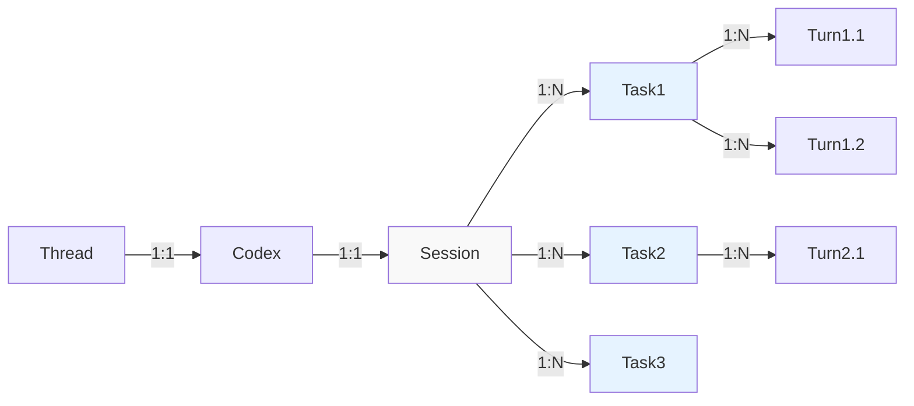

现在 doc/agent_infra/infra_design.md 实现完了，在设计的过程中大量参考了Codex和Gemini-Cli (doc/agent_infra/reference_analysis.md)。但是我发现几个问题：

# High-level clarity

1. Gemini和Codex对相同概念的名字不一样，导致可能之前的design reference它们的时候可能有一些误解。codex-rs/docs/protocol_v1.md解释了codex的terminology (thread, task, turn, item)。帮我找找Gemini有没有类似的，搞一个concept对应关系。然后结合我现在的code，给我写一个类似的protocol.md文档，来总结high-level的核心概念和流程。
Codex agent concepts (1:N are all sequential over time, at any timepoint, session-to-task and task-to-turn is 1:1)

2. 现在的code file folder structure的分割不是很make sense。这里可以参考Codex和Gemini的code organization给出建议。

# Single-Agent vs Multi-Agent
1. 我直接套用mobile-agent-v3，不是最好的start point。现在出问题，我不知道是哪里有bug，还是model的问题等等。所以我要删掉所有的mobile-agent-v3的实现，改成先实现一个single ReAct agent （但保留实现multi-agent的接口，看下一个point）。
2. Agent Orchestration是我提出来的，但这是个伪概念，这个类相关的code都该删掉。这里可以参考Codex的设计。Codex code把 "Codex" class 作为agent的类型，然后一个Codex可以spawn别的Codex。类似的，Gemini的multi-agent也是主agent(GeminiClient)可以通过delegate_to_agent这个tool来启动别的subagent。Codex的设计更优雅一点，主agent和subagent是基于同一个类，而不是不同的类，通过SessionSource::SubAgent来标记。在Codex这个设计里很容易实现higher-depth (>1)的delegation, agentA delegate to agent B, agent B then delegate to agent C，虽然现在没有这么实现。agent orchestration完全是通过agent的delegation来完成的，而不是top-down地去组织。这个是很合理的。
3. 只参考Codex/Gemini还有一个问题，就是我对两个代码库其实都理解得比较肤浅，因为他们也太复杂了。但是我自己实现过一个ReAct agent (single agent without multiple agent support)。当时是在实现一个Matlab coding agent，project叫labmat。labmat的agent代码是跑通了的，在agent core的部分，其实可以直接参考我的那个简化版本的agent逻辑。我把代码放在.reference/labmat底下了，后端代码你只需要参考python里面。当然，其中有一些没用的部分可以先跳过，比如checkpointing, config， at_command都该先跳过/删掉。具体的tool也不用实现，只参考interface。我的代码有一些写的也比较糟糕，但是你可以参考一下我的代码的简单程度。有些地方可以尽可能靠近，来帮助我理解。

# Tool Interface
- 关于tool的实现，在一般的tool call实现中，返回应该包含tool call的结果。在android app use agent的case下，这个tool call结果就是操作后的screen，在我们现在实现下，就是action后的accessibility tree。但是现在的tool实现interface好像不是这样的，这个要改。

Minor:
- platform里的MockPlatform删掉，现在没用。