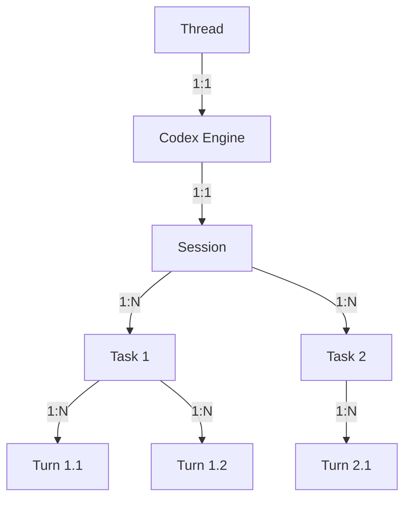
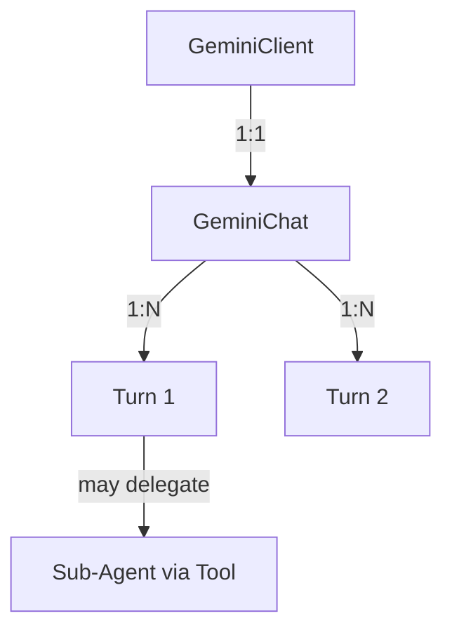
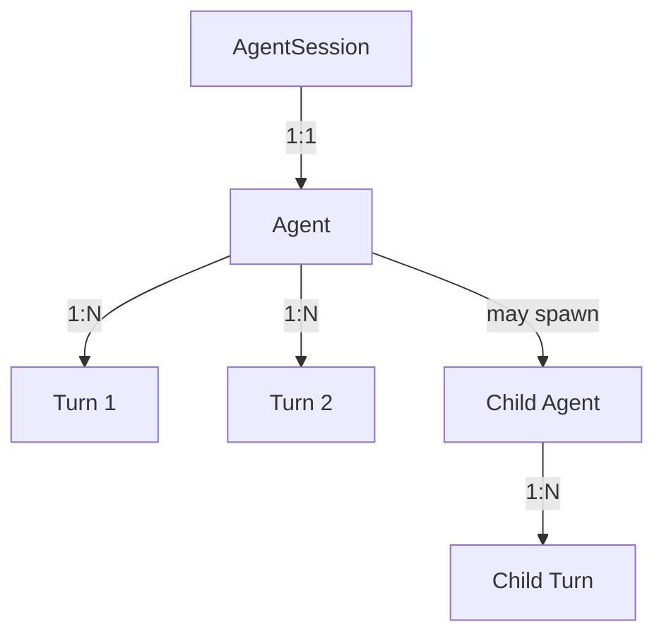

# Agent Infrastructure V2 Design

**Status**: Design Draft  
**Author**: Engineering Team  
**Last Updated**: January 2026

---

## 1. Motivation

Based on the learnings from implementing infra_v1 and referencing Codex, Gemini CLI, and labmat (a simpler ReAct agent implementation), this document outlines the V2 design that addresses the following issues:

1. **Concept Confusion**: Codex and Gemini use different terminology for similar concepts, causing misunderstanding in the original design
2. **Over-engineered Multi-Agent**: The MobileAgent-v3 pattern (Manager/Executor/Reflector) is hard to debug - unclear if bugs are from infra or model
3. **AgentOrchestration as a Pseudo-Concept**: The `AgentOrchestration` class tries to top-down organize agents, but this should emerge from agent delegation
4. **Tool Interface Issues**: Tool execution doesn't properly return post-action screen state
5. **Code Organization**: Package structure doesn't align well with the reference architectures

---

## 2. Concept Mapping: Codex vs Gemini vs AndroidAgent

### 2.1 Terminology Comparison

| Concept | Codex | Gemini | AndroidAgent V2 | Description |
|---------|-------|--------|-----------------|-------------|
| **Engine** | `Codex` | `GeminiClient` | `Agent` | The agent engine class that runs the ReAct loop |
| **Session** | `Session` | (implicit in `GeminiChat`) | `AgentSession` | Configuration + state container for a conversation |
| **Task** | `Task` | (no equivalent) | (removed) | Codex groups turns into tasks; we simplify to just turns |
| **Turn** | `Turn` | `Turn` | `Turn` | One LLM call → response → tool execution cycle |
| **Conversation History** | `ContextManager/history.rs` | `GeminiChat.history` | `HistoryManager` | Manages conversation message history |
| **Memory/Instructions** | User instructions | `ContextManager` (GEMINI.md files) | (future) | Semi-static instructional context |
| **Tool Scheduler** | (inline in turn) | `CoreToolScheduler` | `ToolRouter` | State machine for tool call lifecycle |
| **Multi-Agent** | `Codex.spawn()` + `SessionSource::SubAgent` | `delegate_to_agent` tool | `Agent.spawn()` | Parent agent spawns child agent |

### 2.2 Concept Hierarchy

**Codex Model** (1:N relationships are sequential over time):


**Gemini Model** (simpler, no Task concept):


**AndroidAgent V2 Model** (following Gemini's simplicity + Codex's spawn pattern):


### 2.3 Key Design Choice: No Task Layer

Codex's `Task` layer groups multiple turns from one user input until completion. This adds complexity that's unnecessary for our use case:

- **Codex rationale**: Tasks support `response_id` for thread forking and resumption
- **Our choice**: We don't need thread forking; a Session directly manages Turns

---

## 3. Core Architecture

### 3.1 Layered Architecture (Simplified)

```
┌─────────────────────────────────────────────────────────────────┐
│                           UI Layer                               │
│       (OverlayManager, MainActivity, StatusDisplay)              │
└─────────────────────────────┬───────────────────────────────────┘
                              │ Events ↑↓ Operations
┌─────────────────────────────┴───────────────────────────────────┐
│                         Protocol Layer                           │
│           (Op, AgentEvent, SessionState, AgentError)             │
└─────────────────────────────┬───────────────────────────────────┘
                              │
┌─────────────────────────────┴───────────────────────────────────┐
│                         Session Layer                            │
│        AgentSession (lifecycle, state, event dispatch)           │
│              ├── Agent (ReAct loop executor)                     │
│              └── SessionServices (DI container)                  │
└───────────────┬─────────────────────────────────┬───────────────┘
                │                                 │
┌───────────────┴───────────────┐ ┌───────────────┴───────────────┐
│         Agent Layer           │ │     Infrastructure Layer      │
│   (Agent, Turn - EVOLVING)    │ │  (ToolRouter, HistoryManager, │
│                               │ │   PolicyEngine - STABLE)      │
└───────────────────────────────┘ └───────────────────────────────┘
                │                                 │
                └─────────────┬───────────────────┘
                              │
┌─────────────────────────────┴───────────────────────────────────┐
│                        Platform Layer                            │
│      (AndroidPlatform - abstracts device operations)             │
└─────────────────────────────────────────────────────────────────┘
```

**Key Changes from V1**:
- **Removed**: Orchestration layer (AgentOrchestration, MobileV3Orchestration)
- **Added**: Agent layer with simple ReAct Agent class
- **Simplified**: No Manager/Executor/Reflector separation initially

### 3.2 Component Responsibilities

| Component | Layer | Stability | Responsibility |
|-----------|-------|-----------|----------------|
| `AgentSession` | Session | Stable | Lifecycle management, Op handling, event dispatch |
| `Agent` | Agent | Evolving | ReAct loop: perception → think → act |
| `Turn` | Agent | Evolving | Single LLM call + tool execution |
| `ToolRouter` | Infrastructure | Stable | Tool call state machine, execution |
| `HistoryManager` | Infrastructure | Stable | Conversation history, truncation |
| `PolicyEngine` | Infrastructure | Stable | Approval decisions (ALLOW/DENY/ASK) |
| `ToolRegistry` | Infrastructure | Stable | Tool discovery, schema generation |
| `AndroidPlatform` | Platform | Stable | Device operations abstraction |

---

## 4. Agent Design

### 4.1 Single ReAct Agent (MVP)

The initial implementation is a single ReAct agent (like labmat), not the multi-agent MobileAgent-v3 pattern.

```kotlin
/**
 * Agent executes a goal using the ReAct pattern.
 * 
 * Reference: labmat's AgentCycle + Turn pattern
 */
class Agent(
    private val session: AgentSession,
    private val services: SessionServices,
    private val config: AgentConfig
) {
    /**
     * Execute the ReAct loop until goal achieved, max turns, or interruption.
     */
    suspend fun run(goal: String): Flow<AgentEvent> = flow {
        emit(AgentEvent.TurnStarted(...))
        
        while (canContinue()) {
            // 1. Perception: Capture current screen
            val screen = services.platform.captureScreen()
            emit(AgentEvent.ScreenCaptured(screen))
            
            // 2. Think: LLM decides next action
            val turn = Turn(services.historyManager, services.llmClient)
            val response = turn.run(
                systemPrompt = buildSystemPrompt(),
                userContext = buildUserContext(goal, screen),
                tools = services.toolRegistry.getToolDefinitions()
            )
            
            // 3. Act: Execute tool calls
            for (toolCall in response.toolCalls) {
                val result = services.toolRouter.execute(toolCall)
                emit(AgentEvent.ActionExecuted(toolCall, result))
                
                // Tool result includes post-action screen state
                services.historyManager.addToolResult(toolCall.id, result)
            }
            
            // 4. Check completion
            if (response.isComplete) {
                emit(AgentEvent.SessionCompleted(response.finalMessage))
                return@flow
            }
        }
    }
}
```

### 4.2 Turn Structure

A Turn encapsulates one LLM call cycle:

```kotlin
/**
 * A Turn represents one LLM call → response → (optional) tool execution.
 * 
 * Reference: labmat's Turn class
 */
class Turn(
    private val historyManager: HistoryManager,
    private val llmClient: LLMClient
) {
    /**
     * Execute one turn of the ReAct loop.
     */
    suspend fun run(
        systemPrompt: String,
        userContext: String,
        tools: List<ToolDefinition>
    ): TurnResult {
        // Build messages from history
        val messages = historyManager.getMessages()
        
        // Call LLM
        val response = llmClient.complete(
            messages = messages,
            systemPrompt = systemPrompt,
            tools = tools
        )
        
        // Parse response
        return TurnResult(
            content = response.content,
            toolCalls = response.toolCalls,
            isComplete = response.toolCalls.isEmpty() && response.content != null
        )
    }
}
```

### 4.3 Multi-Agent via Delegation (Future)

Following Codex's pattern where `Codex` can spawn another `Codex`:

```kotlin
/**
 * Agent can spawn child agents for delegation.
 * 
 * Design: Like Codex's SessionSource::SubAgent pattern
 * - Parent and child are same Agent class
 * - Child runs with its own context/tools but shares approval flow
 */
class Agent(...) {
    // For spawning sub-agents
    private val parentAgent: Agent? = null
    private val agentSource: AgentSource = AgentSource.Primary
    
    companion object {
        fun spawn(
            parentAgent: Agent,
            config: AgentConfig,
            source: AgentSource
        ): Agent {
            return Agent(
                session = parentAgent.session,  // Share session for approvals
                services = parentAgent.services.forSubAgent(),
                config = config,
                parentAgent = parentAgent,
                agentSource = source
            )
        }
    }
}

enum class AgentSource {
    Primary,      // Main agent from user
    SubAgent      // Delegated agent
}
```

This is **NOT** implemented in V2 MVP, but the interface is preserved for future extension.

---

## 5. Tool Interface Fix

### 5.1 Problem

Current tool interface returns just success/failure:

```kotlin
// Current (problematic)
interface ToolResult {
    val success: Boolean
    val message: String?
}
```

For Android agent, tools need to return the **post-action screen state** so the agent knows what happened.

### 5.2 Solution

Tool results include observation (accessibility tree after action):

```kotlin
/**
 * Tool execution result with observation.
 */
data class ToolResult(
    val success: Boolean,
    val message: String?,
    val observation: Observation?  // Post-action state
)

/**
 * Observation captures the state after tool execution.
 */
sealed class Observation {
    /**
     * Screen state after action execution.
     */
    data class ScreenState(
        val accessibilityTree: String,  // Parsed accessibility tree
        val screenshot: ByteArray? = null  // Optional screenshot
    ) : Observation()
    
    /**
     * Text output (for non-UI tools).
     */
    data class TextOutput(
        val content: String
    ) : Observation()
}
```

### 5.3 Tool Execution Flow

```
┌─────────────┐     ┌─────────────┐     ┌─────────────┐     ┌─────────────┐
│   Agent     │────>│  ToolRouter │────>│    Tool     │────>│  Platform   │
│  (request)  │     │  (execute)  │     │  (action)   │     │  (perform)  │
└─────────────┘     └─────────────┘     └─────────────┘     └─────────────┘
                                                                    │
                                                                    ▼
┌─────────────┐     ┌─────────────┐     ┌─────────────┐     ┌─────────────┐
│   Agent     │<────│  ToolRouter │<────│    Tool     │<────│  Platform   │
│  (receive)  │     │  (result)   │     │  (observe)  │     │  (capture)  │
└─────────────┘     └─────────────┘     └─────────────┘     └─────────────┘

After executing action, Tool captures new screen state and returns it.
```

### 5.4 Tool Implementation Example

```kotlin
class ClickTool(
    private val platform: AndroidPlatform
) : BaseTool() {
    override val name = "click"
    override val description = "Click on an element by ID"
    
    override suspend fun execute(params: JsonObject): ToolResult {
        val elementId = params.getString("element_id")
        
        // Execute the click
        val actionResult = platform.performAction(
            UIAction.Click(elementId),
            currentSnapshot  // Passed in context
        )
        
        if (!actionResult.success) {
            return ToolResult(
                success = false,
                message = actionResult.error,
                observation = null
            )
        }
        
        // Wait for UI to settle
        delay(config.uiSettleDelay)
        
        // Capture post-action screen state
        val newScreen = platform.captureScreen()
        
        return ToolResult(
            success = true,
            message = "Clicked element $elementId",
            observation = Observation.ScreenState(
                accessibilityTree = newScreen.accessibilityTree,
                screenshot = newScreen.screenshot
            )
        )
    }
}
```
Note that the accessibility tree observation will be processed by Perceptor.kt to sanitize, either within tool implementation or elsewhere, to compact the tree and retain only relevant information in the llm call context.

---

## 6. Code Organization

### 6.1 Current Structure Issues

```
# Current (problematic)
├── domain/agents/        # Manager, Executor, Reflector - to be removed
├── orchestration/        # AgentOrchestration - pseudo-concept, remove
│   └── v3/              # MobileV3 specific - remove
├── infra/               # Good, keep
├── protocol/            # Good, keep
└── session/             # Good, but needs Agent class
```

### 6.2 Proposed Structure

```
com.moonkey.androidagent/
│
├── protocol/                    # Communication contract (STABLE)
│   ├── Op.kt                   # Operations (UI → Session)
│   ├── AgentEvent.kt           # Events (Session → UI)
│   ├── SessionState.kt         # Lifecycle states
│   ├── SessionId.kt            # Value class
│   ├── AgentError.kt           # Error hierarchy
│   └── ApprovalTypes.kt        # Approval-related types
│
├── session/                     # Session management (STABLE)
│   ├── AgentSession.kt         # Main session class
│   └── SessionServices.kt      # DI container
│
├── agent/                       # Agent execution (EVOLVING) - NEW
│   ├── Agent.kt                # ReAct loop executor
│   ├── Turn.kt                 # Single LLM call cycle
│   ├── AgentConfig.kt          # Agent configuration
│   └── AgentSource.kt          # Primary vs SubAgent
│
├── infra/                       # Infrastructure (STABLE)
│   ├── tools/
│   │   ├── ToolSpec.kt         # Tool interface
│   │   ├── ToolRouter.kt       # Execution state machine
│   │   ├── ToolResult.kt       # Result with observation
│   │   └── ToolCallState.kt    # State enum
│   ├── registry/
│   │   └── ToolRegistry.kt     # Tool registration
│   ├── history/
│   │   └── HistoryManager.kt   # Conversation history
│   └── policy/
│       └── PolicyEngine.kt     # Approval decisions
│
├── tools/                       # Tool implementations (EVOLVING)
│   ├── base/BaseTool.kt
│   └── impl/
│       ├── ClickTool.kt
│       ├── TypeTool.kt
│       ├── ScrollTool.kt
│       └── ...
│
├── platform/                    # Android abstraction (STABLE)
│   ├── AndroidPlatform.kt      # Interface
│   ├── AccessibilityPlatform.kt # Real implementation
│   ├── UIAction.kt
│   └── ActionResult.kt
│   # REMOVED: mock/MockPlatform.kt (unused)
│
├── data/                        # External services (STABLE)
│   ├── llm/
│   │   ├── LLMClient.kt
│   │   └── ChatMessage.kt
│   └── perception/
│       └── Perceptor.kt
│
├── service/                     # Android service integration
│   └── OverlayManager.kt
│
└── # REMOVED:
    # domain/agents/             # Manager, Executor, Reflector
    # domain/state/              # InfoPool (multi-agent state)
    # orchestration/             # AgentOrchestration
```

### 6.3 What to Remove

| File/Package | Reason |
|--------------|--------|
| `domain/agents/Manager.kt` | MobileAgent-v3 specific, replace with single Agent |
| `domain/agents/Executor.kt` | MobileAgent-v3 specific |
| `domain/agents/Reflector.kt` | MobileAgent-v3 specific |
| `domain/state/InfoPool.kt` | Multi-agent state sharing, not needed for single agent |
| `orchestration/` (entire package) | Pseudo-concept, Agent handles its own loop |
| `platform/mock/MockPlatform.kt` | Unused |
| `infra/registry/AgentRegistry.kt` | No longer needed without multi-agent orchestration |

---

## 7. Migration Plan

### Phase 1: Simplify to Single Agent
1. Create `agent/Agent.kt` with simple ReAct loop
2. Create `agent/Turn.kt` for single LLM call
3. Update `AgentSession` to use `Agent` instead of `AgentOrchestration`
4. Update tool interface to include `Observation`

### Phase 2: Clean Up
1. Remove `orchestration/` package
2. Remove `domain/agents/` (Manager, Executor, Reflector)
3. Remove `domain/state/InfoPool.kt`
4. Remove `platform/mock/MockPlatform.kt`
5. Remove `infra/registry/AgentRegistry.kt`

### Phase 3: Validation
1. Test single agent on basic tasks
2. Verify tool results include screen state
3. Ensure event flow works correctly

### Phase 4: (Future) Multi-Agent Extension
1. Add `Agent.spawn()` for sub-agent creation
2. Implement delegation tool
3. Handle shared approval flow

---

## 8. Protocol Summary

### 8.1 AndroidAgent V2 Protocol (Similar to Codex protocol_v1.md)

#### Entities

1. **Agent**
   - The core ReAct execution engine
   - Takes user goals, makes LLM requests, executes tools
   - Runs locally within `AgentSession`

2. **Session (AgentSession)**
   - Agent's current configuration and state
   - Created when user starts the agent
   - Manages lifecycle (Created → Running → Completed/Error)

3. **Turn**
   - One cycle of iteration in agent execution:
     - Send messages to LLM (history + current context)
     - LLM returns response (content and/or tool calls)
     - Execute tool calls, capture observations
     - Add results to history
   - Turn completes when LLM provides final answer (no tool calls)

#### Interface

- **Operations (Op)**: UI → Session
  - `Op.Start(goal, config)` - Begin agent execution
  - `Op.Pause` - Cooperative pause
  - `Op.Resume` - Resume from pause
  - `Op.Interrupt` - Abort current turn
  - `Op.Shutdown` - End session
  - `Op.Approve(actionId, decision)` - Respond to approval request

- **Events (AgentEvent)**: Session → UI
  - `TurnStarted` - New turn beginning
  - `TurnCompleted` - Turn finished
  - `ScreenCaptured` - Screen state observed
  - `ActionProposed` - Tool call proposed
  - `ActionExecuted` - Tool call completed
  - `ApprovalRequired` - Waiting for user approval
  - `SessionCompleted` - Goal achieved
  - `SessionError` - Fatal error occurred

---

## 9. References

- **Codex**: [codex-rs/docs/protocol_v1.md](/.reference/codex/codex-rs/docs/protocol_v1.md) - Terminology and protocol design
- **Codex**: [codex-rs/core/src/codex_delegate.rs](/.reference/codex/codex-rs/core/src/codex_delegate.rs) - Sub-agent spawning
- **Gemini**: [delegate-to-agent-tool.ts](/.reference/gemini-cli/packages/core/src/agents/delegate-to-agent-tool.ts) - Agent delegation as tool
- **labmat**: [python/src/labmat_py/agent/](/.reference/labmat/python/src/labmat_py/agent/) - Simple ReAct implementation
  - `session.py` - Session state management
  - `turn.py` - Single LLM call handling
  - `cycle.py` - ReAct loop execution

---

## 10. Open Questions

1. **History Compression**: When context window fills, how do we compress? (Reference Gemini's `ChatCompressionService`) (answer: save for later, no sophisticated compression design for now)
2. **Error Recovery**: Should we support turn rollback like labmat's checkpoint system? (answer: no for now)
3. **Streaming**: Should LLM responses stream to UI, or batch? (answer: streaming)
4. **Tool Parallelism**: Should we support parallel tool execution like Gemini? (answer: no for now)

