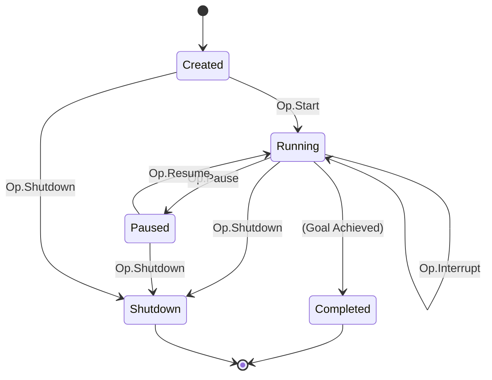

# Android Agent Protocol Reference

> **Last Updated**: January 19, 2026 (V2 Architecture)
>
> This document describes the Op/Event communication protocol between the UI layer and the agent.

## Overview

The Android Agent uses a unidirectional data flow pattern inspired by Codex:

```
┌─────────────────────────────────────────────────────────────────┐
│                                                                  │
│   ┌────────────┐         Op           ┌──────────────┐          │
│   │            │ ─────────────────►   │              │          │
│   │     UI     │                      │ AgentSession │          │
│   │            │ ◄─────────────────   │              │          │
│   └────────────┘      AgentEvent      └──────────────┘          │
│                                                                  │
│         Submission Queue (SQ)              Event Queue (EQ)      │
│                                                                  │
└─────────────────────────────────────────────────────────────────┘
```

- **Operations (Op)**: User intents sent TO the agent
- **Events (AgentEvent)**: State changes emitted FROM the agent

---

## Operations (Op)

**Source:** `protocol/Op.kt`

Operations are immutable, thread-safe commands submitted to the session.

### Lifecycle Operations



### Operation Types

| Operation | Valid States | Effect | Transitions To |
|-----------|--------------|--------|----------------|
| `Op.Start(goal)` | Created | Start agent execution | Running |
| `Op.Pause` | Running | Cooperative pause after current action | Paused |
| `Op.Resume` | Paused | Resume execution | Running |
| `Op.Interrupt` | Running | Cooperative stop after current action | Running |
| `Op.Shutdown` | Any | Graceful shutdown | Shutdown |
| `Op.UserInput(text)` | Running | *(Planned)* Provide additional context | Running |
| `Op.Approve(actionId, decision)` | Running | Respond to approval request | Running |

> **Note on Interrupt**: `Op.Interrupt` is cooperative - the agent will complete its current action before stopping. True cancellation of in-flight LLM calls is not supported. For immediate termination, use `Op.Shutdown`.

> **Note on Session Config**: Session configuration (model, approval mode, delays, etc.) is set at `AgentSession.create()` time, not in `Op.Start`. The goal is the only parameter passed to `Op.Start`.

### Op.Start

Starts the agent with a goal.

```kotlin
data class Start(
    val goal: String
) : Op
```

**SessionConfig** (set at session creation via `AgentSession.create()`):

| Field | Type | Default | Description |
|-------|------|---------|-------------|
| `maxTurns` | Int | 50 | Max iterations before auto-stop |
| `actionDelayMs` | Long | 2000 | Delay after actions for UI settle |
| `approvalMode` | ApprovalMode | SMART | Tool approval behavior |
| `model` | String | "gpt-4o" | LLM model to use |
| `debugMode` | Boolean | false | Verbose logging |

**ApprovalMode Values:**

| Mode | Behavior |
|------|----------|
| `ALWAYS_ASK` | Prompt user before every tool |
| `AUTO_APPROVE` | Never ask, auto-approve all |
| `SMART` | Auto-approve low-risk, ask for high-risk |

### Op.Approve

Responds to an approval request for a pending tool call.

```kotlin
data class Approve(
    val actionId: String,
    val decision: ApprovalDecision
) : Op
```

> **Note**: `Op.UserInput` is **planned for conversational mode** but not yet implemented. The operation is accepted and logged, but has no effect on the agent. This will enable users to provide guidance or clarification during execution in a future release.

**ApprovalDecision Values:**

| Decision | Effect |
|----------|--------|
| `APPROVED` | Execute the tool |
| `DENIED` | Skip this tool, continue session |
| `ABORT` | Stop the entire session |

---

## Events (AgentEvent)

**Source:** `protocol/AgentEvent.kt`

Events are immutable notifications emitted by the agent to the UI layer.

### Event Categories

```
AgentEvent
├── Session Lifecycle
│   ├── SessionStarted
│   ├── SessionCompleted
│   ├── SessionError
│   ├── SessionPaused
│   └── SessionResumed
│
├── Turn Events
│   ├── TurnStarted
│   ├── TurnCompleted
│   └── TurnPhaseChanged
│
├── Agent Thinking
│   └── AgentThinking
│
├── Action Events
│   ├── ActionProposed
│   ├── ActionExecuted
│   └── ActionSkipped
│
├── Perception Events
│   └── ScreenCaptured
│
├── Approval Events
│   ├── ApprovalRequired
│   └── ApprovalResolved
│
└── Status Events
    └── StatusUpdate
```

### Common Fields

All events include:

```kotlin
interface AgentEvent {
    val sessionId: SessionId
    val timestamp: Long
}
```

### Session Lifecycle Events

#### SessionStarted

Emitted when `Op.Start` is processed.

```kotlin
data class SessionStarted(
    override val sessionId: SessionId,
    override val timestamp: Long,
    val goal: String
) : AgentEvent
```

#### SessionCompleted

Emitted when session ends (success, stopped, or max turns).

```kotlin
data class SessionCompleted(
    override val sessionId: SessionId,
    override val timestamp: Long,
    val result: String?,
    val reason: CompletionReason
) : AgentEvent
```

**CompletionReason Values:**

| Reason | Description |
|--------|-------------|
| `GOAL_ACHIEVED` | Agent completed the goal (via `complete_task` tool or text-only response) |
| `USER_STOPPED` | User requested shutdown |
| `MAX_TURNS` | Turn limit reached |
| `TASK_IMPOSSIBLE` | Agent determined task cannot be done |
| `ERROR` | An error occurred |
| `INTERRUPTED` | Session was interrupted |

#### SessionError

Emitted when a non-fatal error occurs.

```kotlin
data class SessionError(
    override val sessionId: SessionId,
    override val timestamp: Long,
    val error: AgentError
) : AgentEvent
```

### Turn Events

#### TurnStarted

Emitted at the beginning of each ReAct iteration.

```kotlin
data class TurnStarted(
    override val sessionId: SessionId,
    override val timestamp: Long,
    val turnId: String,
    val turnNumber: Int,
    val phase: TurnPhase
) : AgentEvent
```

**TurnPhase Values:**

| Phase | Description |
|-------|-------------|
| `PERCEPTION` | Capturing/analyzing screen |
| `REFLECTION` | *(Planned - not yet implemented)* Verifying previous action outcome |
| `PLANNING` | Deciding what to do (LLM reasoning) |
| `EXECUTION` | Executing an action (tool call) |

### Action Events

#### ActionProposed

Emitted before an action is executed (for approval UI).

```kotlin
data class ActionProposed(
    override val sessionId: SessionId,
    override val timestamp: Long,
    val actionId: String,
    val toolName: String,
    val description: String
) : AgentEvent
```

#### ActionExecuted

Emitted after an action completes.

```kotlin
data class ActionExecuted(
    override val sessionId: SessionId,
    override val timestamp: Long,
    val actionId: String,
    val toolName: String,
    val success: Boolean,
    val result: String?
) : AgentEvent
```

### Approval Events

#### ApprovalRequired

Emitted when user approval is needed before executing a tool.

```kotlin
data class ApprovalRequired(
    override val sessionId: SessionId,
    override val timestamp: Long,
    val actionId: String,
    val description: String,
    val details: ApprovalDetails
) : AgentEvent
```

**ApprovalDetails:**

```kotlin
data class ApprovalDetails(
    val toolName: String,
    val args: JSONObject,
    val description: String,
    val riskLevel: RiskLevel
)
```

**RiskLevel Values:**

| Level | Typical Actions |
|-------|-----------------|
| `LOW` | Read-only, reversible actions |
| `MEDIUM` | UI interactions |
| `HIGH` | Destructive, external effects |

#### ApprovalResolved

Emitted when an approval request is resolved.

```kotlin
data class ApprovalResolved(
    override val sessionId: SessionId,
    override val timestamp: Long,
    val actionId: String,
    val decision: ApprovalDecision
) : AgentEvent
```

### Status Events

#### StatusUpdate

General-purpose status for simple UI display.

```kotlin
data class StatusUpdate(
    override val sessionId: SessionId,
    override val timestamp: Long,
    val status: String,
    val emoji: String? = null
) : AgentEvent
```

**Common Status Messages:**

| Emoji | Status | Meaning |
|-------|--------|---------|
| 🚀 | Starting agent... | Session beginning |
| 👀 | Scanning screen... | Perception phase |
| 🧠 | Thinking... | LLM call in progress |
| 💡 | Executing actions... | Tool execution |
| ✓ | {tool} executed | Tool completed |
| ✅ | Goal achieved! | Success |
| ⏸️ | Paused | Session paused |
| ⚠️ | Error/Warning | Non-fatal issue |
| ❌ | Error: {message} | Fatal error |
| 🛑 | Cancelled/Stopped | User stopped |

---

## Implementing Event Handling

### Kotlin Flow Collection

```kotlin
// In AgentService or Activity
scope.launch {
    session.events.collect { event ->
        when (event) {
            is AgentEvent.StatusUpdate -> {
                val display = event.emoji?.let { "$it ${event.status}" } ?: event.status
                updateUI(display)
            }
            
            is AgentEvent.SessionStarted -> {
                Log.i(TAG, "Session started: ${event.sessionId}")
            }
            
            is AgentEvent.SessionCompleted -> {
                when (event.reason) {
                    CompletionReason.GOAL_ACHIEVED -> showSuccess()
                    CompletionReason.USER_STOPPED -> showStopped()
                    CompletionReason.ERROR -> showError(event.result)
                    else -> showGenericComplete()
                }
            }
            
            is AgentEvent.ApprovalRequired -> {
                showApprovalDialog(
                    actionId = event.actionId,
                    description = event.description,
                    onApprove = { session.submit(Op.Approve(event.actionId, APPROVED)) },
                    onDeny = { session.submit(Op.Approve(event.actionId, DENIED)) }
                )
            }
            
            // Handle other events...
            else -> Log.d(TAG, "Unhandled: ${event::class.simpleName}")
        }
    }
}
```

### Event Filtering

```kotlin
// Only status updates
session.events
    .filterIsInstance<AgentEvent.StatusUpdate>()
    .collect { updateStatusBar(it.status) }

// Only completed/error
session.events
    .filter { it is AgentEvent.SessionCompleted || it is AgentEvent.SessionError }
    .collect { handleSessionEnd(it) }
```

---

## Session State Machine

**Source:** `protocol/SessionState.kt`

```
                              ┌─────────┐
                              │ Created │
                              └────┬────┘
                                   │ Op.Start
                                   ▼
                    ┌─────────────────────────────┐
            ┌──────►│           Running           │◄──────┐
            │       └──────┬───────────────┬──────┘       │
            │              │               │              │
            │     Op.Pause │               │ Complete     │
            │              ▼               │              │
            │       ┌──────────┐           │              │
   Op.Resume│       │  Paused  │           │              │
            │       └──────────┘           │              │
            │                              │              │
            │                              ▼              │
            │                       ┌───────────┐        │
            │                       │ Completed │        │
            │                       └───────────┘        │
            │                                            │
            │           Op.Shutdown (from any state)     │
            │                       │                    │
            │                       ▼                    │
            │                ┌───────────┐               │
            └────────────────│  Shutdown │───────────────┘
                             └───────────┘
```

### State Definitions

| State | Description |
|-------|-------------|
| `Created` | Session initialized, not started |
| `Running` | Agent actively executing |
| `Paused` | Execution paused, can resume |
| `Completed` | Agent finished (see `CompletionReason` for details) |
| `Shutdown` | User requested stop via `Op.Shutdown` |

> **Note**: `Completed` and `Shutdown` are both terminal states. The difference is:
> - `Completed`: Agent finished its work (goal achieved, max turns, error, etc.) - the reason is specified by `CompletionReason`
> - `Shutdown`: User explicitly stopped the session via `Op.Shutdown`

---

## Error Handling

**Source:** `protocol/AgentError.kt`

Errors are categorized for appropriate handling:

| Error Type | Description | Recovery |
|------------|-------------|----------|
| `LLMError` | LLM API failure | Retry with backoff |
| `ToolError` | Tool execution failed | Skip tool, continue |
| `PlatformError` | Android operation failed | Report to user |
| `InvalidStateError` | Invalid operation for current state | Ignore or report |
| `TimeoutError` | Operation timed out | Retry or stop |

---

## Best Practices

### For UI Developers

1. **Always handle SessionCompleted** - Clean up resources
2. **Show StatusUpdate immediately** - Provides real-time feedback
3. **Handle ApprovalRequired with timeout** - Don't block forever
4. **Ignore unknown events** - Forward compatibility

### For Agent Developers

1. **Emit StatusUpdate frequently** - User needs feedback
2. **Use appropriate CompletionReason** - Helps UI respond correctly
3. **Include actionId in action events** - Enables tracking
4. **Emit events before state changes** - Order matters

---

*For the complete protocol implementation, see `protocol/` package in the source code.*

