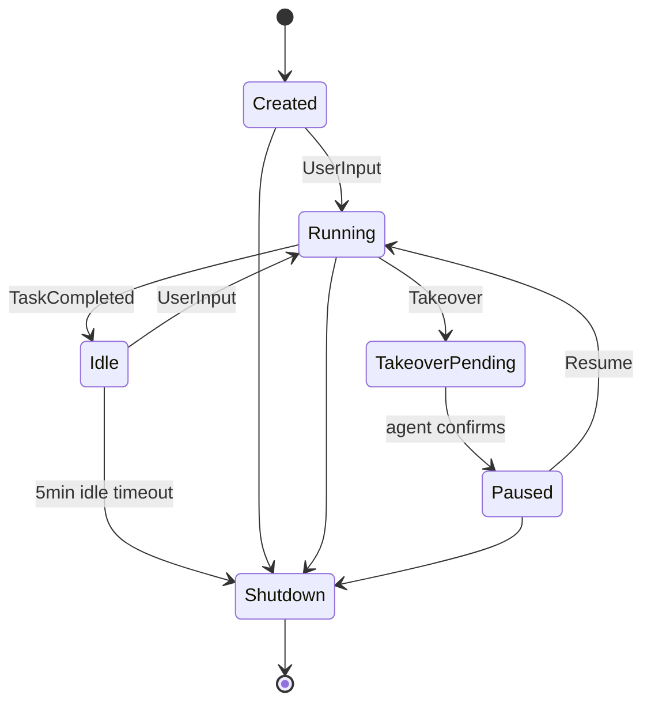
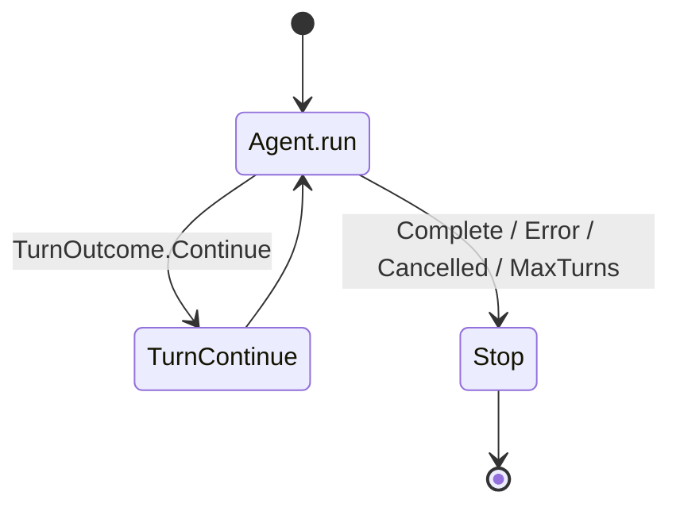
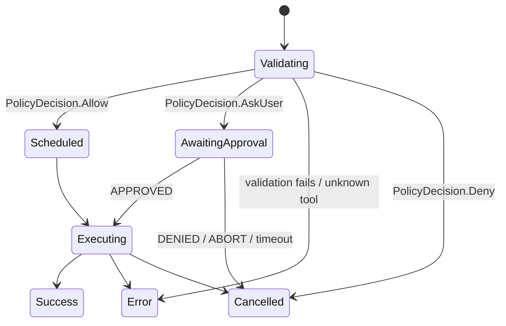

# State Machine Reference

Authoritative reference for every finite-state machine (FSM) inside the Android Agent harness. Each document below is derived from source-of-truth Kotlin code (paths cited inline). Use these docs when reasoning about lifecycle, retries, queueing, or onboarding flow.

## Index

| FSM | Owner | Doc |
|---|---|---|
| Session lifecycle | `app/src/main/kotlin/ai/closepaw/protocol/SessionState.kt`, `app/src/main/kotlin/ai/closepaw/session/AgentSession.kt` | [session_state.md](session_state.md) |
| Session input queue / SubmitResult | `app/src/main/kotlin/ai/closepaw/session/SessionCoordinator.kt` | [session_coordinator.md](session_coordinator.md) |
| Agent run loop | `app/src/main/kotlin/ai/closepaw/agent/Agent.kt`, `app/src/main/kotlin/ai/closepaw/agent/AgentRuntimeTypes.kt` | [agent_run_loop.md](agent_run_loop.md) |
| Tool call lifecycle | `app/src/main/kotlin/ai/closepaw/tool/ToolCallState.kt`, `app/src/main/kotlin/ai/closepaw/tool/ToolRouter.kt` | [tool_call.md](tool_call.md) |
| Cloud streaming retry | `app/src/main/kotlin/ai/closepaw/llm/CloudStreamRetryPolicy.kt`, `app/src/main/kotlin/ai/closepaw/llm/CloudStreamRetryRunner.kt`, `app/src/main/kotlin/ai/closepaw/llm/CloudLlmRetry.kt` | [llm_retry.md](llm_retry.md) |
| Local model loading | `app/src/main/kotlin/ai/closepaw/llm/LFMLLMClient.kt` | [local_model_loading.md](local_model_loading.md) |
| Onboarding wizard funnel | `app/src/main/kotlin/ai/closepaw/onboarding/OnboardingState.kt`, `app/src/main/kotlin/ai/closepaw/onboarding/OnboardingViewModel.kt` | [onboarding_wizard.md](onboarding_wizard.md) |
| Onboarding permission step | `app/src/main/kotlin/ai/closepaw/onboarding/OnboardingState.kt`, `app/src/main/kotlin/ai/closepaw/onboarding/OnboardingViewModel.kt` | [onboarding_permission_step.md](onboarding_permission_step.md) |
| Onboarding API-key step | `app/src/main/kotlin/ai/closepaw/onboarding/OnboardingState.kt`, `app/src/main/kotlin/ai/closepaw/onboarding/OnboardingViewModel.kt` | [onboarding_apikey_step.md](onboarding_apikey_step.md) |
| Onboarding demo step | `app/src/main/kotlin/ai/closepaw/onboarding/OnboardingState.kt`, `app/src/main/kotlin/ai/closepaw/onboarding/OnboardingDemoController.kt` | [onboarding_demo_step.md](onboarding_demo_step.md) |

## Quick overview

## Conventions

- **Transitions table** lists `From | To | Trigger | Guard`.
- **Persistence** identifies what survives process death.
- **Open questions** flag fragile or surprising behaviors for future cleanup.
- Anything unverified against code is marked `UNCONFIRMED`.
