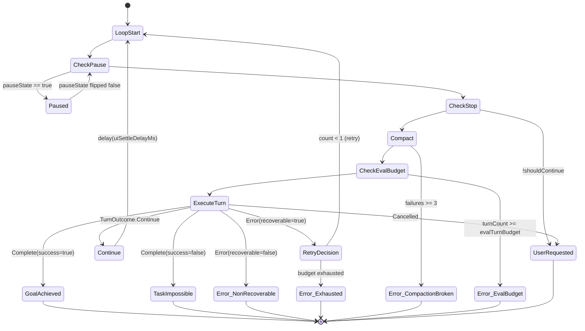

# Agent Run Loop

## Owner

- `app/src/main/kotlin/ai/closepaw/agent/Agent.kt` (loop)
- `app/src/main/kotlin/ai/closepaw/agent/AgentRuntimeTypes.kt` (`AgentStopReason`, `TurnOutcome`, `TurnRunnerState`, `decideTurnOutcome`)
- `app/src/main/kotlin/ai/closepaw/agent/AgentTurnRunner.kt` (per-turn execution)
- `app/src/main/kotlin/ai/closepaw/history/Compactor.kt` (per-turn auto-compaction)

## States

### `AgentStopReason` (terminal verdicts)

| Variant | Data | Meaning |
|---|---|---|
| `GoalAchieved` | `message: String = "Goal achieved"` | `complete_task` succeeded |
| `UserRequested` | none | User stopped or cancellation signal fired |
| `TaskImpossible` | `message: String` | `complete_task(success=false)` |
| `Error` | `message: String` | Non-recoverable turn error, recoverable error after retries exhausted, OR 3 consecutive compaction failures, OR `evalTurnBudget` exceeded |

`MaxTurnsReached` was removed when context-window auto-compaction replaced the
production turn cap.

### `TurnOutcome` (per-turn signal)

| Variant | Data | Meaning |
|---|---|---|
| `Continue` | none | Loop runs another turn |
| `Complete` | `message: String, success: Boolean = true` | Stops loop; mapped to `GoalAchieved` or `TaskImpossible` |
| `Error` | `message: String, recoverable: Boolean` | Stops or retries based on flag |
| `Cancelled` | none | Stops with `UserRequested` |

### Loop state (in `Agent.run`)

Tracked locally per run:
- `turnCount: Int` (0-based, incremented per turn — observability only; no production cap)
- `pauseState: MutableStateFlow<Boolean>`
- `pauseConfirmed: CompletableDeferred<Unit>?` (null when no pause pending)
- `stopRequested: AtomicBoolean`
- `recoverableRetryCount: Int` (resets to 0 on `Continue`)
- `consecutiveCompactionFailures: Int` (resets to 0 on any non-`Failed` compaction outcome)
- `lastKnownPackage: String?` (for auto-retain memory note)
- `turnRunnerState: TurnRunnerState` (carries `NavigationState`)

## Transitions

| From | To | Trigger | Guard |
|---|---|---|---|
| (start) | `Running` | `Agent.run()` invoked | — |
| `Running` | `Paused` | `pauseState.value == true` checked at top of loop | — |
| `Paused` | `Running` | `pauseState.first { !it }` resumes after `resume()` flips flag | — |
| `Running` | terminal `UserRequested` | `!shouldContinue()` (stop or cancellation) | — |
| `Running` | (compact) → `Running` | `compactor.maybeCompact(goal, history)` returns `Compacted/Skipped/Stale/NothingToCompact` | resets compaction-failure counter on non-failed outcomes |
| `Running` | terminal `Error` | compactor returned `Failed` 3 consecutive times | `consecutiveCompactionFailures >= 3` |
| `Running` | terminal `Error` | `config.evalTurnBudget != null && turnCount >= evalTurnBudget` | eval-only safety net |
| `Running` (turn) | `Continue` | `TurnOutcome.Continue` from `executeTurn` | resets `recoverableRetryCount`, delays `uiSettleDelayMs` |
| `Running` (turn) | terminal `GoalAchieved` | `TurnOutcome.Complete(success=true)` | — |
| `Running` (turn) | terminal `TaskImpossible` | `TurnOutcome.Complete(success=false)` | — |
| `Running` (turn) | terminal `Error` | `TurnOutcome.Error(recoverable=false)` | — |
| `Running` (turn) | retry | `TurnOutcome.Error(recoverable=true)` AND `recoverableRetryCount < MAX_RECOVERABLE_RETRIES (=1)` | increments retry count, delays `uiSettleDelayMs` |
| `Running` (turn) | terminal `Error` | recoverable error but retry budget exhausted | — |
| `Running` (turn) | terminal `UserRequested` | `TurnOutcome.Cancelled` | — |

If the loop exits without setting `stopReason`, the fallback is `UserRequested`
(when stop/cancellation observed) or `GoalAchieved()` otherwise.

## Compaction sub-state

The compaction step at the top of each iteration is a self-contained
read-modify-write protected by `HistoryManager`'s revision/CAS:

| State | Event | Next | Side effect |
|---|---|---|---|
| Idle | tokens ≤ threshold | Idle | → `Skipped` |
| Idle | tokens > threshold | Reading | snapshot `(rev, items)` |
| Reading | no safe cut found | Idle | → `NothingToCompact` |
| Reading | safe cut found | Summarizing | start LLM call (clean, no tools) |
| Summarizing | LLM success | Swapping | build newItems |
| Summarizing | LLM error | Idle | → `Failed(reason)`; counter++ |
| Summarizing | `CancellationException` | (propagates) | rethrow — never counted as failure |
| Swapping | CAS success | Idle | → `Compacted(before, after)`; counter = 0 |
| Swapping | CAS miss | Idle | → `Stale`; counter = 0; retry next turn |

A reactive variant (`forceCompactNow`, called by `Turn.runStreaming` on
`ContextWindowExceededException`) runs unconditionally with `keepRecentTokens`
halved. → See: [doc/main/app/history/runtime.md](../app/history/runtime.md#compactor)

## Diagram

## `decideTurnOutcome`

Maps `(TurnResult, ToolArbitrationResult, ExecutionPhaseResult)` to `TurnOutcome`. Key rules:

1. If `execution.terminatedEarly`:
   - last result `Cancelled` → `TurnOutcome.Cancelled`
   - last result `Error` → `TurnOutcome.Error(recoverable=true)`
   - else → `TurnOutcome.Error("Tool execution aborted before completion", recoverable=true)`
2. Else if `complete_task` was selected but its id is **not** in `executedToolIds` → `TurnOutcome.Error("complete_task was planned but did not execute", recoverable=true)`
3. Else `policy.decideCompletion`: if `shouldComplete`, emit `Complete(summary, success)`, otherwise `Continue`.

## Invariants

- `MAX_RECOVERABLE_RETRIES = 1` — at most one consecutive recoverable-error retry; `Continue` resets the counter.
- `MAX_CONSECUTIVE_COMPACTION_FAILURES = 3` — three consecutive `Failed` outcomes trip the circuit breaker; any non-failed outcome (`Compacted`, `Skipped`, `Stale`, `NothingToCompact`) resets the counter.
- `turnCount` is incremented after the compaction step and the eval-budget guard, so the eval safety net catches the (N+1)-th attempt rather than letting it start.
- Pause is cooperative — pause check happens once per loop iteration, immediately before stop check.
- The agent's `pauseConfirmed` deferred is **always** completed in the `finally` block so `AgentSession.handleTakeover()` cannot hang past run termination.
- Cross-turn state lives only in `TurnRunnerState` (currently `NavigationState`); no other mutable state is passed across turns.
- The compactor never silently drops data on contention — `HistoryManager.replaceAllIfRevision` rejects stale swaps and the loop retries.

## Persistence

The loop itself is fully transient; what makes it onto disk is what the turn writes through `services.historyManager`, `services.traceRecorder`, and `services.memoryStore` (auto-retain on failure).

## Entry / exit side-effects

- Entry: emits `🚀 Starting agent...` status, calls `trace.sessionStarted`, appends `USER_INTENT` history item with `Goal: …`.
- Per turn (top): `compactor.maybeCompact`; on `Compacted` emits `📚 Compacted history (before → after tokens)`; on `Failed` increments the counter.
- Per turn: `trace.turnStarted`, `eventDispatcher.turnStarted`, screen capture, planning, execution, `trace.turnCompleted`.
- On failure of a turn (`TurnOutcome.Complete(success=false)` only) and only if `memoryStore.hasWrittenThisSession() == false`: appends an app operational note to memory for the foreground package.
- Exit: `pauseConfirmed?.complete(Unit)`, `trace.sessionStopped(reason, turnCount)`.

## Error / recovery paths

- Exceptions inside `executeTurn` are caught by `AgentTurnRunner`:
  - `CancellationException` is rethrown.
  - All other exceptions go through `TurnErrorClassifier.classify(...)` → `TurnOutcome.Error(message, recoverable)`.
- Recoverable error retry: at most 1 retry per "streak"; `Continue` resets the counter.
- If `complete_task` was planned but did not execute, the loop emits `recoverable=true` error and may retry once.
- Context-window-exceeded errors from the provider are handled inside `Turn.runStreaming` via one `Compactor.forceCompactNow` + retry; a second occurrence propagates as a `TurnStreamEvent.Error` and goes through `TurnErrorClassifier`.

## Open questions / smells

- A stop request that arrives during pause is honored on resume. A stop request arriving **between** the post-pause re-check and `executeTurn` will not be observed until the next iteration.
- `lastKnownPackage` is updated **after** `executeTurn` returns, so the auto-retain memory entry for a failed `Complete` may use a stale package if the turn navigated mid-flight.
- `MAX_RECOVERABLE_RETRIES = 1` and `MAX_CONSECUTIVE_COMPACTION_FAILURES = 3` are private constants; not configurable per session.
