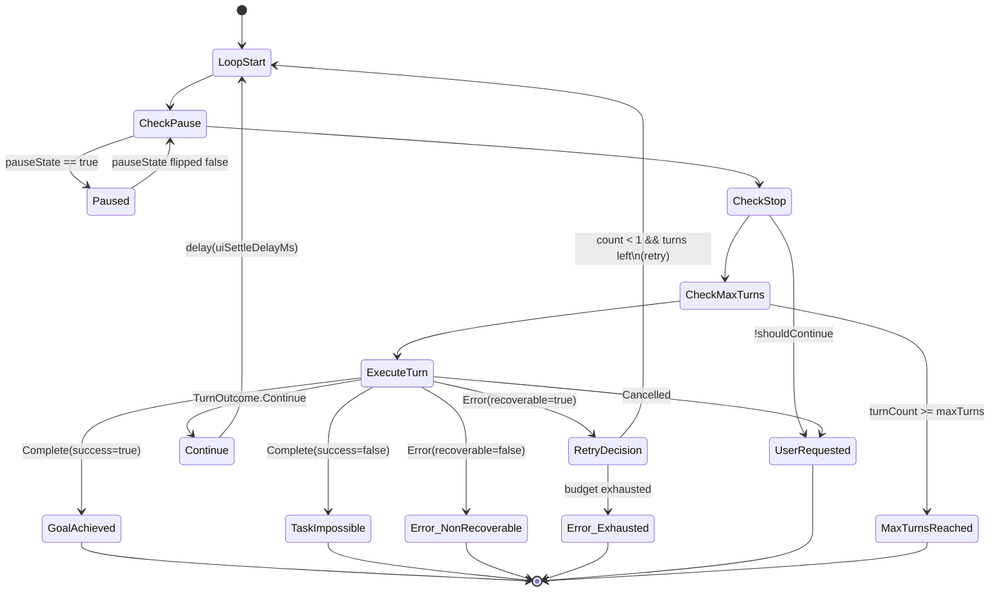

# Agent Run Loop

## Owner

- `app/src/main/kotlin/ai/closepaw/agent/Agent.kt` (loop)
- `app/src/main/kotlin/ai/closepaw/agent/AgentRuntimeTypes.kt` (`AgentStopReason`, `TurnOutcome`, `TurnRunnerState`, `decideTurnOutcome`)
- `app/src/main/kotlin/ai/closepaw/agent/AgentTurnRunner.kt` (per-turn execution)

## States

### `AgentStopReason` (terminal verdicts)

| Variant | Data | Meaning |
|---|---|---|
| `GoalAchieved` | `message: String = "Goal achieved"` | `complete_task` succeeded (AgentRuntimeTypes.kt:11) |
| `UserRequested` | none | User stopped or cancellation signal fired (AgentRuntimeTypes.kt:12) |
| `MaxTurnsReached` | none | `turnCount >= maxTurns` (AgentRuntimeTypes.kt:13) |
| `TaskImpossible` | `message: String` | `complete_task(success=false)` (AgentRuntimeTypes.kt:14) |
| `Error` | `message: String` | Non-recoverable turn error or recoverable error after retries exhausted (AgentRuntimeTypes.kt:15) |

### `TurnOutcome` (per-turn signal)

| Variant | Data | Meaning |
|---|---|---|
| `Continue` | none | Loop runs another turn |
| `Complete` | `message: String, success: Boolean = true` | Stops loop; mapped to `GoalAchieved` or `TaskImpossible` |
| `Error` | `message: String, recoverable: Boolean` | Stops or retries based on flag |
| `Cancelled` | none | Stops with `UserRequested` |

### Loop state (in `Agent.run`)

Tracked locally per run (Agent.kt:62-66):
- `turnCount: Int` (0-based, incremented per turn)
- `pauseState: MutableStateFlow<Boolean>`
- `pauseConfirmed: CompletableDeferred<Unit>?` (null when no pause pending)
- `stopRequested: AtomicBoolean`
- `recoverableRetryCount: Int` (resets to 0 on `Continue`)
- `lastKnownPackage: String?` (for auto-retain memory note)
- `turnRunnerState: TurnRunnerState` (carries `NavigationState`)

## Transitions

| From | To | Trigger | Guard |
|---|---|---|---|
| (start) | `Running` | `Agent.run()` invoked | — |
| `Running` | `Paused` | `pauseState.value == true` checked at top of loop (Agent.kt:69-76) | — |
| `Paused` | `Running` | `pauseState.first { !it }` resumes after `resume()` flips flag (Agent.kt:74) | — |
| `Running` | terminal `UserRequested` | `!shouldContinue()` (stop or cancellation) (Agent.kt:78-81) | — |
| `Running` | terminal `MaxTurnsReached` | `turnCount >= maxTurns` (Agent.kt:83-87) | — |
| `Running` (turn) | `Continue` | `TurnOutcome.Continue` from `executeTurn` (Agent.kt:101-104) | resets `recoverableRetryCount`, delays `uiSettleDelayMs` |
| `Running` (turn) | terminal `GoalAchieved` | `TurnOutcome.Complete(success=true)` (Agent.kt:117-119) | — |
| `Running` (turn) | terminal `TaskImpossible` | `TurnOutcome.Complete(success=false)` (Agent.kt:120-122) | — |
| `Running` (turn) | terminal `Error` | `TurnOutcome.Error(recoverable=false)` (Agent.kt:127-130) | — |
| `Running` (turn) | retry | `TurnOutcome.Error(recoverable=true)` AND `recoverableRetryCount < MAX_RECOVERABLE_RETRIES (=1)` AND `turnCount < maxTurns` (Agent.kt:132-148) | increments retry count, delays `uiSettleDelayMs` |
| `Running` (turn) | terminal `Error` | recoverable error but retry budget exhausted (Agent.kt:137-141) | — |
| `Running` (turn) | terminal `UserRequested` | `TurnOutcome.Cancelled` (Agent.kt:149-153) | — |

If the loop exits without setting `stopReason`, the fallback (Agent.kt:162-168) is `UserRequested` (when stop/cancellation observed) or `GoalAchieved()` otherwise.

## Diagram

## `decideTurnOutcome` (AgentRuntimeTypes.kt:72-104)

Maps `(TurnResult, ToolArbitrationResult, ExecutionPhaseResult)` to `TurnOutcome`. Key rules:

1. If `execution.terminatedEarly`:
   - last result `Cancelled` → `TurnOutcome.Cancelled`
   - last result `Error` → `TurnOutcome.Error(recoverable=true)`
   - else → `TurnOutcome.Error("Tool execution aborted before completion", recoverable=true)`
2. Else if `complete_task` was selected but its id is **not** in `executedToolIds` → `TurnOutcome.Error("complete_task was planned but did not execute", recoverable=true)`
3. Else `policy.decideCompletion`: if `shouldComplete`, emit `Complete(summary, success)`, otherwise `Continue`.

## Invariants

- `MAX_RECOVERABLE_RETRIES = 1` (Agent.kt:29) — at most one consecutive recoverable-error retry; `Continue` resets the counter.
- `turnCount` is incremented before `executeTurn`, so `MaxTurnsReached` is checked at the top of the next iteration, not after the failing turn.
- Pause is cooperative — pause check happens once per loop iteration, immediately before stop check.
- The agent's `pauseConfirmed` deferred is **always** completed in the `finally` block (Agent.kt:156-160) so `AgentSession.handleTakeover()` cannot hang past run termination.
- Cross-turn state lives only in `TurnRunnerState` (currently `NavigationState`); no other mutable state is passed across turns (AgentRuntimeTypes.kt:31-33).

## Persistence

The loop itself is fully transient; what makes it onto disk is what the turn writes through `services.historyManager`, `services.traceRecorder`, and `services.memoryStore` (auto-retain on failure, Agent.kt:106-116).

## Entry / exit side-effects

- Entry: emits `🚀 Starting agent...` status, calls `trace.sessionStarted`, appends `USER_INTENT` history item with `Goal: …` (Agent.kt:55-62).
- Per turn: `trace.turnStarted`, `eventDispatcher.turnStarted`, screen capture, planning, execution, `trace.turnCompleted`.
- On failure of a turn (`TurnOutcome.Complete(success=false)` only) and only if `memoryStore.hasWrittenThisSession() == false`: appends an app operational note to memory for the foreground package (Agent.kt:106-116).
- Exit: `pauseConfirmed?.complete(Unit)`, `trace.sessionStopped(reason, turnCount)`.

## Error / recovery paths

- Exceptions inside `executeTurn` are caught by `AgentTurnRunner`:
  - `CancellationException` is rethrown (AgentTurnRunner.kt:113-114).
  - All other exceptions go through `TurnErrorClassifier.classify(...)` → `TurnOutcome.Error(message, recoverable)` (AgentTurnRunner.kt:245-257).
- Recoverable error retry: at most 1 retry per "streak"; `Continue` resets the counter (Agent.kt:132-148).
- If `complete_task` was planned but did not execute (e.g. early termination), the loop emits `recoverable=true` error and may retry once.

## Open questions / smells

- The pause check executes after stop check is re-evaluated on resume (Agent.kt:78-81), so a stop request that arrives during pause is honored — good. But a stop request arriving **between** the post-pause re-check and `executeTurn` will not be observed until the next iteration.
- `lastKnownPackage` is updated **after** `executeTurn` returns (Agent.kt:98-99), so the auto-retain memory entry for a failed `Complete` may use a stale package if the turn navigated mid-flight.
- The fallback `GoalAchieved()` when `stopReason == null` and no stop/cancellation observed (Agent.kt:166-168) is reachable only if the loop exits via `shouldContinue() == false` returning false at the top — which always sets `UserRequested`. UNCONFIRMED whether the `else` branch is dead code.
- `MAX_RECOVERABLE_RETRIES = 1` is a private constant; not configurable per session.
