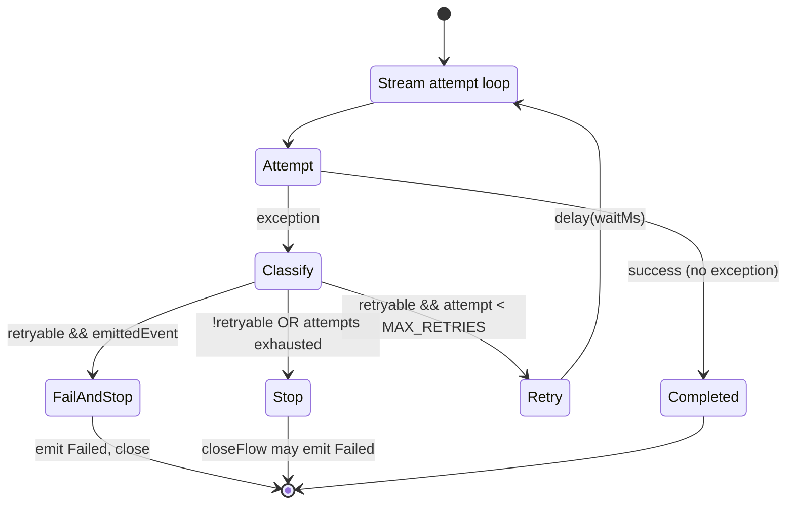
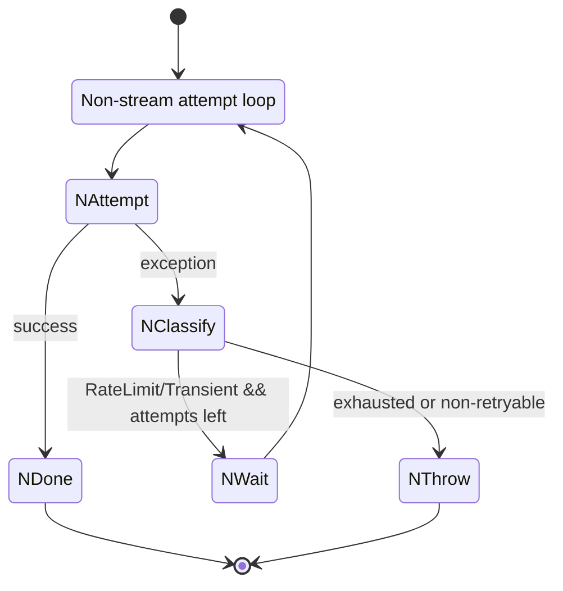

# LLM Retry

## Owner

- `app/src/main/kotlin/ai/closepaw/llm/CloudStreamRetryPolicy.kt` — pure-policy decision for streaming
- `app/src/main/kotlin/ai/closepaw/llm/CloudStreamRetryRunner.kt` — `streamWithRetry` scaffold that drives the policy
- `app/src/main/kotlin/ai/closepaw/llm/CloudLlmRetry.kt` — non-streaming retry loop + shared `advanceBackoff`

Constants come from `LLMClient` companion (LLMClient.kt:29-32): `MAX_RETRIES = 5`, `INITIAL_BACKOFF_MS = 1000L`, `MAX_BACKOFF_MS = 60000L`, `BACKOFF_MULTIPLIER = 2.0`.

## Streaming retry — `CloudStreamRetryPolicy.decide` (CloudStreamRetryPolicy.kt:14-50)

Inputs per attempt: `tag`, `classified: Exception`, `attempt: Int`, `emittedEvent: Boolean`, `backoffMs: Long`.

Outputs `StreamRetryAction`:

| Action | Data | Meaning |
|---|---|---|
| `Retry` | `waitMs: Long, nextBackoffMs: Long` | Wait `waitMs`, then re-attempt with new backoff |
| `FailAndStop` | `message: String` | Emit a synthetic `Failed` event and stop |
| `Stop` | none | Stop without emitting (caller emits final failure if not already emitted) |

Decision matrix:

| Condition | Result |
|---|---|
| `retryable && emittedEvent` | `FailAndStop("Stream interrupted after partial output: …")` — never retry once any text/tool/failed event has reached the consumer |
| `retryable && attempt < MAX_RETRIES` | `Retry(waitMs, nextBackoffMs)`. `waitMs = (e as? RateLimitException)?.retryAfterMs ?: backoffMs`. `nextBackoffMs = CloudLlmRetry.advanceBackoff(backoffMs)` |
| else (non-retryable, or attempts exhausted) | `Stop` |

`retryable = classified is RateLimitException || classified is TransientException` (CloudStreamRetryPolicy.kt:22).

## Streaming runner — `streamWithRetry` (CloudStreamRetryRunner.kt:33-110)

Loop variables: `lastException`, `backoffMs`, `failureEmitted`. Per attempt:

1. Build a `StreamAttemptEmitter` that:
   - Sets `failureEmitted = true` on `Failed`.
   - Sets `emittedEvent = true` on `TextDelta`, `ToolCallDone`, or `Failed` (CloudStreamRetryRunner.kt:51).
   - Forwards the event to the outer flow.
2. Run `attemptBlock(attempt, emitter)`.
3. On exception:
   - Pre-classify `RateLimitException`/`TransientException` as-is, otherwise `OpenAIErrorClassifier.classify(e)` (CloudStreamRetryRunner.kt:65-68).
   - Pass to `CloudStreamRetryPolicy.decide` and act:
     - `FailAndStop` → if not already emitted, emit `Failed(message)`; return `StreamRetryRunResult(completed=false, …)`.
     - `Retry` → `delay(waitMs)`, advance backoff, loop.
     - `Stop` → return `StreamRetryRunResult(completed=false, …)`.

If the loop exits normally (attempt completed without exception) → `StreamRetryRunResult(completed=true, …)`.

After the loop, `StreamRetryRunResult.closeFlow` may emit a final `Failed(lastError?.message ?: "Unknown error")` if neither completion nor a failure event was already emitted (CloudStreamRetryRunner.kt:14-25).

## Non-streaming retry — `CloudLlmRetry.executeWithRetry` (CloudLlmRetry.kt:12-51)

Loop:

| Attempt | Outcome on exception |
|---|---|
| `RateLimitException`, `attempt < MAX_RETRIES` | wait `e.retryAfterMs ?: backoffMs`, advance backoff, retry |
| `RateLimitException`, `attempt == MAX_RETRIES` | rethrow `e` |
| `TransientException`, `attempt < MAX_RETRIES` | wait `backoffMs`, advance backoff, retry |
| `TransientException`, `attempt == MAX_RETRIES` | rethrow `e.cause ?: e` |
| any other exception | propagates up immediately (no catch clause) |

`advanceBackoff(currentMs) = (currentMs * BACKOFF_MULTIPLIER).toLong().coerceAtMost(MAX_BACKOFF_MS)` (CloudLlmRetry.kt:8-10).

## Diagram

## Invariants

- **No retry after partial output.** Once any `TextDelta`/`ToolCallDone`/`Failed` has been emitted, the policy returns `FailAndStop` regardless of remaining attempts. This protects the consumer from duplicated tokens/tool calls (CloudStreamRetryPolicy.kt:24-29).
- **`RateLimitException.retryAfterMs` always wins** over backoff if present (both stream and non-stream paths).
- **`failureEmitted` is monotonic** within a `streamWithRetry` invocation; once set it prevents `closeFlow` from emitting a duplicate `Failed`.
- Streaming runner attempts are 1-indexed (1..MAX_RETRIES), matching `CloudStreamRetryPolicy.decide`'s `attempt < MAX_RETRIES` test.
- The non-streaming loop **rethrows the cause** for `TransientException` at exhaustion, but rethrows the original exception for `RateLimitException` (CloudLlmRetry.kt:24-28, 34-38).

## Persistence

None. Retry state is per-invocation only.

## Entry / exit side-effects

- `delay(waitMs)` between retries (suspends caller's coroutine).
- `Log.w` / `Log.e` per attempt with the `tag` provided by the caller.
- Streaming runner emits up to one synthetic `Failed` event per invocation (either via `FailAndStop` or `closeFlow` fallback).

## Error / recovery paths

- All non-retryable errors propagate as `Stop` (streaming) or rethrow (non-streaming).
- Network/transport errors are funneled through `OpenAIErrorClassifier.classify` for the streaming path (CloudStreamRetryRunner.kt:67) — the non-streaming path expects the caller to have already classified.
- `closeFlow` ensures the downstream `Flow<LLMStreamEvent>` always terminates with either a completion or a `Failed` event.

## Open questions / smells

- `LLMClient.MAX_RETRIES = 5` (LLMClient.kt:29). Streaming attempts run 1..MAX_RETRIES; non-streaming retries until `attempt == MAX_RETRIES`.
- Streaming `failureEmitted` is set only when the attempt **emits** a `Failed`; if the attempt block throws but had already emitted a `Failed` (rare), the policy would still see `emittedEvent = true` and return `FailAndStop`, which then re-emits a `Failed` synthetic only if `failureEmitted == false`. Logically consistent but worth verifying with a test (`CloudStreamRetryRunnerTest.kt`).
- The non-streaming loop does not honor `emittedEvent` semantics (it has no event stream), so a non-streaming call may be retried any number of times up to `MAX_RETRIES` even after partial side-effects.
- `OpenAIErrorClassifier` is invoked only for streaming. UNCONFIRMED whether non-streaming callers wrap their own errors before throwing.
