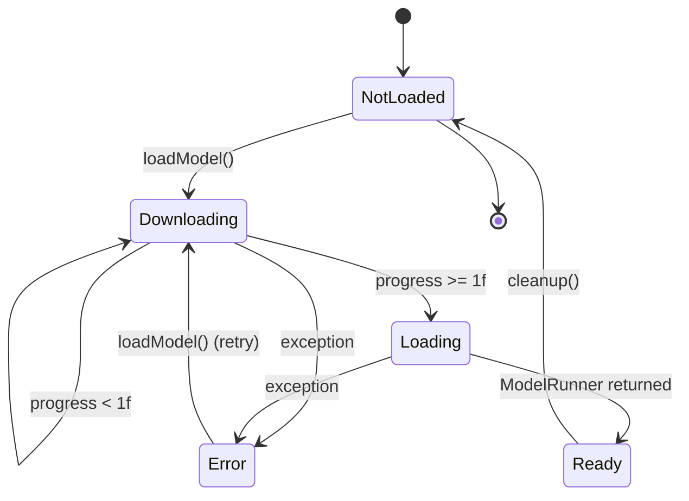

# Local Model Loading (LFM)

## Owner

- `app/src/main/kotlin/ai/closepaw/llm/LFMLLMClient.kt`

## States — `LFMLLMClient.ModelLoadingState` (LFMLLMClient.kt:103-109)

`sealed interface` with five variants:

| State | Data | Meaning |
|---|---|---|
| `NotLoaded` | none | Initial state; also re-entered after `cleanup()` |
| `Downloading` | `progress: Float` (0..1) | Manifest/weights download in progress |
| `Loading` | none | Download finished (progress ≥ 1f), weights being loaded into runtime |
| `Ready` | none | Model is usable (`isReady() == true`) |
| `Error` | `message: String` | Load failed; subsequent `loadModel` retries from `NotLoaded` |

Backed by a `@Volatile` field `modelLoadingState` (LFMLLMClient.kt:97-98) plus a `@Volatile` `modelRunner: ModelRunner?` (LFMLLMClient.kt:95-96).

## Transitions

All transitions occur inside `loadModelLocked` (LFMLLMClient.kt:127-167) under `modelMutex.withLock` (LFMLLMClient.kt:121-125, 285-292, 294-301).

| From | To | Trigger | Guard |
|---|---|---|---|
| `NotLoaded` / `Error` | `Downloading(0f)` | `loadModel(...)` invoked AND `modelRunner == null` | (early-return if `modelRunner != null`, LFMLLMClient.kt:128-131) |
| `Downloading(p)` | `Downloading(p')` | progress callback with `progress < 1f` | (LFMLLMClient.kt:148-152) |
| `Downloading(*)` | `Loading` | progress callback with `progress >= 1f` | (LFMLLMClient.kt:148-150) |
| `Loading` | `Ready` | `downloader.loadModel(...)` returns a `ModelRunner` | sets `modelRunner` (LFMLLMClient.kt:143-159) |
| any in-progress | `Error(message)` | exception thrown by `downloader.loadModel` or `withContext(Dispatchers.IO)` body | rethrows after setting state (LFMLLMClient.kt:161-166) |
| `Ready` | `NotLoaded` | `cleanup()` | unloads runner, clears reference (LFMLLMClient.kt:285-292) |

There is no transition from `Loading` directly back to `Downloading`. Once progress hits ≥1f, the next non-progress signal is the end of `loadModel`.

## Diagram

## Invariants

- All state mutations happen under `modelMutex`; `@Volatile` ensures `isReady()` (LFMLLMClient.kt:111) and `getLoadingState()` (LFMLLMClient.kt:116) observe a coherent value without locking.
- `modelRunner != null` ⇔ `modelLoadingState is Ready` (set together at LFMLLMClient.kt:143-158, cleared together at LFMLLMClient.kt:287-289).
- `loadModel` is idempotent — repeated calls when `modelRunner != null` no-op (LFMLLMClient.kt:128-131).
- `getOrLoadModel` enforces a non-null runner post-call or throws `IllegalStateException` (LFMLLMClient.kt:294-301).

## Persistence

- The downloaded weights live on disk in `<filesDir>/leap_models` (LFMLLMClient.kt:138-141), so a fresh `loadModel` call after process restart skips the download phase if the cache is intact.
- The `ModelLoadingState` itself is not persisted — every process start begins at `NotLoaded`.

## Entry / exit side-effects

- `loadModel` (entry):
  - Switches to `Dispatchers.IO` for I/O (LFMLLMClient.kt:134).
  - Constructs `LeapDownloader` with `saveDir = <filesDir>/leap_models` (LFMLLMClient.kt:138-141).
  - Calls `downloader.loadModel(modelSlug, quantizationSlug, progress)`.
  - Invokes the optional `onProgress` callback for every state mutation it makes (LFMLLMClient.kt:136, 153, 158, 163).
- `cleanup`:
  - `modelRunner?.unload()` releases native resources (LFMLLMClient.kt:287).
- `LFMLLMClient.<clinit>`: `patchLeapJsonConfig()` reflectively patches the Leap SDK's static `Json` to set `ignoreUnknownKeys = true` so newer HuggingFace manifest fields don't fail deserialization (LFMLLMClient.kt:63-91).

## Error / recovery paths

- Any exception inside `withContext(Dispatchers.IO) { … }`:
  1. Sets `modelLoadingState = Error(e.message ?: "Unknown error")`.
  2. Invokes `onProgress` with the error state.
  3. Rethrows the exception so `loadModel`'s caller can react (LFMLLMClient.kt:161-166).
- `chatWithToolsStreaming` catches exceptions and emits `LLMStreamEvent.Failed(...)` (LFMLLMClient.kt:280-281); it does **not** mutate `modelLoadingState`.
- `chatWithTools` (non-streaming) does not catch exceptions — they propagate to the caller.

## Open questions / smells

- `Loading` state has no completion side-effect of its own; the transition `Loading → Ready` happens implicitly when `downloader.loadModel(...)` returns. If `loadModel` throws **after** the progress callback fires `Loading`, the state goes `Loading → Error`. UI must handle this dwell time.
- `cleanup` puts the client in `NotLoaded` even if `modelRunner.unload()` throws — the state mutation happens after the call (LFMLLMClient.kt:287-289). UNCONFIRMED whether unload can throw.
- The reflective `patchLeapJsonConfig` is best-effort; if the SDK changes its private field, the patch silently fails (logged at WARN). Manifest parsing then breaks at runtime, not at init.
- There is no `Cancelled` state — calling `cleanup` mid-download leaves the in-flight coroutine to either succeed (and overwrite `modelLoadingState`) or fail with whatever exception the downloader raises on cancellation. UNCONFIRMED.
