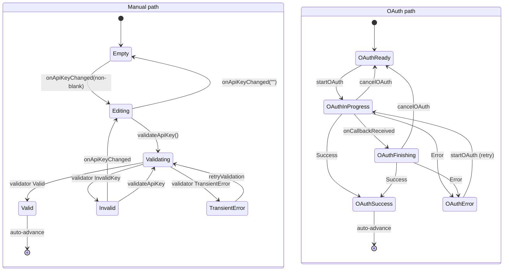

# Onboarding — API Key Step

## Owner

- `app/src/main/kotlin/ai/closepaw/onboarding/OnboardingState.kt` (`ApiKeyStepState`, `OnboardingProvider`, `ApiKeyAuthMethod`)
- `app/src/main/kotlin/ai/closepaw/onboarding/OnboardingViewModel.kt` (manual + OAuth transitions)
- `app/src/main/kotlin/ai/closepaw/onboarding/HttpLlmCredentialValidator.kt` + `LlmCredentialValidator.kt` (validation backend)

The step is split between two paths chosen via `ApiKeyAuthMethod`:

- `MANUAL` — user pastes an API key (used by OpenRouter, Novita, and OpenAI manual fallback).
- `OAUTH` — sign-in with `openAiSignIn` (currently only `OPENAI_CODEX` provider).

`selectAuthMethod` (OnboardingViewModel.kt:83-88) and `selectProvider` (OnboardingViewModel.kt:70-81) coordinate which path is active and reset `stepState` accordingly. Both no-op unless `currentStep == ApiKey`.

## States — `ApiKeyStepState` (OnboardingState.kt:55-69)

### Manual path

| State | Data | Meaning |
|---|---|---|
| `Empty` | none | Initial state for manual provider; key field blank |
| `Editing` | `key: String` | User typing — non-blank key |
| `Validating` | `key: String` | HTTP validation in flight |
| `Invalid` | `key: String, message: String` | Validator returned `InvalidKey` |
| `TransientError` | `key: String, message: String` | Validator returned `TransientError`; user can `retryValidation` |
| `Valid` | `key: String` | Validator returned `Valid`; auto-advance after 400 ms |

### OAuth path

| State | Data | Meaning |
|---|---|---|
| `OAuthReady` | none | Initial state for OpenAI provider in OAuth mode |
| `OAuthInProgress` | none | `openAiSignIn` running (browser launched, awaiting redirect) |
| `OAuthFinishing` | none | Callback received from browser; finalizing token exchange |
| `OAuthSuccess` | `email: String` | Tokens stored; auto-advance after 400 ms |
| `OAuthError` | `message: String` | Sign-in failed; user can retry via `startOAuth` |

## Transitions

### Manual path (OnboardingViewModel.kt:200-250)

| From | To | Trigger | Guard |
|---|---|---|---|
| (entry, manual provider selected) | `Empty` | `enterStep(ApiKey)` with non-OPENAI provider AND no existing credential, OR `selectAuthMethod(MANUAL)` | (OnboardingViewModel.kt:365-368, 88) |
| `Empty` / `Invalid` | `Editing(key)` | `onApiKeyChanged(key)` with non-blank key | rejects when `key.isBlank()` (OnboardingViewModel.kt:200-202) |
| `Editing` / `Invalid` | `Empty` | `onApiKeyChanged("")` (blank) | (OnboardingViewModel.kt:202) |
| `Editing` / `Invalid` | `Validating(key)` | `validateApiKey()` | requires non-blank key; from `Editing.key` or `Invalid.key` (OnboardingViewModel.kt:205-214) |
| `Validating` | `Valid(key)` | `validator.validate(key) is Valid` | persists `AuthCredential.ApiKey(key)` to `AuthStore`, applies default model, saves `Done`, auto-advances (OnboardingViewModel.kt:222-232) |
| `Validating` | `Invalid(key, message)` | `validator.validate(key) is InvalidKey` | (OnboardingViewModel.kt:234-236) |
| `Validating` | `TransientError(key, message)` | `validator.validate(key) is TransientError` OR validator factory returns null | (OnboardingViewModel.kt:217-220, 237-239) |
| `TransientError` | `Editing(key)` → `Validating(key)` | `retryValidation()` | (OnboardingViewModel.kt:244-250) |

### OAuth path (OnboardingViewModel.kt:92-138)

| From | To | Trigger | Guard |
|---|---|---|---|
| (entry, OPENAI provider, auth=OAUTH) | `OAuthReady` | `enterStep(ApiKey)` with no existing credential (OnboardingViewModel.kt:362-364) OR `selectAuthMethod(OAUTH)` (OnboardingViewModel.kt:85-90) OR `cancelOAuth()` (OnboardingViewModel.kt:134-139) | — |
| `OAuthReady` / `OAuthError` | `OAuthInProgress` | `startOAuth()` | early-return if already `OAuthInProgress` (OnboardingViewModel.kt:94) |
| `OAuthInProgress` | `OAuthFinishing` | `openAiSignIn` invokes `onCallbackReceived` (after browser redirect arrives) | (OnboardingViewModel.kt:101) |
| `OAuthInProgress` / `OAuthFinishing` | `OAuthSuccess(email)` | `openAiSignIn` returns `Success` | persists `AuthCredential.OAuth(...)` for `OPENAI_CODEX`, saves `Done`, auto-advances (OnboardingViewModel.kt:105-126) |
| `OAuthInProgress` / `OAuthFinishing` | `OAuthError(message)` | `openAiSignIn` returns `Error(message)` | (OnboardingViewModel.kt:127-129) |
| `OAuthInProgress` / `OAuthFinishing` | `OAuthReady` | `cancelOAuth()` | cancels coroutine job (OnboardingViewModel.kt:134-138) |

### Path switching

`selectProvider(provider)` resets state:
- `OPENAI_API` → `authMethod = OAUTH`, `stepState = OAuthReady` (OnboardingViewModel.kt:74-77)
- otherwise → `authMethod = MANUAL`, `stepState = Empty` (OnboardingViewModel.kt:77-81)

`selectAuthMethod(method)` resets state to `Empty` (manual) or `OAuthReady` (oauth).

### Re-entry from back-nav

`enterStep(ApiKey)` (OnboardingViewModel.kt:339-368) delegates to `tryRenderExistingCredential()` (OnboardingViewModel.kt:447-470). `AuthStore` is the source of truth — outcome is overridden when a credential exists:

1. If `AuthStore.has(OPENAI_CODEX)` → set `OAuthSuccess("")`, mark step Done.
2. Else first matching `OnboardingProvider.entries` with `AuthStore.has(...)` → set `Valid("")`, mark step Done.
3. Else if `outcomes.apiKey == Done` (stale Done with no matching credential) → reset outcome to `Pending` and fall through to a fresh editable state.

## Diagram

## Invariants

- All state mutations from this step early-return unless `currentStep == ApiKey` (OnboardingViewModel.kt:73, 86, 201).
- The typed key only ever lives inside `ApiKeyStepState.{Editing|Validating|Invalid|TransientError|Valid}.key` — it is **never** persisted to `OnboardingStore`. On process death the user must retype.
- Transition to `Valid` always writes the credential to `AuthStore` and applies a default model **before** auto-advancing (OnboardingViewModel.kt:223-230). `OAuthSuccess` does the same for OAuth (OnboardingViewModel.kt:107-122).
- `OAuthReady` is also the post-cancel state — `cancelOAuth` does not surface an error.
- `OAuthSuccess` re-derived from back-navigation carries an empty email string (OnboardingViewModel.kt:458) — UI must tolerate.

## Persistence

- Durable: `StepOutcomes.apiKey` (`Pending|Done`), `AuthStore` credential (api key or OAuth tokens), and the default model selection in `AppSettingsState`.
- Transient: typed API key, `selectedProvider`, `authMethod`, `stepState`.

## Entry / exit side-effects

- `validateApiKey` builds an `HttpLlmCredentialValidator(baseUrl, modelId)` via `createValidatorForProvider` (OnboardingViewModel.kt:507-524); OPENAI base URL respects `AppSettingsState.openaiBaseUrl` override.
- `startOAuth` emits `OnboardingEffect.LaunchOAuth(url)` via `_effects` (OnboardingViewModel.kt:100); the composable opens the URL in a browser.
- On `Valid` / `OAuthSuccess`, `applyDefaultModelFor(provider)` picks the **last** entry from the catalog for that provider (OnboardingViewModel.kt:501-505).
- Both success paths save `StepOutcome.Done` and call `advanceToNextStep` after `delay(AUTO_ADVANCE_DELAY_MS = 400)`.

## Error / recovery paths

- `Invalid` and `TransientError` keep the user on the step with the most-recently typed key intact for inline correction.
- `OAuthError` keeps the user on `OAuthError`; `startOAuth` is the retry trigger (no separate retry method).
- If the model catalog has no entry for the chosen provider, `validateApiKey` returns `TransientError("No model found for …")` (OnboardingViewModel.kt:217-220).
- `enterStep(ApiKey)` after credential was externally deleted resets the outcome to `Pending` so the user gets an editable state instead of being stuck in a fake `Valid` state (OnboardingViewModel.kt:355-360).

## Open questions / smells

- `applyDefaultModelFor` always picks `modelsFor(provider).lastOrNull()` (OnboardingViewModel.kt:501-502). This silently overrides any prior model selection. UX-correct for first-run but surprising on back-nav re-validation.
- `OAuthSuccess("")` synthesised on re-entry obscures the actual signed-in email (OnboardingViewModel.kt:458). UI displays "" instead of the real email.
- `cancelOAuth` cancels the job but does not invalidate any partially-completed handshake state. UNCONFIRMED whether `openAiSignIn` is fully cancellation-safe.
- `selectProvider` does not check if the new provider already has a credential in `AuthStore`; the user always starts at `Empty`/`OAuthReady` even if there's a stored key/token to reuse.
