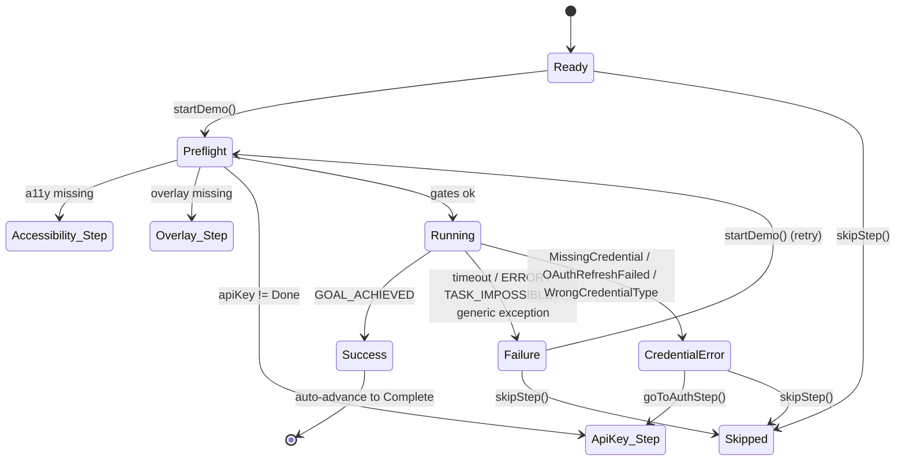

# Onboarding — Demo Step

## Owner

- `app/src/main/kotlin/ai/closepaw/onboarding/OnboardingState.kt` (`DemoStepState`)
- `app/src/main/kotlin/ai/closepaw/onboarding/OnboardingViewModel.kt` (`startDemo`, `skipStep`)
- `app/src/main/kotlin/ai/closepaw/onboarding/OnboardingDemoController.kt` (throwaway `AgentSession` driver)

## States — `DemoStepState` (OnboardingState.kt:69-78)

| State | Data | Meaning |
|---|---|---|
| `Ready` | none | Initial state on entering the Demo step (OnboardingViewModel.kt:365-367) |
| `Preflight` | none | `startDemo` re-checks hard gates and apiKey before running |
| `Running` | none | `OnboardingDemoController.run` is in flight |
| `Success` | `message: String` | Demo finished with `GOAL_ACHIEVED` (settings open or generic) |
| `Failure` | `reason: String` | Demo finished but not as `GOAL_ACHIEVED`, or timed out, or threw a non-credential error |
| `CredentialError` | `message: String, isOAuth: Boolean` | Auth-related failure surfaced inline with re-auth CTA |
| `Skipped` | none | Set externally via `skipStep()` — never produced by the demo controller itself |

## Transitions — `startDemo` + controller callbacks

`startDemo()` (OnboardingViewModel.kt:245-289):

| From | To | Trigger | Guard |
|---|---|---|---|
| `Ready` (or any) | `Preflight` | `startDemo()` | requires `currentStep == Demo` (OnboardingViewModel.kt:246) |
| `Preflight` | (back to broken permission step) | `!isAccessibilityEnabled() || !isOverlayEnabled()` | resets that step's outcome to `Pending`, jumps via `enterStep` (OnboardingViewModel.kt:250-261) |
| `Preflight` | (back to ApiKey) | `outcomes.apiKey != Done` | jumps via `enterStep(ApiKey)` (OnboardingViewModel.kt:262-266) |
| `Preflight` | `Running` | preflight passes | `demoController.run(...)` invoked (OnboardingViewModel.kt:268-289) |
| `Running` | `Success(message)` | `onSuccess` callback (`GOAL_ACHIEVED`) | persists `Done`, auto-advances after 400 ms (OnboardingViewModel.kt:270-278) |
| `Running` | `Failure(reason)` | `onFailure` callback | does **not** persist; user retries (OnboardingViewModel.kt:279-281) |
| `Running` | `CredentialError(message, isOAuth)` | `onCredentialError` callback | (OnboardingViewModel.kt:282-284) |

`Failure`/`CredentialError`/`Success`/`Ready` → `Skipped` via `skipStep()` (OnboardingViewModel.kt:298-303).

`CredentialError` → `ApiKey` step via `goToAuthStep()` (OnboardingViewModel.kt:166-175).

`Success` → next step (`Complete`) via auto-advance.

Any → `Ready` via `goBack()` from the next step (re-entry sets `DemoStepState.Ready`).

## Demo controller — outcome mapping (OnboardingDemoController.kt:144-203)

The controller resolves the awaited `TaskCompleted` event under a 60 s timeout. Outcome → callback:

| Conditions | Callback | Resulting state |
|---|---|---|
| `taskCompleted == null` (timeout) | `onFailure("The demo timed out before opening Settings.")` | `Failure` |
| `outcome == GOAL_ACHIEVED && lastPackageName == "com.android.settings"` | `onSuccess("Settings app opened successfully!")` | `Success` |
| `outcome == GOAL_ACHIEVED && lastPackageName != settings` | `onSuccess("Demo task completed!")` (still success) | `Success` |
| `outcome == ERROR` | `onFailure("Demo encountered an error")` | `Failure` |
| `outcome == TASK_IMPOSSIBLE` | `onFailure("Demo could not complete the task")` | `Failure` |
| other outcome | `onFailure("Demo ended: $outcome")` | `Failure` |
| `MissingCredential` exception | `onCredentialError("No <provider> credential found. Sign in again.", isOAuth)` | `CredentialError` |
| `OAuthRefreshFailed` exception | `onCredentialError("Sign-in expired. Please sign in again.", true)` | `CredentialError` |
| `WrongCredentialType` exception | `onCredentialError("Credential mismatch for <provider>. Re-enter it.", isOAuth)` | `CredentialError` |
| any other exception | `onFailure("Demo failed: ${e.message}")` | `Failure` |
| Service not bound | `onFailure("Accessibility service not available")` | `Failure` |

All success/failure callbacks also invoke `onBringToFront()` → `OnboardingEffect.BringMainActivityToFront` (OnboardingDemoController.kt:151, 155, 165, 170) so the demo UI returns to foreground.

## Diagram

## Invariants

- `startDemo` no-ops unless `currentStep == Demo` (OnboardingViewModel.kt:246).
- `Preflight` is a single atomic phase — either it short-circuits to a missing-prereq step, or it transitions to `Running` synchronously without yielding control to the UI thread between (OnboardingViewModel.kt:268-269).
- Only `Success` persists `StepOutcome.Done`; `Failure`/`CredentialError` keep the step pending so the next launch returns to `Demo` (or the user can `skipStep` for `Skipped`).
- `OnboardingDemoController.run` cancels any prior demo before starting a new one (OnboardingDemoController.kt:66, 209-213).
- Demo session is **always** torn down via `Op.Shutdown` in the `finally` block (OnboardingDemoController.kt:203-205, 215-226), even on exception.
- The demo session uses `ApprovalMode.AUTO_APPROVE` (OnboardingDemoController.kt:82) so no user approval interrupts the funnel.

## Persistence

- Durable: `StepOutcomes.demo` (`Pending|Done|Skipped`).
- Transient: `DemoStepState`, demo `AgentSession`, event-collector job, `lastPackageName`, awaited `TaskCompleted`. None survive process death.
- Demo session credentials are pulled from `AuthStore` at runtime (no copy made).

## Entry / exit side-effects

| Transition | Side-effects |
|---|---|
| `Ready → Preflight` | (none beyond state mutation) |
| `Preflight → Running` | Builds `SessionConfig(AUTO_APPROVE, OPENAI backend, AccessibilityOnly)` (OnboardingDemoController.kt), creates `AgentSession` on `Dispatchers.IO`, registers it with `AgentService.observeExternalSession`, launches event collector, submits `Op.UserInput("Open the Settings app")` |
| `Running → Success` | Persists `Done`, schedules `advanceToNextStep` after 400 ms (OnboardingViewModel.kt:271-277); also `onBringToFront` |
| `Running → Failure/CredentialError` | `onBringToFront`; no persistence |
| any → (controller exit) | `shutdownSession()` submits `Op.Shutdown` and clears `demoSession` reference |

## Error / recovery paths

- 60 s timeout (`TIMEOUT_MS`) maps to `Failure`. The demo no longer has its own turn cap — production runs are bounded by context-window auto-compaction. The 60 s wall-clock timeout is what guards against a runaway demo.
- Credential exceptions are mapped to `CredentialError` with `isOAuth` derived from `provider == OPENAI_CODEX` (OnboardingDemoController.kt:174-197).
- Non-credential exceptions fall through to `Failure("Demo failed: …")`.
- Controller's `cancel()` cancels the coroutine job and shuts down the session — used implicitly when `run` is called again.

## Open questions / smells

- The demo blocks waiting for `TaskCompleted` via a 200 ms polling loop on a captured local `var`. Functional but a `Channel`/`callbackFlow` would be cleaner and avoid the polling jitter.
- `Skipped` is set by `skipStep` directly without going through any controller — the demo `AgentSession` in flight (if any) is **not** cancelled here. UNCONFIRMED whether a stale demo session can outlive a `Skipped` transition.
- `enterStep(WizardStep.Complete)` re-uses `DemoStepState.Ready` as a placeholder — see [onboarding_wizard.md](onboarding_wizard.md).
