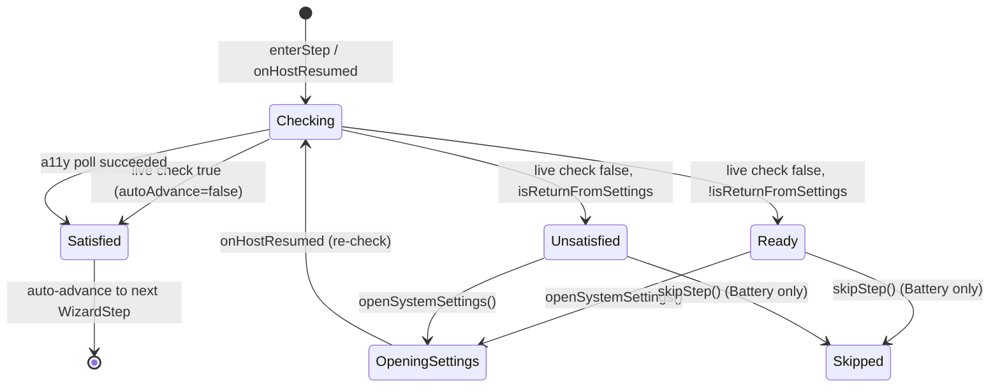

# Onboarding — Permission Step

## Owner

- `app/src/main/kotlin/ai/closepaw/onboarding/OnboardingState.kt` (`PermissionStepState`)
- `app/src/main/kotlin/ai/closepaw/onboarding/OnboardingViewModel.kt` (`enterStep`, `checkCurrentPermission`, `openSystemSettings`, `onPermissionSatisfied`)
- `app/src/main/kotlin/ai/closepaw/onboarding/PermissionStateMonitor.kt` (live checks)

Applies to three wizard steps: `Accessibility`, `Overlay`, `Battery`.

## States — `PermissionStepState` (OnboardingState.kt:45-52)

| State | Data | Meaning |
|---|---|---|
| `Checking` | none | Just entered the step (or returned from settings); about to query the live monitor |
| `Ready` | none | Permission missing on first entry — render the explainer + "Open settings" CTA |
| `OpeningSettings` | none | "Open settings" tapped; system intent has been emitted via `OnboardingEffect` |
| `Satisfied` | none | Permission granted — terminal-ish (advances to next step after `AUTO_ADVANCE_DELAY_MS = 400`) |
| `Unsatisfied` | none | Returned from settings without granting (or polling for a11y exhausted) — render retry CTA |
| `Skipped` | none | Battery only — set externally via `skipStep()`; not produced by `checkCurrentPermission` |

`PermissionStepState` is a `sealed interface` with `data object` variants only (no per-state data).

## Transitions — `checkCurrentPermission` (OnboardingViewModel.kt:374-411)

Inputs: `isReturnFromSettings: Boolean`, `autoAdvance: Boolean = true`.

| From | To | Trigger | Guard |
|---|---|---|---|
| (entry to step) | `Checking` | `enterStep(stepInPermissionFamily)` → `checkCurrentPermission` (OnboardingViewModel.kt:329-331) | always set first (OnboardingViewModel.kt:375) |
| `Checking` | `Satisfied` | live check returns true AND `autoAdvance == false` | (OnboardingViewModel.kt:384-389) |
| `Checking` | (advance) | live check returns true AND `autoAdvance == true` | calls `onPermissionSatisfied` → sets `Satisfied`, persists `Done`, auto-advances (OnboardingViewModel.kt:413-427) |
| `Checking` | `Ready` | live check false AND `isReturnFromSettings == false` | (OnboardingViewModel.kt:409-410) |
| `Checking` | `Unsatisfied` | live check false AND `isReturnFromSettings == true` AND step is `Overlay`/`Battery` | (OnboardingViewModel.kt:409-410) |
| `Checking` | `Satisfied` (poll path) | step is `Accessibility` AND `isReturnFromSettings == true` AND poll succeeds within 15 × 200 ms = 3 s | (OnboardingViewModel.kt:393-407) |
| `Checking` | `Unsatisfied` | a11y poll exhausts 3 s without success | (OnboardingViewModel.kt:403-404) |
| `Ready` / `Unsatisfied` | `OpeningSettings` | `openSystemSettings()` user action | also emits the relevant `OnboardingEffect` (OnboardingViewModel.kt:177-193) |
| `OpeningSettings` | `Checking` | `onHostResumed()` → `checkCurrentPermission(isReturnFromSettings = true)` (OnboardingViewModel.kt:147-151) | step in permission family |
| `Battery` `Ready`/`Unsatisfied` | `Skipped` | `skipStep()` → persists `Skipped`, advances | not represented as a `PermissionStepState` write — the wizard advances and the Battery step is left behind (OnboardingViewModel.kt:292-297) |

`Satisfied → Ready/Unsatisfied` is not directly modeled; if the user returns to a previously satisfied step via `goBack()`, `enterStep(step, autoAdvance=false)` re-enters and `checkCurrentPermission` re-derives the state.

## Diagram

## Invariants

- `Skipped` is only reachable for the `Battery` wizard step; `skipStep` no-ops on `Accessibility`/`Overlay` (OnboardingViewModel.kt:291-305).
- `Checking` is always the first state on entry — both fresh entry and `onHostResumed` route through it.
- The accessibility-service poll (3 s) only runs when returning from settings, never on first entry.
- `autoAdvance = false` is used only by `goBack` (OnboardingViewModel.kt:156-157), so a user revisiting a satisfied step does not get bounced forward again.

## Persistence

- Durable: `StepOutcome` per step (`Pending|Done|Skipped`), written by `onPermissionSatisfied` (Done) or `skipStep` (Skipped).
- Transient: `PermissionStepState` is recomputed on every `enterStep`/`onHostResumed`.

## Entry / exit side-effects

| Transition | Side-effects |
|---|---|
| → `Checking` | Calls one of `permissionMonitor.{isAccessibilityEnabled, isOverlayEnabled, isBatteryOptimized}` (PermissionStateMonitor.kt:16-23) |
| `Checking` → `Satisfied` (advance path) | `store.saveOutcome(step, Done)`, updates `outcomes`, schedules `advanceToNextStep` after 400 ms (OnboardingViewModel.kt:413-427) |
| → `OpeningSettings` | Emits one of `OpenAccessibilitySettings`, `OpenOverlaySettings`, `OpenBatteryOptimization` via the `_effects` channel (OnboardingViewModel.kt:177-193) |
| `Battery` → `Skipped` | `store.saveOutcome(Battery, Skipped)`, updates `outcomes`, advances |

`PermissionStateMonitor.isAccessibilityEnabled()` is short-circuited to `AgentService.instance != null` (PermissionStateMonitor.kt:16) — i.e. it relies on the bound a11y service singleton, not the `Settings.Secure` enabled-services list.

## Error / recovery paths

- A11y poll never throws; it just falls through to `Unsatisfied` after 3 s.
- If `onHostResumed` runs while `currentStep` is not in the permission family, it no-ops (OnboardingViewModel.kt:148-151).
- A permission previously granted but later revoked is detected at the next `firstIncompleteStep` evaluation (live check overrides stored `Done`) — see [onboarding_wizard.md](onboarding_wizard.md).

## Open questions / smells

- The 3 s a11y poll is fixed; on slow boots the service may bind later than 3 s, leading to a confusing `Unsatisfied` state that resolves on the next foreground event.
- `Settings.canDrawOverlays(context)` (PermissionStateMonitor.kt:18) returns the live system answer; OEM-specific behavior (e.g. Xiaomi requiring extra permission) is not modeled.
- `OpeningSettings` has no timeout — if the user backgrounds the app permanently, the wizard sits in `OpeningSettings` until next resume. Acceptable since `onResume` will re-enter `Checking`.
- Battery `isIgnoringBatteryOptimizations` returning true does not guarantee the doze exemption survives OEM-specific killers; not modeled here.
