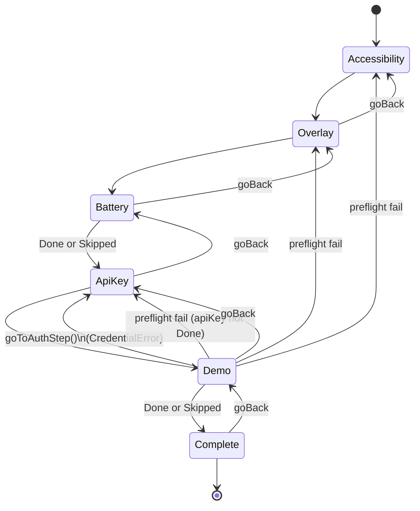

# Onboarding Wizard Funnel

## Owner

- `app/src/main/kotlin/ai/closepaw/onboarding/OnboardingState.kt` (`WizardStep`, `StepOutcome`, `StepOutcomes`)
- `app/src/main/kotlin/ai/closepaw/onboarding/OnboardingViewModel.kt` (transitions, advance/back logic)
- `app/src/main/kotlin/ai/closepaw/onboarding/OnboardingStore.kt` (durable outcomes)

## States — `WizardStep` (OnboardingState.kt:6)

`enum class WizardStep { Accessibility, Overlay, Battery, ApiKey, Demo, Complete }`

Per-step outcome — `StepOutcome` (OnboardingState.kt:9):
`enum class StepOutcome { Pending, Done, Skipped }`

`StepOutcomes` data class (OnboardingState.kt:33-39) holds one outcome per step (no entry for `Complete`).

Each step has its own transient `OnboardingStepState` (OnboardingState.kt:43-78):
- `PermissionStepState` — see [onboarding_permission_step.md](onboarding_permission_step.md)
- `ApiKeyStepState` — see [onboarding_apikey_step.md](onboarding_apikey_step.md)
- `DemoStepState` — see [onboarding_demo_step.md](onboarding_demo_step.md)

## Transitions

### Forward — `nextStep` (OnboardingViewModel.kt:474-482)

| From | To |
|---|---|
| `Accessibility` | `Overlay` |
| `Overlay` | `Battery` |
| `Battery` | `ApiKey` |
| `ApiKey` | `Demo` |
| `Demo` | `Complete` |
| `Complete` | `Complete` (self-loop) |

`advanceToNextStep` is invoked after each step's success path with a `delay(AUTO_ADVANCE_DELAY_MS = 400)` to let the UI breathe (OnboardingViewModel.kt:41, 124, 231, 282, 429).

### Backward — `previousStep` (OnboardingViewModel.kt:484-492)

| From | To |
|---|---|
| `Accessibility` | `null` (no back) |
| `Overlay` | `Accessibility` |
| `Battery` | `Overlay` |
| `ApiKey` | `Battery` |
| `Demo` | `ApiKey` |
| `Complete` | `Demo` |

`goBack()` (OnboardingViewModel.kt:160-163) calls `enterStep(prev, isResume=false, autoAdvance=false)` so a satisfied permission step does not auto-advance again.

### Initial step selection — `firstIncompleteStep` (OnboardingViewModel.kt:321-331)

Live hard-gate checks override stored `Done`:

1. If `!isAccessibilityEnabled()` → `Accessibility`.
2. Else if `!isOverlayEnabled()` → `Overlay`.
3. Else if `outcomes.battery == Pending && !isBatteryOptimized()` → `Battery`.
4. Else if `outcomes.battery != Pending && outcomes.apiKey == Pending` → `ApiKey`.
5. Else if `outcomes.battery == Pending` → `Battery` (covers explicit pending despite gate satisfied).
6. Else if `outcomes.apiKey == Pending` → `ApiKey`.
7. Else if `outcomes.demo == Pending` → `Demo`.
8. Else → `Complete`.

### Demo failure jumping back

- `goToAuthStep()` (OnboardingViewModel.kt:171-180): from `Demo` `CredentialError`, resets `apiKey` and `demo` outcomes to `Pending`, jumps to `ApiKey`.
- `startDemo()` preflight (OnboardingViewModel.kt:252-273): if a hard gate (a11y/overlay) is missing, resets that step's outcome to `Pending` and jumps back to it. If `apiKey != Done`, jumps to `ApiKey` without resetting.

### Skip — `skipStep` (OnboardingViewModel.kt:298-312)

Allowed only on `Battery` and `Demo`. Persists `Skipped`, advances.

## Diagram

## Invariants

- `StepOutcome.Done` for hard-gate steps (`Accessibility`, `Overlay`) is always re-validated against the live system at `firstIncompleteStep` time — a revoked permission re-routes the user back even after `Done` was persisted.
- `WizardStep.Complete` is never persisted as a `StepOutcome` (OnboardingStore.kt:67).
- `Battery` and `Demo` are the only steps that accept `Skipped`; `OnboardingViewModel.skipStep` no-ops elsewhere (OnboardingViewModel.kt:310-311).
- `selectProvider`, `selectAuthMethod`, `onApiKeyChanged`, `validateApiKey`, `startOAuth`, `startDemo` all early-return unless `currentStep` matches the relevant step (OnboardingViewModel.kt:73, 86, 201, 253).
- `init { … }` runs `enterStep(firstIncompleteStep(), isResume = false)` — the wizard is **always** entered at the first incomplete step, never from disk-state alone (OnboardingViewModel.kt:142-147).

## Persistence

Durable in `SharedPreferences` (`onboarding_prefs`):
- Per-step `StepOutcome` strings: `"pending" | "done" | "skipped"`.
- `KEY_COMPLETED: Boolean` — flipped only by `setCompleted()` in `finish()` (OnboardingStore.kt:43-46).
- `KEY_SCHEMA_VERSION = 2` — used by `migrateIfNeeded` to strip legacy `auth_method` key (OnboardingStore.kt:108-113).

Transient (process-death loses):
- `currentStep`, `stepState`, `outcomes` (re-derived from store on construction).
- `selectedProvider`, `authMethod` (re-derived heuristically in `enterStep(ApiKey)` from `AuthStore` via `tryRenderExistingCredential`, OnboardingViewModel.kt:447-470).
- API key text being typed (held only inside `ApiKeyStepState.Editing(key)`).

## Entry / exit side-effects

- `enterStep` (OnboardingViewModel.kt:333-377) — for permission steps it calls `checkCurrentPermission`; for `ApiKey` it derives a starting `ApiKeyStepState` from `AuthStore`/provider via `tryRenderExistingCredential`; for `Demo` it sets `DemoStepState.Ready`.
- `onPermissionSatisfied` writes `StepOutcome.Done` to `OnboardingStore`, updates `outcomes`, then schedules `advanceToNextStep` after 400 ms (OnboardingViewModel.kt:418-431).
- OAuth success / API-key validation success / demo success all save `Done` and auto-advance.
- `finish()` calls `store.setCompleted()` — only invoked by the `Complete` CTA (OnboardingViewModel.kt:314-319).
- `OnboardingEffect`s (sealed interface, OnboardingState.kt:82-91) are emitted via a buffered `Channel` for the composable to consume (open settings, launch OAuth, bring activity to front).

## Error / recovery paths

- Permission revoked between onboarding and demo → `startDemo` preflight kicks back to the broken step (OnboardingViewModel.kt:256-268).
- API-key step `Done` but `AuthStore` no longer has a matching credential → re-resets `apiKey` to `Pending` and shows editable state (OnboardingViewModel.kt:355-360).
- Demo credential error → `DemoStepState.CredentialError` with re-auth CTA → `goToAuthStep`.
- Demo timeout / failure → stays on `Demo` with `DemoStepState.Failure(...)`; user retries via `startDemo`.

## Open questions / smells

- `firstIncompleteStep`'s rules 4 and 5 (OnboardingViewModel.kt:326-327) are subtle: rule 4 short-circuits to `ApiKey` only when `battery != Pending`. The intended semantics are correct but read awkwardly — a refactor into a single ordered loop would help.
- `selectedProvider` defaults to `OPENAI_API` and `authMethod` to `OAUTH` (OnboardingViewModel.kt:62, 65). After back-navigation to `ApiKey`, the heuristic in `tryRenderExistingCredential` re-derives both from `AuthStore`; but if the user previously chose a provider but then deleted the credential, they will land back on the default — UX worth verifying.
- `OnboardingStore.migrateIfNeeded` (OnboardingStore.kt:89-119) intentionally leaves the legacy `onboarding_secure_prefs` file on disk — the comment at OnboardingStore.kt:81 documents "nothing reads it anymore". Deleting it is non-essential cleanup.
- `enterStep(WizardStep.Complete)` sets `stepState = DemoStepState.Ready` as a placeholder (OnboardingViewModel.kt:373-375). Anyone reading `stepState` post-completion will see a `DemoStepState`, which is misleading.
