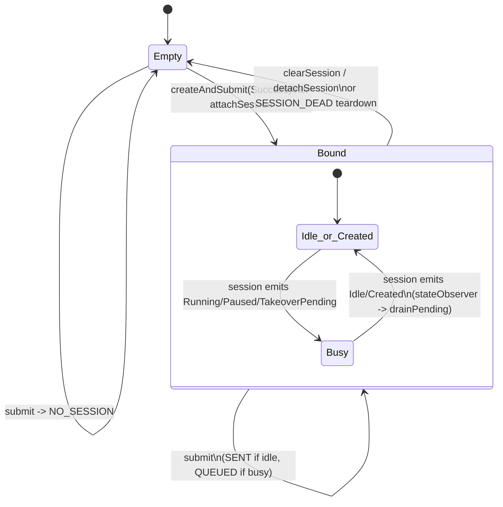
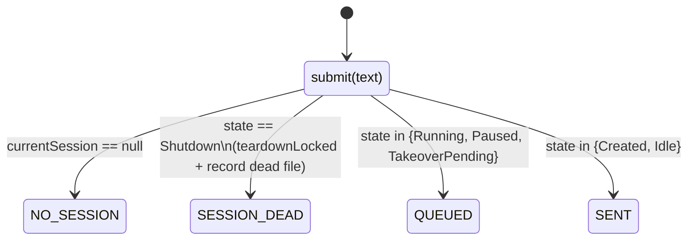

# Session Coordinator (Submit Queue)

## Owner

- `app/src/main/kotlin/ai/closepaw/session/SessionCoordinator.kt`

## Role

Front-door for user inputs into the active `AgentSession`. Owns:
- A single nullable `currentSession` reference.
- A FIFO `pendingInputs: MutableList<String>` used while the session is busy.
- A `Mutex` serializing creation, submission, draining, and teardown.
- A `stateObserverJob` that triggers automatic drain when the session enters `Idle` or `Created`.

## States

The coordinator does not have a named FSM, but its observable status forms one. Effective states:

| State | `currentSession` | Inferred from |
|---|---|---|
| `Empty` | `null` | initial / after `clearSession` / `detachSession` / `teardownLocked` |
| `Bound-Live` | non-null, `session.state.value != Shutdown` | between `createAndSubmit Success` and any teardown |
| `Bound-Dead` | non-null, but next `submit` observes `SessionState.Shutdown` | transient — caller's `submit` immediately tears down and returns `SESSION_DEAD` (SessionCoordinator.kt:57-62) |

## SubmitResult

Sealed enum returned from `submit(text)` (SessionCoordinator.kt:228-238):

| Value | Meaning | When |
|---|---|---|
| `SENT` | Forwarded to session immediately as `Op.UserInput` | `currentSession.state ∈ {Created, Idle}` (default branch, SessionCoordinator.kt:67-70) |
| `QUEUED` | Appended to `pendingInputs`; will drain on next `Idle`/`Created` transition | `currentSession.state ∈ {Running, Paused, TakeoverPending}` (SessionCoordinator.kt:63-66) |
| `NO_SESSION` | No session bound | `currentSession == null` (SessionCoordinator.kt:54-55) |
| `SESSION_DEAD` | Session was already `Shutdown`; coordinator records `lastDeadSessionFileName` and tears down | `currentSession.state == Shutdown` (SessionCoordinator.kt:57-62) |

## CreateResult

Returned from `createAndSubmit(text, create)` (SessionCoordinator.kt:241-248):

| Value | Meaning |
|---|---|
| `Success` | Lock acquired, factory returned a session, first input submitted, drain attempted |
| `LockBusy` | `mutex.tryLock()` failed; caller should fall back to `enqueue(text)` |
| `Aborted` | Factory returned `null` (e.g. non-reloadable checkpoint); `pendingInputs` cleared |

## Diagram

## Invariants

- Only one `stateObserverJob` is alive per bound session (`stateObserverJob?.cancel()` before launching, SessionCoordinator.kt:199-200).
- `pendingInputs` only drains while `mutex` is held, and only while `session.state` is in `{Idle, Created}` (SessionCoordinator.kt:219-225).
- On `SESSION_DEAD`, the coordinator records the dead session's file name **before** teardown so callers can offer auto-reload via `consumeDeadSessionFileName()` (SessionCoordinator.kt:58-61, 164-168).
- `createAndSubmit` uses `tryLock` (non-suspending) so concurrent creation attempts return `LockBusy` instead of stacking up.
- `enqueue` is **not** mutex-guarded (SessionCoordinator.kt:128-130) — the doc-comment requires main-thread confinement. Same for `attachSession` / `detachSession` (SessionCoordinator.kt:139-157).

## Persistence

Nothing in the coordinator is durable. `pendingInputs` is lost on process death; the `lastDeadSessionFileName` hint is also in-memory only (its source — the recording service — is durable).

## Entry / exit side-effects

| Operation | Side-effects |
|---|---|
| `createAndSubmit` | Calls factory (which may create platform/services), assigns `currentSession`, launches state observer, submits first `Op.UserInput`, drains pending under lock (SessionCoordinator.kt:98-117) |
| `submit` (SENT path) | `session.submit(Op.UserInput(text))` |
| `submit` (SESSION_DEAD path) | Records dead-session file name, then `teardownLocked` (SessionCoordinator.kt:57-62, 191-196) |
| `clearSession` | `session.submit(Op.Shutdown)`, `delay(SHUTDOWN_GRACE_DELAY_MS=100)`, `teardownLocked` (SessionCoordinator.kt:173-189) |
| `detachSession` | Cancels observer, clears state — does **not** shut down the session (SessionCoordinator.kt:151-157) |
| stateObserver collector | On `Idle`/`Created`, calls `drainPending` which acquires the mutex and drains FIFO until empty or state changes (SessionCoordinator.kt:198-225) |

## Error / recovery paths

- Exceptions thrown by `clearSession`'s `Op.Shutdown` are swallowed (logged as warnings) so teardown still runs (SessionCoordinator.kt:181-183).
- If `createAndSubmit` factory throws, the exception propagates; `mutex` is released by `finally` but `currentSession` is never assigned and pending inputs remain. UNCONFIRMED — caller (MainActivity / AgentService) must handle.
- A drain that observes a state change mid-loop simply breaks; remaining inputs stay queued for the next `Idle`/`Created` transition (SessionCoordinator.kt:219-225).

## Open questions / smells

- `attachSession` / `detachSession` are documented as main-thread-only but are not mutex-guarded; concurrent `submit` from another coroutine could observe a half-installed session. Caller-enforced confinement is the only safety net.
- `enqueue` is also main-thread-only and unguarded; dropped/duplicated input is possible if invoked off-thread.
- `SESSION_DEAD` triggers teardown inside `submit` itself — the calling code must immediately recreate or the user input is lost (it is **not** retained for replay).
- `createAndSubmit`'s `Aborted` path clears all pending inputs (SessionCoordinator.kt:106-107). Any inputs queued via `enqueue` while a creation was in progress are silently dropped.
- `stateObserver` collects every state change but only acts on two values; idle timeout's `Shutdown` will not trigger a drain — by design, but a stale `pendingInputs` will sit in memory until `detachSession`/`clearSession`.
