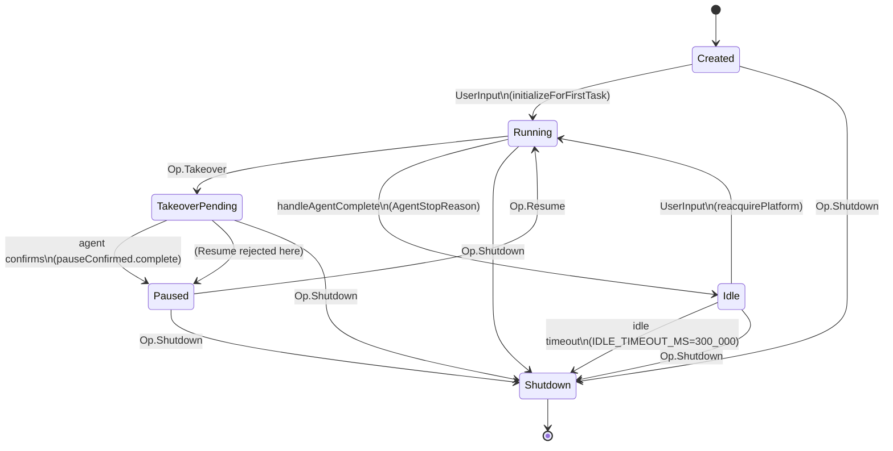

# Session State

## Owner

- `app/src/main/kotlin/ai/closepaw/protocol/SessionState.kt` (state definitions)
- `app/src/main/kotlin/ai/closepaw/session/AgentSession.kt` (transition logic, mutex)

## States

| State | Data | Notes |
|---|---|---|
| `Created` | none (data object) | Fresh session, platform not yet started. Initial value of `_state` (AgentSession.kt:229). |
| `Running` | none | A task is in flight; agent runner is active. |
| `Idle` | none | "Hot Idle" between tasks — platform stays alive, lightweight conversation state retained, idle-timeout job armed. |
| `TakeoverPending` | none | User asked to pause; waiting for agent to reach end-of-turn pause point. Resume is rejected here (AgentSession.kt:535-538). |
| `Paused` | none | Agent confirmed cooperative pause. |
| `Shutdown` | none | Terminal. All resources cleaned up, completions channel closed. |

`SessionState` is a `sealed interface` with `data object` instances (SessionState.kt:33-50).

## Transitions

| From | To | Trigger | Guard |
|---|---|---|---|
| `Created` | `Running` | `Op.UserInput` (AgentSession.kt:304-316, 397-399) | Recording + `platform.start()` succeed (AgentSession.kt:361-378) |
| `Created` | `Shutdown` | `Op.Shutdown` (AgentSession.kt:284) | none |
| `Running` | `Idle` | Agent runner emits `AgentStopReason` → `handleAgentComplete` (AgentSession.kt:422-486) | Not already `Shutdown` |
| `Running` | `TakeoverPending` | `Op.Takeover` (AgentSession.kt:504-516) | `state == Running` |
| `TakeoverPending` | `Paused` | Agent's `pauseConfirmed` deferred completes (AgentSession.kt:519-530) | `state == TakeoverPending` after await |
| `Paused` | `Running` | `Op.Resume` (AgentSession.kt:533-550) | `state == Paused` (rejects from `TakeoverPending`) |
| `Idle` | `Running` | `Op.UserInput` (AgentSession.kt:311-316, 397-399) | `reacquirePlatform()` succeeds |
| `Idle` | `Shutdown` | Idle timeout job fires after `IDLE_TIMEOUT_MS=300_000` (AgentSession.kt:56, 710-718) | none |
| any non-Shutdown | `Shutdown` | `Op.Shutdown` or idle timeout (AgentSession.kt:593-700) | Idempotent guard at line 595 |
| `Running` / `TakeoverPending` | (signals stop) | `Op.Interrupt` (AgentSession.kt:580-591) | Calls `agentRunner.stop()` + `cancelJob()`; the actual transition to `Idle` follows from `handleAgentComplete` |

`Op.Supplement`, `Op.UserResponse`, `Op.Approve` do **not** change `SessionState` — they mutate history / approval / response channels and are routed without taking the lifecycle mutex (AgentSession.kt:286-289).

## Diagram

## Invariants

- All transitions go through `lifecycleMutex` (AgentSession.kt:236), except `Op.Takeover` which deliberately drops the lock during `confirmed.await()` so concurrent Ops can observe `TakeoverPending` and reject (AgentSession.kt:504-531).
- `Shutdown` is terminal — `handleShutdown` early-returns when already in `Shutdown` (AgentSession.kt:595-598).
- After `Idle`, exactly one `idleTimeoutJob` is scheduled at a time (`scheduleIdleTimeout` cancels prior, AgentSession.kt:710-713).
- `Op.UserInput` is rejected when `state in {Running, Paused, TakeoverPending}` (AgentSession.kt:305-309) — the queue lives in `SessionCoordinator`, not here.
- `currentTaskId` is non-null iff the latest transition originated from `startTask` and `handleAgentComplete`/`handleShutdown` have not yet cleared it.

## Persistence

Durable (via `SessionCheckpointCoordinator`):
- History items, todos, scratchpad → checkpointed on every mutation while `_state.value` is non-Shutdown (AgentSession.kt:256-258).
- `flushIdleReady()` runs on `Running → Idle` (AgentSession.kt:459).
- `flushClosed()` runs on any `→ Shutdown` (AgentSession.kt:670 region).

Transient (lost on process death):
- The `SessionState` value itself — recomputed at reload via `AgentSession.reload(...)` which always returns a session in `Created` state (AgentSession.kt:121-217).
- `currentTaskId`, `idleTimeoutJob`, in-flight pending approvals, agent runner state.

## Entry / exit side-effects

| Transition | Side-effects |
|---|---|
| `Created → Running` (first task) | `recordingService.initializeNewSession`, `platform.start()`, emit `SessionStarted` + `TaskStarted`, agent runner `start` (AgentSession.kt:361-415) |
| `Idle → Running` | `cancelIdleTimeout()`, idempotent `platform.start()`, emit `TaskStarted`, agent runner `start` (AgentSession.kt:380-415) |
| `Running → Idle` | `traceRecorder.flush()`, emit `TaskCompleted`, `checkpointCoordinator.flushIdleReady()`, `agentRunner.clear()`, `scheduleIdleTimeout()` (AgentSession.kt:437-486) |
| `Running → TakeoverPending` | `agentRunner.pause()` (returns Deferred); release mutex while awaiting (AgentSession.kt:504-518) |
| `TakeoverPending → Paused` | Re-acquire mutex; emit `SessionTakeover` (AgentSession.kt:519-530) |
| `Paused → Running` | `agentRunner.resume()`, emit `SessionResumed` (AgentSession.kt:543-550) |
| any → `Shutdown` | If task active, emit `TaskCompleted(USER_STOPPED)`; `cancelIdleTimeout()`, `flushClosed()`, disable mutation listeners, cancel `userResponseChannel`, `agentRunner.shutdown()` + close completions channel, `services.cleanup()`, emit `SessionCompleted` with `SessionEndReason` derived from `ShutdownCause`: `UserRequested→USER_STOPPED`, `IdleTimeout→IDLE_TIMEOUT`, `ReacquireFailed→INTERRUPTED` (AgentSession.kt:593-700) |

## Error / recovery paths

- Bootstrap failure on `Created → Running`: `initializeForFirstTask` returns false → emit synthetic `TaskStarted` + `SessionError`; **state stays `Created`** (AgentSession.kt:304-360).
- Bootstrap failure on `Idle → Running`: `reacquirePlatform` returns false; idle timeout is **re-armed** so the session does not leak in `Idle` (AgentSession.kt:380-395).
- Agent runner exception → propagates as `AgentStopReason.Error` through the completions channel → handled by `handleAgentComplete` like any other stop reason.
- Checkpoint flush failure on `Running → Idle` is non-fatal — emits a status warning, session stays in `Idle` (AgentSession.kt:459-464).

## Open questions / smells

- `handleSupplement` allows `Paused`/`TakeoverPending` to receive supplements (AgentSession.kt:552). That is by design but means user text mutates history while the agent is mid-pause; downstream consumers must be tolerant.
- `Op.Takeover` is the only operation that releases `lifecycleMutex` during `await()`. If the agent never confirms (e.g. crash inside the runner before `pauseConfirmed.complete`), the suspended takeover handler relies on the `finally` block in `Agent.run` (Agent.kt:191-195) to complete the deferred. UNCONFIRMED — needs verification that all agent error paths reach that finally.
- `handleInterrupt` does not transition `_state.value` directly; it defers to the agent runner emitting `UserRequested`. If the runner cannot be cancelled, the session is effectively stuck in `Running` until shutdown.
- `attachSession` / `detachSession` in `SessionCoordinator` bypass any state validation against the attached session — see [session_coordinator.md](session_coordinator.md).
