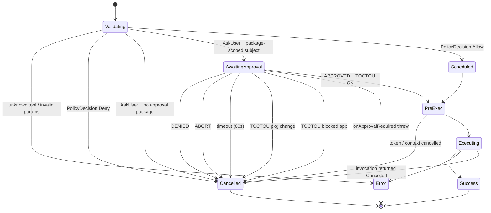

# Tool Call Lifecycle

## Owner

- `app/src/main/kotlin/ai/closepaw/tool/ToolCallState.kt` (state definitions)
- `app/src/main/kotlin/ai/closepaw/tool/ToolRouter.kt` (transition logic, approval mediation, cancellation)

## States

`ToolCallState` is a `sealed class`; every variant carries `callId: String`, `toolName: String`, `params: JSONObject` (ToolCallState.kt:24-32). Specific data:

| State | Extra data | Terminal? |
|---|---|---|
| `Validating` | — | no |
| `Scheduled` | `invocation: ToolInvocation` | no |
| `AwaitingApproval` | `invocation`, `description: String`, `requestedAt: Long` | no |
| `Executing` | `invocation`, `startedAt: Long` | no |
| `Success` | `result: ToolExecutionResult.Success`, `completedAt: Long` | yes |
| `Error` | `error: String`, `exception: Throwable?` | yes |
| `Cancelled` | `reason: String`, `decision: ApprovalDecision?` | yes |

`isTerminal()` returns true only for `Success`/`Error`/`Cancelled` (ToolCallState.kt:113).

## Transitions (ToolRouter.execute)

| From | To | Trigger | Guard / Notes |
|---|---|---|---|
| (entry) | `Validating` | `execute(...)` called | initial state set at ToolRouter.kt:80 |
| `Validating` | `Error` | `registry.get(toolName) == null` | `"Unknown tool: …"` (ToolRouter.kt:84-90) |
| `Validating` | `Error` | `tool.validate(params) is Invalid` | aggregated error message (ToolRouter.kt:93-100) |
| `Validating` | `Cancelled` | `policyDecision is Deny` | reason carries policy reason (ToolRouter.kt:115-123) |
| `Validating` | `Cancelled` | `policyDecision is AskUser` but no valid approval package exists | fails closed before `onApprovalRequired` |
| `Validating` | `AwaitingApproval` | `policyDecision is AskUser` and `destinationPackage ?: packageName` is valid | creates `pendingApprovals[callId]` deferred BEFORE invoking `onApprovalRequired` |
| `Validating` | `Scheduled` | `policyDecision is Allow` | (ToolRouter.kt:243-247) |
| `AwaitingApproval` | `Error` | `onApprovalRequired` callback throws | clears pending, emits `"Approval request failed: …"` (ToolRouter.kt:152-164) |
| `AwaitingApproval` | `Cancelled` | approval deferred not completed within `APPROVAL_TIMEOUT_MS = 60_000` | reason `"Approval timed out"`, decision = null (ToolRouter.kt:168-184) |
| `AwaitingApproval` | `Cancelled` | decision == `DENIED` | reason `"User denied"` (ToolRouter.kt:189-196) |
| `AwaitingApproval` | `Cancelled` | decision == `ABORT` | reason `"User aborted"` — also raised by `cancel`/`cancelAll` (ToolRouter.kt:197-204, 348-365) |
| `AwaitingApproval` | `Cancelled` | TOCTOU: foreground package changed during approval wait | `"App changed during approval wait"` (ToolRouter.kt:206-219) |
| `AwaitingApproval` | `Cancelled` | TOCTOU: original package unknown but current foreground is BLOCKED | `"Blocked app detected after approval"` (ToolRouter.kt:220-235) |
| `AwaitingApproval` | (continue → Executing) | decision == `APPROVED` AND TOCTOU checks pass | sets `approvalWasRequired = true` so snapshot is re-captured before exec (ToolRouter.kt:205-239, 263-270) |
| `Scheduled` / (post-approval) | `Cancelled` | `context.isCancelled() || token.isCancelled()` checked before exec | `"Cancelled before execution"` (ToolRouter.kt:251-256) |
| `Scheduled` / (post-approval) | `Executing` | passes pre-exec cancel check | (ToolRouter.kt:259-260) |
| `Executing` | `Success` | `invocation.execute(...) is ToolExecutionResult.Success` | (ToolRouter.kt:289-298) |
| `Executing` | `Error` | `invocation.execute(...) is Failure` OR throws | exceptions wrapped via try/catch at ToolRouter.kt:281-285, then mapped at 300-306 |
| `Executing` | `Cancelled` | `invocation.execute(...) is Cancelled` | reason from invocation (ToolRouter.kt:308-312) |

`cleanupCall` runs in a `finally` for the post-policy path (ToolRouter.kt:314-317) so `activeToolCalls` and `cancellationTokens` are always purged on terminal state. The pre-policy paths (`Error` from validation, `Cancelled` from `Deny`) call `cleanupCall` explicitly.

## Diagram

## Invariants

- Approval prompts are package-scoped. `ToolRouter` sends `destinationPackage ?: packageName` in `ApprovalDetails.packageName`; `open_app` uses the destination app when it can be resolved.
- `pendingApprovals[callId]` is set **before** `onApprovalRequired` is invoked, eliminating the race where a fast approval responder calls `resolveApproval` before the deferred exists (ToolRouter.kt:137-138 comment).
- `activeToolCalls` only ever holds non-terminal states (`updateState` checks `!isTerminal()` before insertion, ToolRouter.kt:382-387).
- Exactly one cancellation token per `callId` (ToolRouter.kt:74-75).
- `approvalWasRequired` triggers a fresh snapshot capture **with** perception-gate masking before execution (ToolRouter.kt:263-270).
- `cancel(callId)` does not remove from `activeToolCalls`; it signals the token + completes the approval deferred with `ABORT`. The executing coroutine reaches a terminal state and `cleanupCall` does the removal (ToolRouter.kt:344-352).
- `cancelAll()` clears `pendingApprovals` map after completing all deferreds, but leaves `activeToolCalls` for the executing coroutines to clean up (ToolRouter.kt:360-365).

## Persistence

None. All maps (`activeToolCalls`, `cancellationTokens`, `pendingApprovals`) are in-memory `ConcurrentHashMap`s scoped to the `ToolRouter` instance, which is itself scoped to a single `SessionServices` (and therefore a single `AgentSession`).

The approval allow-list mutated by `AgentSession.handleApproval` (`policyEngine.allowPackageForSession` / `…Persistent`) **is** persisted, but the tool-call FSM itself is not.

## Entry / exit side-effects

| Transition | Side-effects |
|---|---|
| Any state change | `updateState` updates `activeToolCalls` (if non-terminal) and invokes the `onStateChange` callback (ToolRouter.kt:382-388) |
| `Validating → Cancelled` for missing approval package | Fails closed before UI; no pending approval is registered |
| `Validating → AwaitingApproval` | Creates `CompletableDeferred<ApprovalDecision>`, registers in `pendingApprovals`, invokes `onApprovalRequired(ApprovalDetails)` |
| `AwaitingApproval → Cancelled` (any reason) | Removes from `pendingApprovals` (in `finally`) and runs `cleanupCall` |
| `→ Executing` after approval | Re-captures screen snapshot via `platform.captureScreen` + perception-gate mask (ToolRouter.kt:262-270) |
| Execution | Runs `invocation.execute(execContext)`; uncaught exception → `Failure` |
| Terminal | `cleanupCall(resolvedCallId)` removes from `activeToolCalls` and `cancellationTokens` |

## Error / recovery paths

- Validation errors and unknown tool produce `Error` directly with no execution.
- `Deny` produces `Cancelled` (not `Error`) so callers can distinguish policy block from runtime failure.
- Execution exceptions are wrapped by the `try/catch` (ToolRouter.kt:281-285) and reported as `Error` with the exception attached.
- The wrapping `try { … } finally { cleanupCall }` (ToolRouter.kt:288-317) guarantees cleanup even if `updateState` or the callback throws.

## Open questions / smells

- The `Scheduled` state is reachable but immediately followed by either `Cancelled` (cancel check) or `Executing`; UI consumers will see it for a single tick. UNCONFIRMED whether any code actually filters on `Scheduled`.
- `cancel(callId)` does **not** remove from `activeToolCalls` — relies on the executing coroutine to terminate. If the tool's `execute` ignores `isCancelled()`, the call lingers. UNCONFIRMED whether all `ToolInvocation` implementations honor the flag promptly.
- TOCTOU recheck only fires after `APPROVED` decision (ToolRouter.kt:206-236). For `Allow` policy decisions, no recheck happens between the policy verdict and execution — so a fast app switch between policy-check and `Executing` can still result in a tool acting on a different foreground app than was checked.
- The doc-comment at the top of `ToolCallState.kt:8-22` shows a pre-Gemini-style flow that does not match the current code (no `Scheduled` mentioned in the ASCII art). Source of truth is the `sealed class` itself plus `ToolRouter.execute`, not the comment.
- `APPROVAL_TIMEOUT_MS` is a private constant (60s); no per-session override.
