# Smart Capsule UI State Machine

Authoritative reference for the Smart Capsule's user-facing finite state machine.

**Owner code**:
- States: `app/src/main/kotlin/ai/closepaw/ui/overlay/model/CapsuleMode.kt`
- Transitions: `app/src/main/kotlin/ai/closepaw/ui/overlay/CapsuleStateHolder.kt`
- Render mapping: `app/src/main/kotlin/ai/closepaw/ui/overlay/model/CapsuleRenderSpec.kt`
- Nav visibility: `NavSpec` (same file as `CapsuleRenderSpec`)
- Renderer: `app/src/main/kotlin/ai/closepaw/ui/capsule/surface/SmartCapsuleSurface.kt`
- Tests: `app/src/test/kotlin/ai/closepaw/ui/overlay/CapsuleStateHolderTest.kt`,
  `CapsuleApprovalTransitionTest.kt`, `model/CapsuleRenderSpecTest.kt`, `model/NavSpecTest.kt`

> -> See: [`doc/main/ui/capsule/state_machine.md`](../ui/capsule/state_machine.md) for the broader location/visibility decision machine (CapsuleMode × OverlayUserLocation × ShowPreference) layered on top of this FSM.

## Why this exists

The capsule is the primary surface where the agent talks back to the user. Every visual
state in the overlay and in the in-app chat header is derived from a single
`CapsuleMode`. No boolean soup, no parallel render-only flags — one value drives every
pixel. This document is the source of truth for what state we can be in, how we get
there, and what the user sees.

## States

`CapsuleMode` is a sealed interface with nine states.

| State | Trigger | What user sees |
|---|---|---|
| `Hidden` | Initial / session ended / Done auto-hides / Error dismissed | No dot, no thought, no control bar; the input bar is still rendered with the idle prompt "What can I help you with?" so the main-app idle composer remains usable |
| `Running(thought)` | Task started or resumed | Blue pulsing dot + thought; `[Takeover]` `[Stop]`; input row "Add note" |
| `TakeoverPending(lastThought)` | User tapped Takeover while Running | Amber dot + "Handing over…"; takeover button disabled, stop available |
| `Takeover(lastThought)` | Agent confirmed pause | Amber dot + dimmed last thought; `[Resume]` `[Stop]` |
| `WaitingForInput(question, callId)` | Agent asked a text question | Expanded body shows question; input row hint "Type your response…" |
| `WaitingForAction(instruction, callId)` | Agent asked the user to do something on the phone | Expanded body shows instruction; `[Done]` button; input row hidden |
| `WaitingForApproval(callId, …)` | Agent needs approval to operate an app | Status line asks `Allow ClosePaw to operate {AppName}?`; no expanded body; `[Always]` `[Session]` `[Reject]` |
| `Done(message)` | Task completed (any non-ERROR outcome) | Teal dot + checkmark message; auto-hides after 3 s |
| `Error(message)` | Task ended in ERROR / `onError()` called | Red dot + warning; `[Close]` button stays until dismissed |

### Sidecar state

These flags live next to `CapsuleMode` on `CapsuleStateHolder` because they are
orthogonal to the mode:

- `isStopPending: StateFlow<Boolean>` — transient "Stopping…" disabled-button feedback.
  Cleared by every terminal event and by `onTaskStarted`.
- `isAgentMidTurn: StateFlow<Boolean>` — drives supplement-confirmation UI.
  Cleared on `onResumed`.
- `previousMode: CapsuleMode` — last value of `mode`, used for transition animations
  and to decide whether to clear the input field on entering `WaitingForInput`.
- `turnPhase: StateFlow<TurnPhase?>` — feeds glow derivation only, not capsule mode.

## Transition matrix

```mermaid
stateDiagram-v2
    [*] --> Hidden

    Hidden --> Running: onTaskStarted
    Hidden --> Error: onError

    Running --> Running: onThoughtUpdate
    Running --> TakeoverPending: onTakeoverRequested
    Running --> Takeover: onTakeoverConfirmed (skip pending)
    Running --> WaitingForInput: onAskUser(QUESTION)
    Running --> WaitingForAction: onAskUser(ACTION)
    Running --> WaitingForApproval: onApprovalRequired

    TakeoverPending --> Takeover: onTakeoverConfirmed
    TakeoverPending --> Running: onResumed

    Takeover --> Running: onResumed

    WaitingForInput --> Running: onUserResponseSent (matching callId)
    WaitingForAction --> Running: onUserResponseSent (matching callId)
    WaitingForApproval --> Running: onApprovalResolved (matching callId)

    Running --> Done: onTaskCompleted (non-ERROR)
    TakeoverPending --> Done: onTaskCompleted (non-ERROR)
    Takeover --> Done: onTaskCompleted (non-ERROR)
    WaitingForInput --> Done: onTaskCompleted (non-ERROR)
    WaitingForAction --> Done: onTaskCompleted (non-ERROR)
    WaitingForApproval --> Done: onTaskCompleted (non-ERROR)

    Running --> Error: onTaskCompleted(ERROR) / onError
    TakeoverPending --> Error: onTaskCompleted(ERROR) / onError
    Takeover --> Error: onTaskCompleted(ERROR) / onError
    WaitingForInput --> Error: onTaskCompleted(ERROR) / onError
    WaitingForAction --> Error: onTaskCompleted(ERROR) / onError
    WaitingForApproval --> Error: onTaskCompleted(ERROR) / onError

    Done --> Hidden: 3 s auto-hide
    Done --> Running: onTaskStarted (cancels auto-hide)

    Error --> Hidden: onDismissError
    Error --> Running: onTaskStarted

    note right of Hidden: onSessionEnded from any state -> Hidden
```

### Guard rules

Every event below the "universal" line is guarded — if the current state isn't an
allowed source state, the event is silently logged and ignored. This is enforced in
`CapsuleStateHolder` and tested in `CapsuleStateHolderTest` /
`CapsuleApprovalTransitionTest`.

| Event | Allowed source states | Notes |
|---|---|---|
| `onTaskStarted` | Any | Universal; cancels auto-hide, clears `isStopPending` |
| `onError` | Any | Universal |
| `onAskUser` | Any | Universal; replaces mode |
| `onApprovalRequired` | Any | Universal; replaces mode |
| `onSessionEnded` | Any | Always returns to `Hidden` |
| `onThoughtUpdate` | `Running` only | Silently dropped otherwise |
| `onTakeoverRequested` | `Running` only | |
| `onTakeoverConfirmed` | `Running`, `TakeoverPending` | Pending is the normal path |
| `onResumed` | `Takeover`, `TakeoverPending` | Resets `turnPhase` and `isAgentMidTurn` |
| `onUserResponseSent(callId)` | `WaitingForInput`, `WaitingForAction` | callId must match |
| `onApprovalResolved(callId)` | `WaitingForApproval` | callId must match |
| `onStopRequested` | Active modes only (`Running`, `TakeoverPending`, `Takeover`, `WaitingFor*`) | Returns `false` from `Hidden`/`Done`/`Error`; idempotent (second call returns `false`) |
| `onTaskCompleted` | Active modes only | Ignored from `Hidden`/`Done`/`Error` |
| `onDismissError` | `Error` only | |

## Render derivation

`CapsuleRenderSpec.from(mode, previousMode, isStopPending)` is a pure function that
maps `CapsuleMode → CapsuleRenderSpec`. Both the in-app composable and the overlay
host read this spec — there is no second renderer with its own logic.

The spec has five parts:
- `dot` — status dot color + pulse
- `thought` — status-line text + alpha
- `expandedBody` — optional detail body (questions and instructions; approval prompts keep this empty)
- `buttons` — control-bar button slots (`primary`, `secondary`, `stop`)
- `input` — optional input-bar spec (`hint`, `submitLabel`, `clearDraft`)

`NavSpec.from(context, platformMode, hasIsland, mode)` separately derives navigation
button visibility (minimize / open-app / open-watch). Nav visibility depends on
context + platform **and** mode, but the mode-dependence is limited to a few
narrow rules — that is why it lives in its own spec rather than inside
`CapsuleRenderSpec`:

- When `mode is Done`, the entire control bar (and its nav cluster) hides
  regardless of context — `Done` is a "calm" state with only the auto-fade message.
- `showMinimize` additionally hides whenever the user is being asked to act or
  decide (`WaitingForInput`, `WaitingForAction`, `WaitingForApproval`) or when
  the capsule is in `Error`, so the user cannot dismiss a prompt by minimising.
- `showApp` and `showWatch` depend only on context + platform.

## Input behavior

The input bar is rendered only when `renderSpec.input != null`. It is enabled when:

- `context == MAIN_APP`, OR
- the device is *not* in `PlatformMode.ACCESSIBILITY` while `Running` /
  `TakeoverPending` (in accessibility mode the user must Takeover first to type).

On entering `WaitingForInput` from any other mode, `clearDraft = true` resets the
field so a stale draft doesn't leak into a Q&A response. Submitting routes to:

| Mode | Routed callback |
|---|---|
| `Hidden` | `onSend` (start a new task) |
| `WaitingForInput` | `onUserResponse(callId, text)` |
| anything else | `onSupplement(text)` (mid-task amendment) |

## Sidecar lifecycle

`isStopPending` is set true by `onStopRequested` (in active modes) and cleared by:
- `onTaskStarted` (next task)
- `onTaskCompleted` (terminal)
- `onError`
- `onSessionEnded`
- `onDismissError`

Auto-hide is a coroutine that fires `setMode(Hidden)` 3 s after entering `Done`. It
is cancelled by `onTaskStarted`, `onError`, and `onSessionEnded`. If the mode has
already moved off `Done` when the timer fires, the transition is suppressed.

## Invariants

1. **Single source of truth.** `_mode.value` is the only thing that drives capsule
   appearance. No view reaches into the holder for "secret" state.
2. **All events are total.** Any event can be called in any state; invalid pairings
   are dropped, never crash.
3. **previousMode tracks the last accepted mutation** — every `setMode` snapshots
   the prior value first.
4. **Approval is callId-scoped.** A stale `onApprovalResolved` for a closed approval
   leaves state untouched.
5. **Positive approval is app-scoped.** `Always` writes the persistent allow-list,
   `Session` writes the session allow-list, and both require a resolved app package
   before the prompt is shown.
6. **Reject is current-call only.** It cancels the pending approval/tool call and
   does not create a session or persistent deny-list.
7. **Stop is one-shot.** A second `onStopRequested` while pending returns `false` so
   the controller knows not to send a duplicate stop.
