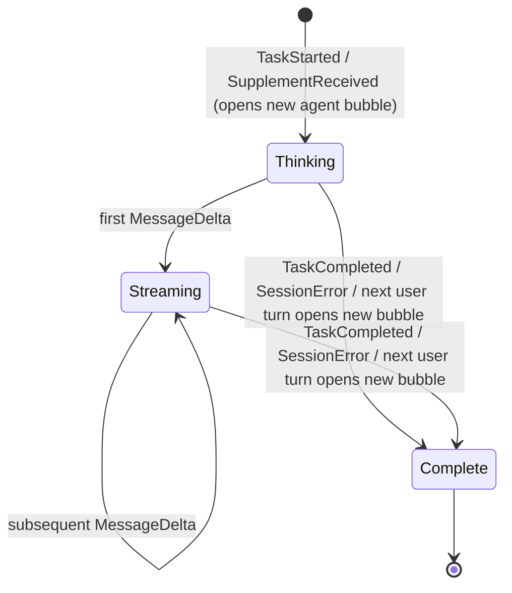
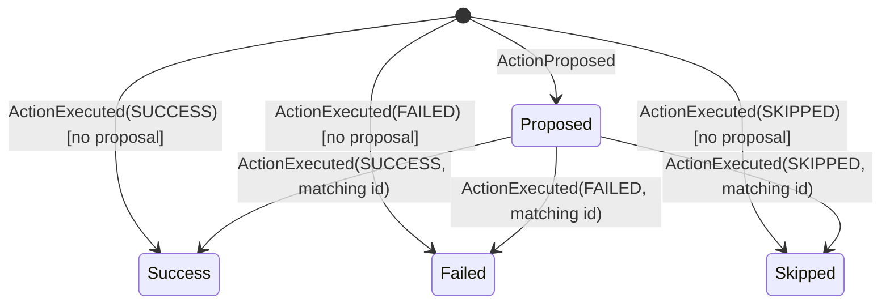
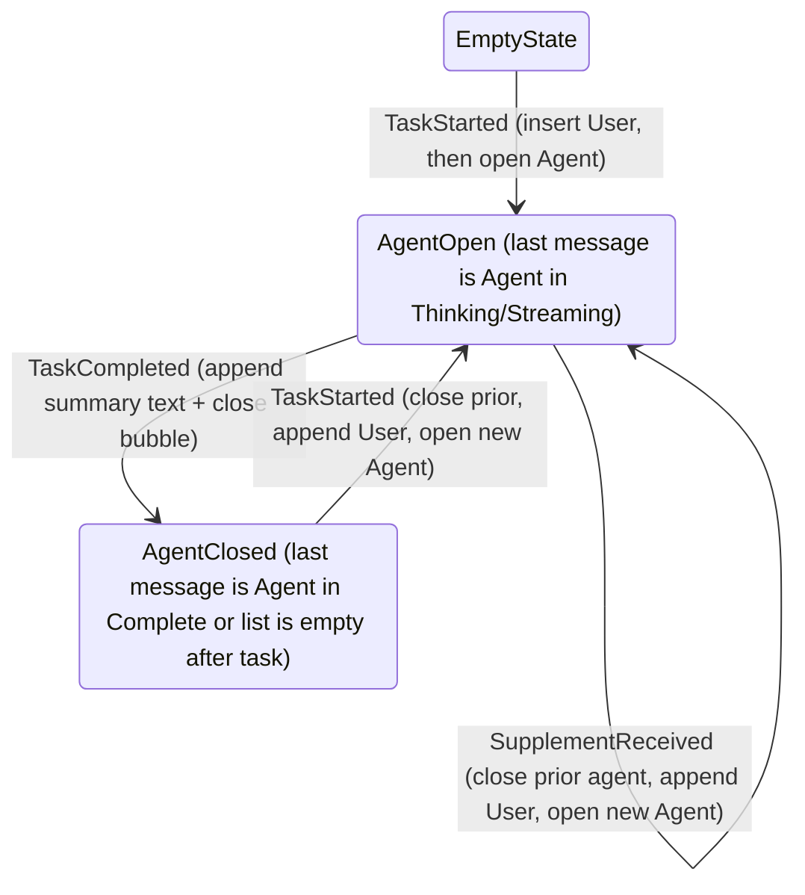
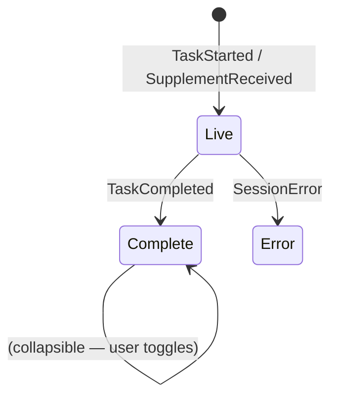

# Chat UI State Machine

Authoritative reference for how the chat screen translates `AgentEvent` streams into
the visible message timeline.

**Owner code**:
- Message types & per-message state: `app/src/main/kotlin/ai/closepaw/ui/chat/model/ChatMessage.kt`
- Reducer (event → state): `app/src/main/kotlin/ai/closepaw/ui/chat/ChatEventReducer.kt`
- Hosting view-model: `app/src/main/kotlin/ai/closepaw/ui/chat/ChatViewModel.kt`
- Renderer: `app/src/main/kotlin/ai/closepaw/ui/chat/ChatScreen.kt`,
  `app/src/main/kotlin/ai/closepaw/ui/chat/components/MessageBubble.kt`
- Tests: `app/src/test/kotlin/ai/closepaw/ui/chat/ChatEventReducerTest.kt`,
  `ChatSupplementAndActionTransitionTest.kt`,
  `ChatActionExecutionMappingTest.kt`, `ChatCompletionMessageTest.kt`,
  `ChatCompletionSummaryTest.kt`, `ChatViewModelTest.kt`

## Why this exists

The chat screen is a thin, pure projection of an event stream — it must never
"remember" anything that is not in the event log, because the same projection runs on
fresh sessions and on reloaded history. This document fixes the contract so the
projection cannot silently drift during refactors.

There are two interlocking machines:

1. **Per-`Agent`-message state** — the streaming lifecycle of a single bubble.
2. **Conversation timeline** — how user/agent bubbles get appended and split.

## Per-message state: `AgentMessageState`

| State | Meaning | Visual |
|---|---|---|
| `Thinking` | Bubble created, no text deltas yet | Animated thinking indicator |
| `Streaming` | At least one `MessageDelta` accumulated | Text + blinking cursor |
| `Complete` | Bubble is closed; no further mutations expected | Plain text, no cursor |

Action cards (`ContentBlock.Action`) live inside the same bubble alongside text
blocks; their lifecycle is described below and is **independent** of the parent
bubble's `AgentMessageState`. A `Complete` bubble can still contain action cards in
non-terminal `ActionState` if the session ended mid-execution — the renderer just
stops animating them.

## Action lifecycle: `ActionState`

Each `ActionCardData` lives inside its parent `Agent.contentBlocks` and walks its own
state machine, sourced from `ActionProposed` / `ActionExecuted`.

`ActionExecuted` matches against the **most recent** action with the same `actionId`
in the bubble's content blocks. If no match is found the reducer synthesises a new
action card directly in the executed state — this keeps the timeline correct even
when the proposal event is lost or comes from a replayed log.

`Executing` is declared in `ActionState` but the current reducer never emits it —
`ActionProposed` lands directly in `Proposed` and `ActionExecuted` jumps straight to
`Success`/`Failed`/`Skipped`.

## Conversation timeline

The timeline is a `SnapshotStateList<ChatMessage>` mutated by `ChatEventReducer`
under `stateLock`. Every event is a structural mutation rule on that list.

### Event-by-event semantics

| Event | Effect on timeline |
|---|---|
| `TaskStarted` | `showEmptyState = false`. Close current `Agent` (idempotent). Append `User(text)`. Open new `Agent(id = taskId, state = Thinking, blocks = [])`. Clear streaming buffer. |
| `TurnStarted` | Clear streaming buffer only. (Each turn restarts text accumulation; action cards persist.) |
| `TurnPhaseChanged` | No-op for chat. |
| `MessageDelta` | Append delta to `streamingBuffer`; replace the trailing `ContentBlock.Text`, or append a new Text block if the last block is an Action or the bubble is empty (the first-delta case); set state `Streaming`. |
| `ActionProposed` | Clear `streamingBuffer`; append `ContentBlock.Action(state = Proposed)` to the open agent. (Buffer cleared so the next `MessageDelta` starts a fresh text block after the action card.) |
| `ActionExecuted` | If matching `Proposed` block exists, mutate it in place; otherwise append a new `Action` block already in the executed state. |
| `ThoughtUpdate` | Append a new `ContentBlock.Thought(text)` to the open agent's `contentBlocks`. Each update is a distinct trace item — no merging with the prior Thought (Track A spec §4.1). Empty thoughts are dropped. Streaming buffer is cleared so the next `MessageDelta` starts a fresh Text block. |
| `TaskCompleted` | Append a completion summary text block (per `completionSummary(result)`); set state `Complete`; set `rowState = Complete` (preserved as `Error` if already errored); copy `TaskCompleted.handoff` onto the row (VD-only metadata that drives the post-completion `Open <App>` CTA — see [ui/session/user_flows.md](../ui/session/user_flows.md#vd-completion-handoff)); clear buffer; clear `currentAgentMessageId`. |
| `SessionError` | If an `Agent` exists, append `⚠️ <message>` text block, mark `Complete`, set `rowState = Error`. Otherwise create a fresh `Agent` containing only the error and set `showEmptyState = false`. |
| `SupplementReceived` | Same operation as `TaskStarted` minus the agent-id binding (id is `supplement-<timestamp>`). |
| anything else | Silently ignored (default branch is `else -> Unit`). |

### The "user turn" invariant

`insertUserTurn(text, timestamp, agentId?)` is the canonical operation for *any* user
message arriving mid-conversation, whether from a fresh task (`TaskStarted`) or a
mid-task amendment (`SupplementReceived`). It always:

1. Marks the trailing `Agent` `Complete` (no-op if absent or already complete).
2. Appends a `User` bubble.
3. Opens a fresh `Agent` bubble in `Thinking` with empty content and clears the
   streaming buffer.

The chat UI deliberately does not distinguish between a new task and a supplement —
the user just sees their message split the conversation in the same way.

## Streaming buffer

`streamingBuffer: StringBuilder` is held by `ChatViewModel` and reset by:

- `TaskStarted` / `SupplementReceived` (via `insertUserTurn`)
- `TurnStarted` (each turn starts a fresh text accumulator)
- `ActionProposed` / `ActionExecuted` (when no matching proposal — text after an
  action card is a new text block)
- `ThoughtUpdate` (text after a thought is a new text block — chronological trace)
- `TaskCompleted`

This means after every action card the next chunk of LLM text begins in a *new*
`ContentBlock.Text` rather than fusing into the prior one. Renderers can therefore
interleave thought / action / thought-after-action without ever splicing strings.

## Invariants

1. **Append-only timeline.** Existing `User` bubbles are never mutated; existing
   `Agent` bubbles only mutate the trailing one (the "open" agent message).
2. **At most one open agent message.** Any user-driven event closes the prior agent
   bubble before opening a new one.
3. **Action ordering is preserved.** Action blocks are appended in receipt order;
   `ActionExecuted` mutates the matching block in place rather than reordering.
4. **Errors never silently drop.** `SessionError` always lands in the timeline,
   creating a synthetic agent bubble if necessary.
5. **All mutations are guarded by `stateLock`** — the reducer is safe to call from
   any thread that delivers `AgentEvent`s.

## Row state: `RowState` (Track A spec §5)

A second per-bubble enum drives the chat row's collapse/expand UX, independent
of `AgentMessageState` (which only tracks streaming lifecycle).

| RowState | Meaning | Disclosure |
|---|---|---|
| `Live` | Task in progress | Locked open (auto-tracking) |
| `Waiting` | Awaiting AskUser/Approval reply | Locked open |
| `Complete` | Task finished | Collapsible — default collapsed |
| `Error` | Task errored | Locked open |

Locked-open invariant: rows in `Error` are not downgraded to `Complete` when a
subsequent user turn closes them — the error remains visible in history.
`Waiting` is reserved for future AskUser/Approval routing in the chat reducer
(no current event triggers it; the capsule still owns the live affordance).

## Trace items: `ContentBlock.Thought`

`ThoughtUpdate` events append `ContentBlock.Thought(text)` items into the
chronological trace (same `contentBlocks: List<ContentBlock>` already used for
Text and Action). Ordering invariant from Track A spec §5: trace items appear
in event arrival order with no reordering and no deduplication. Multiple
consecutive `ThoughtUpdate`s become multiple Thought blocks — never merged.
