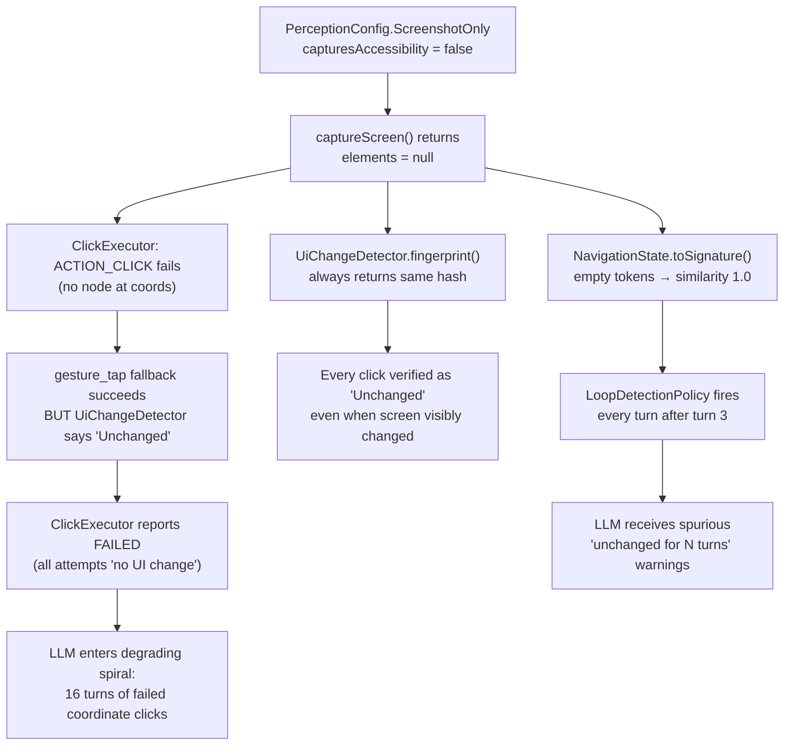
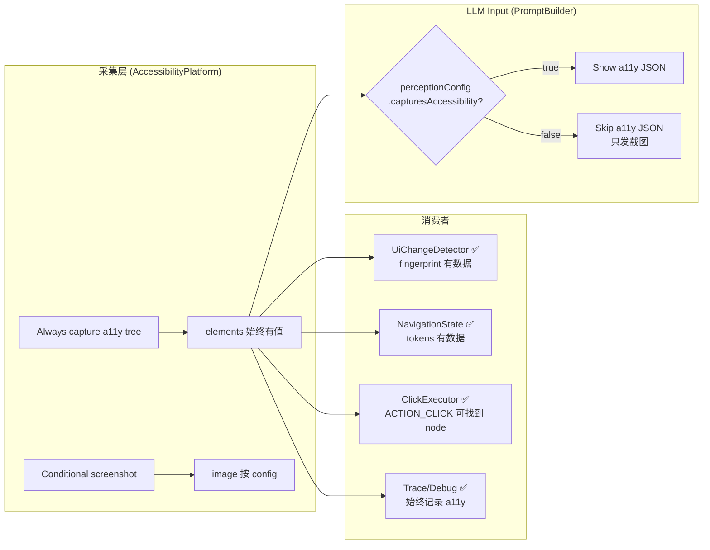

# Stage 2 Design: Always-Collect A11y + Robust Change Detection

## 核心洞察

`final_design.md` 的 Phase 1 实现把 `ScreenshotOnly` 定义为 **不采集 a11y**。这在 debug run 里产生了一系列连锁故障：



用户的想法是：**不要把 a11y collection 和 LLM input 耦合在一起。** 这个洞察从根本上解决了上面所有问题。

---

## 设计方案: Elements Always Present + PromptBuilder Gates

### 核心原则

> `ScreenSnapshot.elements` **始终填充**（不管 perception mode）。`ScreenshotOnly` 的语义从 "不采集 a11y" 变为 "**不把 a11y 展示给 LLM**"。



### 语义变化

| | Phase 1 设计 | Stage 2 设计 |
|---|---|---|
| `elements` | `null` in ScreenshotOnly | **始终有值** |
| `hasAccessibility` | 表示 "是否有 a11y 数据" | **不再需要** — elements 始终非空 |
| `capturesAccessibility` | 控制是否采集 | 控制是否**展示给 LLM** |
| 什么 gate LLM | `snapshot.hasAccessibility` | **`perceptionConfig.capturesAccessibility`** |

---

## 具体改动

### 1. AccessibilityPlatform.captureScreen() — 始终采集

```diff
 override suspend fun captureScreen(): ScreenSnapshot {
     val pc = config.perceptionConfig
     val timestamp = System.currentTimeMillis()

-    // 1. Accessibility capture (only when config requires it)
-    val a11yResult: A11yCaptureResult? =
-            if (pc.capturesAccessibility) {
-                captureAccessibilityTree()
-            } else null
+    // 1. Always capture accessibility tree (for change detection, node finding, trace)
+    val a11yResult = captureAccessibilityTree()

     // 2. Screenshot capture (when config requires it OR trace is enabled)
     val shouldCaptureScreenshot = pc.capturesScreenshot || traceRecorder.enabled
-    val windowId = a11yResult?.windowId
+    val windowId = a11yResult.windowId
     val screenshotCapture =
             captureScreenshotIfEnabled(windowId, enabled = shouldCaptureScreenshot)

     // ... rest unchanged, elements = a11yResult.elements (always non-null now)
```

### 2. PerceptionConfig — 语义澄清

```diff
 sealed class PerceptionConfig {
-    /** Whether this config captures accessibility data */
-    val capturesAccessibility: Boolean get() = this !is ScreenshotOnly
+    /** Whether this config exposes accessibility data to the LLM */
+    val capturesAccessibility: Boolean get() = this !is ScreenshotOnly
```

实际代码不变，只改 KDoc。`capturesAccessibility` 现在的语义是 "LLM 是否能看到 a11y"。

### 3. PromptBuilder.buildObservationText() — 用 perceptionConfig gate

```diff
 internal fun buildObservationText(
     snapshot: ScreenSnapshot,
     image: ScreenImage?,
-    warnings: List<String>
+    warnings: List<String>,
+    perceptionConfig: PerceptionConfig = PerceptionConfig.DEFAULT
 ): String {
     return buildString {
         for (warning in warnings) { appendLine(warning) }
         if (warnings.isNotEmpty()) appendLine()

-        if (snapshot.hasAccessibility) {
+        if (perceptionConfig.capturesAccessibility) {
             val screenJson = Perceptor.toPromptJson(snapshot)
-            appendLine("Screen state (${snapshot.elements!!.size} elements):")
+            appendLine("Screen state (${snapshot.elements.orEmpty().size} elements):")
             appendLine("```json")
             appendLine(screenJson)
             append("```")
         } else {
             appendLine("No accessibility tree available for this screen.")
             append("Use coordinate-based actions (x, y) or analyze the screenshot visually.")
         }

         if (image != null && llmBackend == LLMBackendType.OPENAI) {
-            if (snapshot.hasAccessibility) appendLine()
+            if (perceptionConfig.capturesAccessibility) appendLine()
             appendLine()
             append("Screenshot attached (analyze visually if needed).")
         }
     }.trim()
 }
```

### 4. AgentTurnRunner.recordScreenObservation() — 同样 gate

```diff
-private fun recordScreenObservation(snapshot: ScreenSnapshot) {
-    val screenJson = Perceptor.toPromptJson(snapshot)
-    val text = buildString {
-        appendLine("Screen state (${snapshot.elements.orEmpty().size} elements):")
-        appendLine("```json")
-        appendLine(screenJson)
-        append("```")
-    }
+private fun recordScreenObservation(snapshot: ScreenSnapshot) {
+    val pc = services.config.perceptionConfig
+    val text = if (pc.capturesAccessibility) {
+        val screenJson = Perceptor.toPromptJson(snapshot)
+        buildString {
+            appendLine("Screen state (${snapshot.elements.orEmpty().size} elements):")
+            appendLine("```json")
+            appendLine(screenJson)
+            append("```")
+        }
+    } else {
+        "(Screenshot-only mode — accessibility tree omitted from history)"
+    }
     services.historyManager.addItem(
         ResponseItem.Message(
             role = "user",
             content = text.trim(),
             isScreenObservation = true
         )
     )
 }
```

### 5. ScreenSnapshot Model — elements 不再 nullable

```diff
 data class ScreenSnapshot(
     val timestamp: Long,
-    val elements: List<PerceptionElement>?,  // Nullable: absent in screenshot-only mode
+    val elements: List<PerceptionElement>,   // Always present (may be empty)
     val image: ScreenImage? = null,
     val debug: ScreenSnapshotDebug? = null
 ) {
     init {
-        require(elements != null || image != null) {
-            "ScreenSnapshot must have at least one perception modality"
-        }
+        // elements is always present; image is optional
     }

-    val hasAccessibility: Boolean get() = !elements.isNullOrEmpty()
+    /** True when accessibility elements were found */
+    val hasElements: Boolean get() = elements.isNotEmpty()
     val hasScreenshot: Boolean get() = image != null
 }
```

> [!IMPORTANT]
> **Breaking change**: `elements` 从 `List?` 变为 `List`。所有 `.orEmpty()` 和 `?.` 调用变为多余但无害。可以在后续 cleanup pass 中移除。

### 6. UiChangeDetector — 不需要改

因为 `elements` 始终有值，现有的 `fingerprint()` 自然有效：

```kotlin
// 现有代码 — elements.orEmpty() 现在永远有值
for (element in snapshot.elements.orEmpty().sortedBy { it.index }) {
    hash = mix(hash, element.index.toLong())
    // ...
}
```

但可以加一个 screenshot fallback 让 change detection 更鲁棒：

```kotlin
private fun fingerprint(snapshot: ScreenSnapshot): Long {
    // A11y-based fingerprint (always available now)
    val elements = snapshot.elements
    if (elements.isNotEmpty()) {
        return fingerprintFromElements(elements)
    }
    // Fallback: screenshot perceptual hash (for empty a11y trees)
    return snapshot.image?.let { fingerprintFromImage(it) } ?: 0L
}
```

> [!NOTE]
> **Perceptual hash**: 8×8 average hash。将截图下采样到 8×8 灰度，用平均亮度做阈值，编码为 64-bit hash。对页面切换敏感，对时钟/信号变化不敏感。

### 7. NavigationState — 不需要改

`toSignature()` 已使用 `elements.orEmpty()`，现在 elements 始终有值，自然生效。

### 8. ClickExecutor — 不需要改

`UiChangeDetector.compare()` 修复后，click verification 自然恢复正常。ACTION_CLICK 在 screen-only 模式下也能工作，因为 `service.rootInActiveWindow` 不依赖 `ScreenSnapshot.elements`。

---

## Null Safety Cleanup（可选后续 pass）

`elements` 变为非空后，以下 `orEmpty()` / `?.` 调用变为冗余：

| 文件 | 旧代码 | 可简化为 |
|------|--------|----------|
| `UiChangeDetector.kt` | `snapshot.elements.orEmpty()` | `snapshot.elements` |
| `NavigationState.kt` | `elements.orEmpty()` | `elements` |
| `AgentTurnRunner.kt` | `snapshot.elements.orEmpty().size` | `snapshot.elements.size` |
| `TargetResolver.kt` | `snapshot.elements.orEmpty()` | `snapshot.elements` |
| `Perceptor.kt` | `snapshot.elements ?: return "[]"` | 直接使用 elements |

> 这些是无害的冗余调用，优先级低，可以在 Stage 2 完成后统一清理。

---

## 实现顺序

### Phase 2a: Model + Platform（基础）

1. `Models.kt` — `elements` 变为 `List<PerceptionElement>`（非 nullable），移除 `hasAccessibility`，添加 `hasElements`
2. `AccessibilityPlatform.captureScreen()` — 移除 a11y 条件判断，始终采集
3. **编译修复** — 所有 `elements?` / `hasAccessibility` 引用更新

### Phase 2b: LLM Gate（核心变更）

1. `PromptBuilder.buildObservationText()` — 接受 `perceptionConfig` 参数，用 `capturesAccessibility` gate
2. `PromptBuilder.buildObservationSection()` — 传递 perceptionConfig
3. `AgentTurnRunner.recordScreenObservation()` — screen-only 模式跳过 a11y history

### Phase 2c: Change Detection 增强（可选但推荐）

1. `UiChangeDetector.fingerprint()` — 添加 screenshot perceptual hash fallback（for 空 a11y tree 场景）

---

## 风险评估

| 风险 | 概率 | 影响 | 缓解 |
|------|------|------|------|
| `elements` 非空 breaking change | 高 | 低 | Kotlin 编译器会捕获所有 nullable → non-null 的不匹配。`.orEmpty()` 调用无害冗余 |
| A11y 采集增加 screen-only 延迟 | 低 | 低 | A11y snapshot < 50ms vs LLM 调用 1-5s |
| 某些 app 的 a11y tree 真的为空 | 中 | 低 | 返回空列表是有效值。perceptual hash fallback 处理此场景 |
| PromptBuilder perceptionConfig 参数穿透 | 低 | 低 | 只需从 `services.config` 传入，调用链已有 config 访问 |

## 什么不做

1. ~~`internalElements` 方案~~ — 已排除，用简化方案
2. **修改 ClickExecutor fallback 链** — 不需要，UiChangeDetector 修复后自然生效
3. **Pixel-by-pixel 截图对比** — 用 8×8 perceptual hash 替代
4. **修改 TargetResolver** — `Target.Coordinate` 始终 resolve 成功
5. ~~**移除 `hasAccessibility`**~~ — 已完成：renamed 为 `hasElements`

---

## 实现记录

### 实现状态: ✅ 全部完成

All three phases implemented and committed:

**Phase 2a — commit `0f5e31f`**: Model + Platform
- `ScreenSnapshot.elements`: `List<PerceptionElement>?` → `List<PerceptionElement>` (non-nullable)
- `hasAccessibility` → `hasElements` (semantic rename)
- `AccessibilityPlatform.captureScreen()`: removed conditional a11y capture, always captures
- Cleaned up all `.orEmpty()`, `!!`, `?.` patterns across 16 files
- PerceptionConfig KDoc updated: `capturesAccessibility` = "exposes to LLM", not "captures"

**Phase 2b — commit `83dfc6e`**: LLM Gate
- `PromptBuilder` constructor now accepts `perceptionConfig` (session-level, like `llmBackend`)
- `buildObservationText()` gates on `perceptionConfig.capturesAccessibility`, not `snapshot.hasElements`
- `AgentTurnRunner.recordScreenObservation()` omits a11y tree in screenshot-only mode history
- `compressScreenContent()` updated to handle new screenshot-only history format
- PromptBuilderTest updated: screenshot-only test uses `PerceptionConfig.ScreenshotOnly()`

**Phase 2c — commit `a302f89`**: Change Detection Enhancement
- `UiChangeDetector.fingerprint()` now: elements first, screenshot perceptual hash fallback
- 8×8 average hash (ITU-R BT.601 luminance): insensitive to clock/signal, sensitive to page navigation
- `fingerprintFromElements()` extracted for clarity
- `fingerprintFromImage()` added with BitmapFactory decode → 8×8 scale → luminance → threshold

### 实现偏差

| 设计 | 实现 | 原因 |
|------|------|------|
| `perceptionConfig` 作为 `buildObservationText()` 参数 | 作为 `PromptBuilder` 构造函数参数 | Session-level config 放构造函数更干净，避免三层方法穿透 |
| `hasAccessibility` 保留为可选 rename | 直接 rename 为 `hasElements` | Phase 2a 的非空 breaking change 已触及所有调用点，顺手 rename 零额外成本 |
| `ObservationBuilder` 也用 perceptionConfig gate | 保持用 `hasElements` | ObservationBuilder 输出用于 trace，不直接进 LLM history，始终记录 a11y 更利于调试 |
