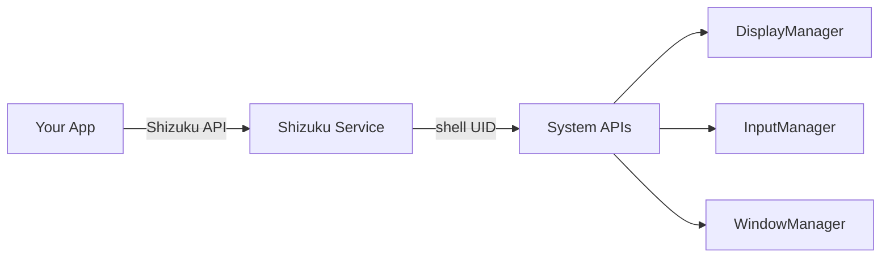

# Virtual Display AI Agent - 技术设计文档

> 本文档结合豆包 Agent 逆向分析与用户 Android Agent (`com.moonkey.androidagent`) 实际代码，提供完整的虚拟屏幕实现方案。

---

## 目录
1. [方案对比](#方案对比)
2. [Shizuku 方案 (推荐)](#shizuku-方案-推荐)
3. [ADB Shell 方案](#adb-shell-方案)
4. [系统级方案 (ROM定制)](#系统级方案-rom定制)
5. [实现代码](#实现代码)
6. [集成到现有项目](#集成到现有项目)

---

## 方案对比

| 方案 | Root | OEM支持 | 用户门槛 | 功能完整度 | 推荐场景 |
|------|------|---------|----------|------------|----------|
| **Shizuku** | ❌ | ❌ | 中 | ⭐⭐⭐⭐ | 消费者App |
| **ADB Shell** | ❌ | ❌ | 高 | ⭐⭐⭐ | 开发调试 |
| **系统签名** | ❌ | ⚠️ ROM修改 | 极高 | ⭐⭐⭐⭐⭐ | OEM预装 |
| **Root** | ✅ | ❌ | 高 | ⭐⭐⭐⭐⭐ | 发烧友 |

> [!IMPORTANT]
> **推荐 Shizuku 方案**：无需 root、无需厂商合作，用户可通过 Wireless Debugging 自行激活。

---

## Shizuku 方案 (推荐)

### 核心原理



Shizuku 作为 shell 权限代理，允许普通 App 调用需要 `shell` 或 `system` 权限的 API：
- `DisplayManager.createVirtualDisplay()` 
- `InputManager.injectInputEvent()`
- `WindowManager.captureDisplay()`

### 用户激活流程

```
1. 安装 Shizuku App (Play Store / GitHub)
2. 启用开发者选项 → 无线调试
3. 打开 Shizuku → 通过无线调试启动
4. 授权你的 App 使用 Shizuku
```

> [!TIP]
> Android 11+ 支持无线调试，无需连接电脑。用户只需配对一次即可。

### 依赖配置

```kotlin
// build.gradle.kts (app)
dependencies {
    // Shizuku API
    implementation("dev.rikka.shizuku:api:13.1.5")
    implementation("dev.rikka.shizuku:provider:13.1.5")
    
    // Hidden API 访问 (可选，用于 @hide 方法)
    compileOnly("dev.rikka.hidden:stub:4.3.3")
}

android {
    buildFeatures {
        aidl = true
    }
}
```

### AndroidManifest.xml

```xml
<manifest>
    <!-- Shizuku 权限 -->
    <uses-permission android:name="moe.shizuku.manager.permission.API_V23" />
    
    <application>
        <!-- Shizuku Provider -->
        <provider
            android:name="rikka.shizuku.ShizukuProvider"
            android:authorities="${applicationId}.shizuku"
            android:multiprocess="false"
            android:enabled="true"
            android:exported="true"
            android:permission="android.permission.INTERACT_ACROSS_USERS_FULL" />
    </application>
</manifest>
```

### 权限检查

```kotlin
object ShizukuHelper {
    
    fun isAvailable(): Boolean {
        return Shizuku.pingBinder()
    }
    
    fun hasPermission(): Boolean {
        return if (Shizuku.isPreV11()) {
            false // 旧版不支持
        } else {
            Shizuku.checkSelfPermission() == PackageManager.PERMISSION_GRANTED
        }
    }
    
    fun requestPermission(activity: Activity, requestCode: Int) {
        if (Shizuku.isPreV11()) {
            activity.requestPermissions(
                arrayOf("moe.shizuku.manager.permission.API_V23"),
                requestCode
            )
        } else {
            Shizuku.requestPermission(requestCode)
        }
    }
}
```

---

## ADB Shell 方案

适用于开发调试阶段，通过 ADB 运行 shell 进程来执行操作。

### 启动 Shell 服务

```bash
# 在电脑上运行，启动一个持久化的 shell 进程
adb shell "app_process -Djava.class.path=/path/to/agent.dex \
    /system/bin com.moonkey.androidagent.ShellMain"
```

### 通过 Socket 通信

```kotlin
// App 端
class ShellClient {
    private val socket = LocalSocket()
    
    fun connect() {
        socket.connect(LocalSocketAddress("agent_shell", LocalSocketAddress.Namespace.ABSTRACT))
    }
    
    fun sendCommand(cmd: String): String {
        socket.outputStream.write(cmd.toByteArray())
        return socket.inputStream.bufferedReader().readLine()
    }
}

// Shell 端 (dex)
class ShellServer {
    fun start() {
        val serverSocket = LocalServerSocket("agent_shell")
        while (true) {
            val client = serverSocket.accept()
            handleClient(client)
        }
    }
    
    private fun handleClient(socket: LocalSocket) {
        val cmd = socket.inputStream.bufferedReader().readLine()
        val result = executeCommand(cmd)
        socket.outputStream.write(result.toByteArray())
    }
}
```

---

## 系统级方案 (ROM定制)

豆包使用的方案，需要 OEM 支持或自定义 ROM。

### 关键 OEM 扩展 (豆包实现)

```java
// 这些需要厂商提供，标准 AOSP 没有
ActivityManagerEx.getInstance().moveTaskToDisplay(taskId, displayId, onTop);
ActivityManagerEx.getInstance().getCurrentTaskInfo(displayId);
TaskStackListenerEx.onTaskToBackground(taskInfo);  // 自动迁移
TaskStackListenerEx.onDisplaySecureChanged(displayId, secure);
```

### 权限白名单 (priv-app)

```xml
<!-- /system/etc/permissions/privapp-permissions-aiagent.xml -->
<privapp-permissions package="com.moonkey.androidagent">
    <permission name="android.permission.READ_FRAME_BUFFER"/>
    <permission name="android.permission.INJECT_EVENTS"/>
    <permission name="android.permission.CAPTURE_SECURE_VIDEO_OUTPUT"/>
    <permission name="android.permission.ADD_TRUSTED_DISPLAY"/>
    <permission name="android.permission.MANAGE_ACTIVITY_TASKS"/>
</privapp-permissions>
```

---

## 实现代码

### VirtualDisplayManager (Shizuku 版)

```kotlin
package com.moonkey.androidagent.platform.display

import android.graphics.SurfaceTexture
import android.hardware.display.DisplayManager
import android.hardware.display.VirtualDisplay
import android.hardware.display.VirtualDisplayConfig
import android.os.Build
import android.view.Surface
import rikka.shizuku.Shizuku
import rikka.shizuku.ShizukuBinderWrapper
import rikka.shizuku.SystemServiceHelper

/**
 * 虚拟屏幕管理器 - Shizuku 版
 * 
 * 集成到 com.moonkey.androidagent.platform 模块
 */
class VirtualDisplayManager {
    
    companion object {
        private const val TAG = "VirtualDisplayManager"
        private const val DISPLAY_NAME = "moonkey_agent_display"
        
        // 标准 flags (无需特权)
        private const val BASE_FLAGS = 
            VirtualDisplay.VIRTUAL_DISPLAY_FLAG_PUBLIC or
            VirtualDisplay.VIRTUAL_DISPLAY_FLAG_OWN_CONTENT_ONLY
        
        // 需要 shell 权限的 flags
        private const val PRIVILEGED_FLAGS =
            0x40 or   // SUPPORTS_TOUCH
            0x80 or   // ROTATES_WITH_CONTENT
            0x200 or  // SHOULD_SHOW_SYSTEM_DECORATIONS
            0x400     // TRUSTED (豆包使用)
    }
    
    private var virtualDisplay: VirtualDisplay? = null
    private var headlessSurface: Surface? = null
    private var headlessTexture: SurfaceTexture? = null
    
    val displayId: Int get() = virtualDisplay?.display?.displayId ?: -1
    val isActive: Boolean get() = virtualDisplay != null
    
    /**
     * 创建虚拟屏幕
     */
    fun create(width: Int, height: Int, dpi: Int): Result<Int> {
        return runCatching {
            synchronized(this) {
                if (virtualDisplay != null) {
                    return@runCatching displayId
                }
                
                // 创建 headless surface
                headlessTexture = SurfaceTexture(false)
                headlessSurface = Surface(headlessTexture)
                
                val vd = if (ShizukuHelper.hasPermission()) {
                    createWithShizuku(width, height, dpi)
                } else {
                    createWithoutPrivilege(width, height, dpi)
                }
                
                virtualDisplay = vd
                android.util.Log.i(TAG, "Created VD: id=${vd.display.displayId}")
                vd.display.displayId
            }
        }
    }
    
    private fun createWithShizuku(width: Int, height: Int, dpi: Int): VirtualDisplay {
        // 通过 Shizuku 获取 DisplayManager 服务
        val displayManager = SystemServiceHelper.getSystemService("display")
        val wrapper = ShizukuBinderWrapper(displayManager)
        
        // 这里需要通过 AIDL 调用 IDisplayManager
        // 简化版：使用反射调用
        val dmService = android.hardware.display.IDisplayManager.Stub.asInterface(wrapper)
        
        val config = if (Build.VERSION.SDK_INT >= 31) {
            VirtualDisplayConfig.Builder(DISPLAY_NAME, width, height, dpi)
                .setFlags(BASE_FLAGS or PRIVILEGED_FLAGS)
                .setSurface(headlessSurface)
                .build()
        } else {
            throw UnsupportedOperationException("Requires Android 12+")
        }
        
        // 通过服务创建
        return dmService.createVirtualDisplay(config, null, null, "moonkey")
    }
    
    private fun createWithoutPrivilege(width: Int, height: Int, dpi: Int): VirtualDisplay {
        val dm = android.app.ActivityThread.currentApplication()
            .getSystemService(DisplayManager::class.java)
        
        return dm.createVirtualDisplay(
            DISPLAY_NAME,
            width, height, dpi,
            headlessSurface,
            BASE_FLAGS
        )
    }
    
    /**
     * 设置渲染目标 Surface (用于预览)
     */
    fun setSurface(surface: Surface?) {
        synchronized(this) {
            virtualDisplay?.surface = surface ?: headlessSurface
        }
    }
    
    /**
     * 释放虚拟屏幕
     */
    fun release() {
        synchronized(this) {
            virtualDisplay?.release()
            virtualDisplay = null
            headlessSurface?.release()
            headlessSurface = null
            headlessTexture?.release()
            headlessTexture = null
        }
    }
}
```

### InputInjector (Shizuku 版)

```kotlin
package com.moonkey.androidagent.platform.input

import android.hardware.input.IInputManager
import android.os.SystemClock
import android.view.InputDevice
import android.view.InputEvent
import android.view.MotionEvent
import android.view.KeyEvent
import rikka.shizuku.ShizukuBinderWrapper
import rikka.shizuku.SystemServiceHelper

/**
 * 输入事件注入器 - Shizuku 版
 * 
 * 集成到 com.moonkey.androidagent.platform 模块
 */
class InputInjector {
    
    private var inputManager: IInputManager? = null
    
    fun init(): Boolean {
        return try {
            val binder = SystemServiceHelper.getSystemService("input")
            val wrapper = ShizukuBinderWrapper(binder)
            inputManager = IInputManager.Stub.asInterface(wrapper)
            true
        } catch (e: Exception) {
            android.util.Log.e(TAG, "Init failed: ${e.message}")
            false
        }
    }
    
    /**
     * 点击指定位置
     */
    fun tap(displayId: Int, x: Float, y: Float): Boolean {
        val downTime = SystemClock.uptimeMillis()
        
        val down = obtainMotionEvent(downTime, downTime, MotionEvent.ACTION_DOWN, x, y, displayId)
        val up = obtainMotionEvent(downTime, downTime + 50, MotionEvent.ACTION_UP, x, y, displayId)
        
        val result = inject(down) && inject(up)
        down.recycle()
        up.recycle()
        return result
    }
    
    /**
     * 滑动操作
     */
    fun swipe(displayId: Int, x1: Float, y1: Float, x2: Float, y2: Float, durationMs: Long): Boolean {
        val downTime = SystemClock.uptimeMillis()
        val steps = 20
        val stepDelay = durationMs / steps
        
        // DOWN
        inject(obtainMotionEvent(downTime, downTime, MotionEvent.ACTION_DOWN, x1, y1, displayId))
        
        // MOVE
        for (i in 1..steps) {
            Thread.sleep(stepDelay)
            val progress = i.toFloat() / steps
            val x = x1 + (x2 - x1) * progress
            val y = y1 + (y2 - y1) * progress
            inject(obtainMotionEvent(downTime, SystemClock.uptimeMillis(), MotionEvent.ACTION_MOVE, x, y, displayId))
        }
        
        // UP
        return inject(obtainMotionEvent(downTime, SystemClock.uptimeMillis(), MotionEvent.ACTION_UP, x2, y2, displayId))
    }
    
    /**
     * 输入文本
     */
    fun inputText(displayId: Int, text: String): Boolean {
        // 通过 IME 或逐字符输入
        text.forEach { char ->
            val keyCode = getKeyCodeForChar(char)
            if (keyCode != KeyEvent.KEYCODE_UNKNOWN) {
                pressKey(displayId, keyCode)
            }
        }
        return true
    }
    
    /**
     * 按键操作
     */
    fun pressKey(displayId: Int, keyCode: Int): Boolean {
        val downTime = SystemClock.uptimeMillis()
        
        val down = KeyEvent(downTime, downTime, KeyEvent.ACTION_DOWN, keyCode, 0).apply {
            setDisplayId(displayId)
        }
        val up = KeyEvent(downTime, downTime + 10, KeyEvent.ACTION_UP, keyCode, 0).apply {
            setDisplayId(displayId)
        }
        
        return inject(down) && inject(up)
    }
    
    private fun obtainMotionEvent(
        downTime: Long, eventTime: Long,
        action: Int, x: Float, y: Float,
        displayId: Int
    ): MotionEvent {
        return MotionEvent.obtain(downTime, eventTime, action, x, y, 0).apply {
            source = InputDevice.SOURCE_TOUCHSCREEN
            setDisplayId(displayId)
        }
    }
    
    private fun inject(event: InputEvent): Boolean {
        return try {
            inputManager?.injectInputEvent(event, 0) ?: false
        } catch (e: Exception) {
            android.util.Log.e(TAG, "Inject failed: ${e.message}")
            false
        }
    }
    
    private fun getKeyCodeForChar(char: Char): Int {
        // 简化实现，实际应使用 KeyCharacterMap
        return when (char) {
            in 'a'..'z' -> KeyEvent.KEYCODE_A + (char - 'a')
            in 'A'..'Z' -> KeyEvent.KEYCODE_A + (char - 'A')
            in '0'..'9' -> KeyEvent.KEYCODE_0 + (char - '0')
            ' ' -> KeyEvent.KEYCODE_SPACE
            '\n' -> KeyEvent.KEYCODE_ENTER
            else -> KeyEvent.KEYCODE_UNKNOWN
        }
    }
    
    companion object {
        private const val TAG = "InputInjector"
    }
}
```

### ScreenCapture (Shizuku 版)

```kotlin
package com.moonkey.androidagent.platform.capture

import android.graphics.Bitmap
import android.graphics.Rect
import android.view.IWindowManager
import android.window.ScreenCapture
import rikka.shizuku.ShizukuBinderWrapper
import rikka.shizuku.SystemServiceHelper

/**
 * 屏幕截图 - Shizuku 版
 */
class ScreenCapturer {
    
    private var windowManager: IWindowManager? = null
    
    fun init(): Boolean {
        return try {
            val binder = SystemServiceHelper.getSystemService("window")
            val wrapper = ShizukuBinderWrapper(binder)
            windowManager = IWindowManager.Stub.asInterface(wrapper)
            true
        } catch (e: Exception) {
            android.util.Log.e(TAG, "Init failed: ${e.message}")
            false
        }
    }
    
    /**
     * 截取指定 display 的屏幕
     */
    fun capture(displayId: Int, width: Int, height: Int): Bitmap? {
        return try {
            val listener = ScreenCapture.createSyncCaptureListener()
            val args = ScreenCapture.CaptureArgs.Builder()
                .setSourceCrop(Rect(0, 0, width, height))
                .build()
            
            windowManager?.captureDisplay(displayId, args, listener)
            
            val buffer = listener.getBuffer()
            if (buffer?.containsSecureLayers() == true) {
                android.util.Log.w(TAG, "Contains secure layers")
            }
            
            buffer?.asBitmap()
        } catch (e: Exception) {
            android.util.Log.e(TAG, "Capture failed: ${e.message}")
            null
        }
    }
    
    companion object {
        private const val TAG = "ScreenCapturer"
    }
}
```

---

## 集成到现有项目

### 目录结构

```
com.moonkey.androidagent/
├── platform/              ← 新增虚拟屏幕模块
│   ├── display/
│   │   ├── VirtualDisplayManager.kt
│   │   └── DisplayStateController.kt
│   ├── input/
│   │   └── InputInjector.kt
│   ├── capture/
│   │   └── ScreenCapturer.kt
│   └── ShizukuHelper.kt
├── tool/                  ← 现有工具模块
│   ├── ClickTool.kt       ← 修改：使用 InputInjector
│   ├── SwipeTool.kt       ← 修改：使用 InputInjector
│   └── ScreenshotTool.kt  ← 修改：使用 ScreenCapturer
├── perception/            ← 现有感知模块
└── agent/                 ← 现有 agent 模块
```

### Tool 适配示例

```kotlin
// tool/ClickTool.kt
class ClickTool(
    private val inputInjector: InputInjector,
    private val displayManager: VirtualDisplayManager
) {
    
    fun execute(x: Int, y: Int): ToolResult {
        val displayId = displayManager.displayId
        if (displayId < 0) {
            return ToolResult.failure("虚拟屏幕未初始化")
        }
        
        val success = inputInjector.tap(displayId, x.toFloat(), y.toFloat())
        return if (success) {
            ToolResult.success("点击 ($x, $y) 成功")
        } else {
            ToolResult.failure("点击失败")
        }
    }
}
```

### 初始化流程

```kotlin
class AgentService : Service() {
    
    private lateinit var displayManager: VirtualDisplayManager
    private lateinit var inputInjector: InputInjector
    private lateinit var screenCapturer: ScreenCapturer
    
    override fun onCreate() {
        super.onCreate()
        
        // 1. 检查 Shizuku
        if (!ShizukuHelper.isAvailable()) {
            showShizukuSetupGuide()
            return
        }
        
        if (!ShizukuHelper.hasPermission()) {
            ShizukuHelper.requestPermission(this, REQUEST_CODE)
            return
        }
        
        // 2. 初始化平台组件
        displayManager = VirtualDisplayManager()
        inputInjector = InputInjector().also { it.init() }
        screenCapturer = ScreenCapturer().also { it.init() }
        
        // 3. 创建虚拟屏幕
        val metrics = resources.displayMetrics
        displayManager.create(
            width = metrics.widthPixels,
            height = metrics.heightPixels,
            dpi = metrics.densityDpi
        )
    }
}
```

---

## 限制与解决方案

| 限制 | 原因 | 解决方案 |
|------|------|---------|
| 重启后需重新激活 Shizuku | ADB 权限不持久 | 引导用户开启"保持唤醒" |
| 无法获取安全内容截图 | DRM 保护 | 检测并跳过安全层 |
| 仅支持 Android 11+ | Wireless Debugging | 低版本需连接 PC |
| 任务迁移有限制 | 标准 API 限制 | 使用 `setLaunchDisplayId` |

---

## 下一步

1. 在 `platform/` 模块添加 Shizuku 依赖和基础代码
2. 实现 `VirtualDisplayManager`、`InputInjector`、`ScreenCapturer`
3. 修改现有 `tool/` 使用新的平台组件
4. 添加用户引导 UI 帮助激活 Shizuku
