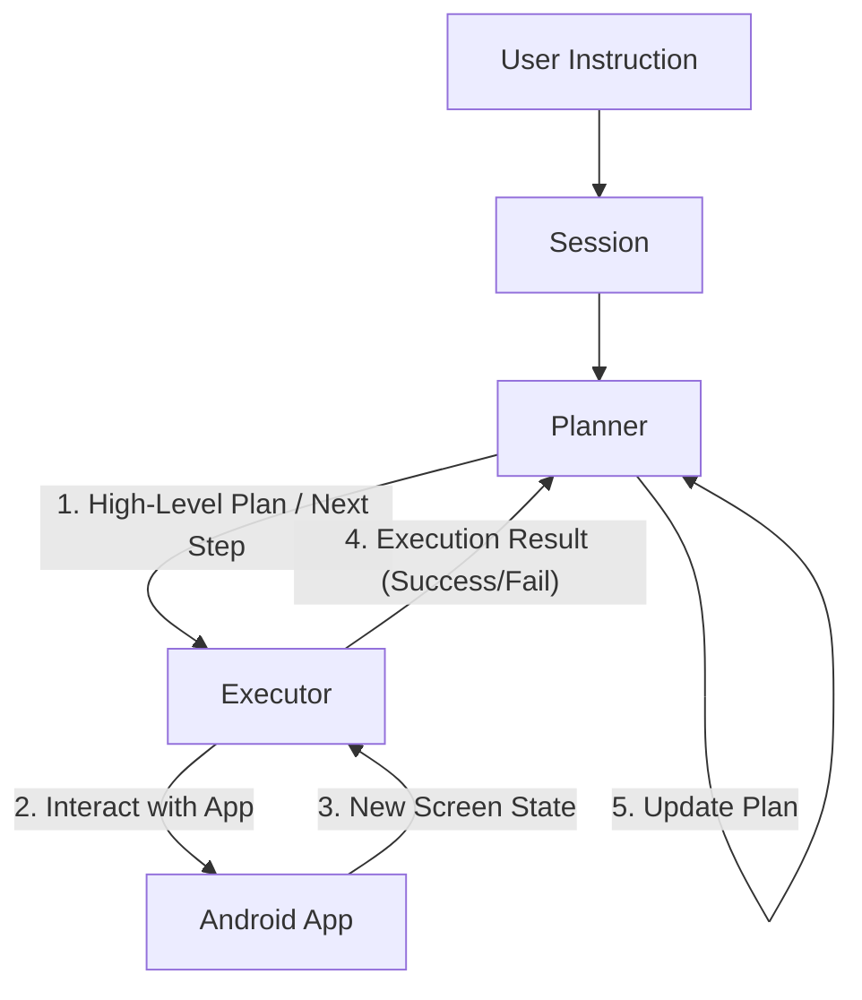

# Planner-Executor Framework Design

> [!IMPORTANT]
> This design prioritizes **Simplicity (KISS)**, **Readability**, and **Separation of Concerns**. Backward compatibility is explicitly ignored to ensure the best possible architecture.

## 1. System Overview

The core idea is to separate **High-Level Reasoning (Planning)** from **Low-Level Grounding & Execution**.

- **Planner Agent**: " The Brain". Uses a SOTA model (GPT-4o, Claude 3.5 Sonnet) to understand user intent, decompose complex tasks, and reason about app navigation flows.
- **Executor Agent**: "The Hands/Eyes". Uses a specialized Grounding Model (UI-Tars, or a specialized prompt with Gemini/GPT) to interact with the UI, find elements, and execute atomic or semi-atomic actions.

## 2. Architecture



### 2.1 The Two-Loop System

We implement a **Dual-Loop** architecture:

1.  **Macro-Loop (Planning Loop)**:
    -   Frequency: Low (Once per logical step).
    -   Context: High-level history, user constraints, overall goal.
    -   Decision: "What should be done next?" (e.g., "Search for 'Coffee' in Maps").

2.  **Micro-Loop (Execution Loop)**:
    -   Frequency: High (Multiple times per logical step).
    -   Context: Current screenshot, A11y tree, immediate target.
    -   Decision: "Where is the search bar? Click it. Type 'Coffee'. Hit Enter."

## 3. Core Components

### 3.1 `PlannerAgent`

The Planner is responsible for the **Strategy**.

**Responsibilities**:
-   Decompose `User Instruction` into a `Sequence of Sub-Tasks`.
-   Monitor progress.
-   Handle high-level errors (e.g., "App not installed", "Login failed").
-   Decide when the task is complete.

**Interface**:
```kotlin
interface PlannerAgent {
    suspend fun generatePlan(
        instruction: String,
        history: List<PlanStepResult>,
        screenContext: ScreenContext // Optional: Planner might mostly need text/summary
    ): Plan
}

data class Plan(
    val currentStep: PlanStep,
    val reasoning: String,
    val status: PlanStatus // RUNNING, COMPLETED, FAILED
)

data class PlanStep(
    val description: String, // "Open Settings app"
    val expectedOutcome: String // "Settings app is open"
)
```

### 3.2 `ExecutorAgent`

The Executor is responsible for the **Tactics**.

**Responsibilities**:
-   Translate a `PlanStep` (natural language) into specific `MobileAction`s.
-   **Grounding**: Locate UI elements (coordinates, element IDs) matching the description.
-   **Verification**: Check if the action had the desired immediate effect (e.g., keyboard appeared).
-   **Self-Correction**: If a click misses (no state change), retry or look for alternatives (Micro-Loop).

**Interface**:
```kotlin
interface ExecutorAgent {
    suspend fun executeStep(
        step: PlanStep,
        sessionContext: SessionContext
    ): ExecutionResult
}

sealed class ExecutionResult {
    data class Success(val observation: String) : ExecutionResult()
    data class Failure(val reason: String, val recoverySuggestion: String?) : ExecutionResult()
}
```

### 3.3 The `System` (Orchestrator)

The `AgentSession` or `Orchestrator` manages the state and loops. It does not contain "intelligence" but manages the flow of data.

```kotlin
class AgentOrchestrator(
    private val planner: PlannerAgent,
    private val executor: ExecutorAgent
) {
    suspend fun run(task: String) {
        var state = planner.initialize(task)
        
        while (state.status != COMPLETED) {
            // 1. Plan
            val plan = planner.generatePlan(task, history)
            
            // 2. Execute
            val result = executor.executeStep(plan.currentStep, getScreenContext())
            
            // 3. Record & Loop
            history.add(result)
        }
    }
}
```

## 4. Design Decisions (Granularity)

### Decision: "Semi-Autonomous Executor" (Recommended)

Instead of the Executor being a "dumb" coordinate finder, it should be **Semi-Autonomous**.

**Why?**
-   **Latency**: Reduces round-trips to the (expensive/slow) Planner LLM.
-   **Context**: The Planner doesn't need to know that "Clicking search" required "Dismissing a popup" first. The Executor handles transient UI states.
-   **Token Economy**: Planner context window is preserved for high-level history, while Executor consumes high-res screenshot tokens only when needed.

**Example**:
-   **Planner**: "Log in with username 'Alice' and password '1234'."
-   **Executor**:
    -   (Loop 1) Find "Username", Type "Alice".
    -   (Loop 2) Find "Password", Type "1234".
    -   (Loop 3) Find "Login", Click.
    -   (Loop 4) Verify login success.
    -   Return `Success`.

If we used a **Micro-Executor** (Single Action), the Planner would be bombarded:
1.  Planner: "Click Username"
2.  Executor: "Clicked."
3.  Planner: "Type Alice"
4.  Executor: "Typed."
...
This is too chatty and brittle.

## 5. Multi-LLM Integration

We leverage the `@doc/todo/0.5_multi_llms/` design.

-   `PlannerAgent` is injected with an `LLMClient` configured for **Reasoning** (e.g., `PlannerLLMConfig(model="gpt-4o")`).
-   `ExecutorAgent` is injected with an `LLMClient` configured for **Vision/Grounding** (e.g., `GroundingLLMConfig(model="ui-tars-7b", local=true)` or `Gemini 1.5 Pro`).

## 6. Prompt Engineering Concept

### Planner Prompt
> "You are an expert Android User. Your goal is to [Goal]. The current state is [Summary]. The history is [History].
> Output the NEXT logic step to take. Do not describe exact coordinates. Just describe WHAT to do."

### Executor Prompt
> "You are a precise UI Automator. Your objective is: [PlanStep].
> Here is the screen.
> 1. Identify the elements needed for [PlanStep].
> 2. Output the exact action (TAP x,y or TYPE text) to achieve it.
> 3. If the objective is met, output DONE."

## 7. Directory Structure (Proposed)

```text
app/src/main/kotlin/com/moonkey/androidagent/
├── agent/
│   ├── core/           # Core interfaces (Agent, Orchestrator)
│   ├── planner/        # Planner implementation & Prompts
│   └── executor/       # Executor implementation & Prompts
├── system/             # State management, Session
└── llm/                # (From 0.5_multi_llms)
```

## 8. Migration Plan (Deprecation)
Since backward compatibility is not required:
1.  Create `com.moonkey.androidagent.agent.v2` (or just refactor in place if we are bold).
2.  Implement `PlannerAgent` and `ExecutorAgent`.
3.  Rewrite `AgentTurnRunner` to be the `Orchestrator`.
4.  Delete/Archive old monolithic `Agent` logic once V2 is verified.
