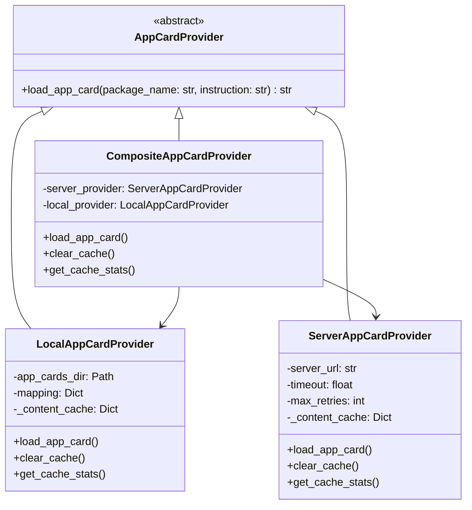

# DroidRun AppCard Implementation Analysis

> Reference: `.reference/mobile_agent/droidrun/`

## Overview

DroidRun 的 AppCard（App Instruction Cards）是一种**为特定应用程序提供操作指南**的机制，帮助 Agent 更有效地操作不同的应用。核心思想是为每个 Android 应用预先准备一份"说明书"，在 Agent 操作该应用时自动加载并注入到 prompt 中。

## 架构设计

### 核心组件

```
droidrun/app_cards/
├── app_card_provider.py          # 抽象接口
└── providers/
    ├── __init__.py               # 导出所有 Provider
    ├── local_provider.py         # 本地文件加载
    ├── server_provider.py        # 远程服务加载
    └── composite_provider.py     # 组合策略（server + local fallback）

droidrun/config/app_cards/
├── app_cards.json               # Package Name → Markdown 文件映射
├── gmail.md                     # Gmail 应用的操作指南
└── README.md                    # 使用说明
```

### 类关系图



---

## 详细实现

### 1. 抽象接口 (`AppCardProvider`)

```python
class AppCardProvider(ABC):
    """Abstract interface for loading app-specific instruction cards."""

    @abstractmethod
    async def load_app_card(self, package_name: str, instruction: str = "") -> str:
        """
        Load app card for a given package asynchronously.

        Args:
            package_name: Android package name (e.g., "com.google.android.gm")
            instruction: User's instruction/goal (optional context for server providers)

        Returns:
            App card content as string, or empty string if not found or on error
        """
        pass
```

**设计要点**：
- 异步接口 (`async`)，支持非阻塞加载
- 返回空字符串表示"未找到"或"出错"，避免异常传播
- 接受 `instruction` 参数，Server Provider 可以用于动态生成 AppCard

### 2. 本地文件 Provider (`LocalAppCardProvider`)

**核心逻辑**：

```python
class LocalAppCardProvider(AppCardProvider):
    def __init__(self, app_cards_dir: str = "config/app_cards"):
        # 1. 解析 app_cards.json 路径
        mapping_path = PathResolver.resolve(f"{app_cards_dir}/app_cards.json")
        self.app_cards_dir = mapping_path.parent
        
        # 2. 加载映射关系 (package_name -> filename)
        if mapping_path.exists():
            self.mapping = json.load(open(mapping_path))
        else:
            self.mapping = {}
        
        # 3. 内存缓存
        self._content_cache: Dict[tuple[str, str], str] = {}
    
    async def load_app_card(self, package_name: str, instruction: str = "") -> str:
        # 检查缓存
        cache_key = (package_name, instruction)
        if cache_key in self._content_cache:
            return self._content_cache[cache_key]
        
        # 检查映射
        if package_name not in self.mapping:
            self._content_cache[cache_key] = ""
            return ""
        
        # 读取 markdown 文件
        filename = self.mapping[package_name]
        app_card_path = self.app_cards_dir / filename
        
        loop = asyncio.get_running_loop()
        content = await loop.run_in_executor(None, app_card_path.read_text, "utf-8")
        
        self._content_cache[cache_key] = content
        return content
```

**特点**：
- JSON 映射文件：`{"com.google.android.gm": "gmail.md"}`
- 异步文件读取：使用 `run_in_executor` 避免阻塞事件循环
- 按 `(package_name, instruction)` 缓存，支持动态内容场景

### 3. 远程服务 Provider (`ServerAppCardProvider`)

```python
class ServerAppCardProvider(AppCardProvider):
    def __init__(self, server_url: str, timeout: float = 2.0, max_retries: int = 2):
        self.server_url = server_url.rstrip("/")
        self.timeout = timeout
        self.max_retries = max_retries
        self._content_cache: Dict[tuple[str, str], str] = {}
    
    async def load_app_card(self, package_name: str, instruction: str = "") -> str:
        cache_key = (package_name, instruction)
        if cache_key in self._content_cache:
            return self._content_cache[cache_key]
        
        endpoint = f"{self.server_url}/app-cards"
        payload = {"package_name": package_name, "instruction": instruction}
        
        for attempt in range(1, self.max_retries + 1):
            try:
                async with httpx.AsyncClient(timeout=self.timeout) as client:
                    response = await client.post(endpoint, json=payload)
                    if response.status_code == 200:
                        app_card = response.json().get("app_card", "")
                        self._content_cache[cache_key] = app_card
                        return app_card
                    elif response.status_code == 404:
                        self._content_cache[cache_key] = ""
                        return ""
            except (httpx.TimeoutException, httpx.RequestError):
                continue  # 重试
        
        self._content_cache[cache_key] = ""
        return ""
```

**特点**：
- 支持**动态生成 AppCard**：服务端可以根据 `instruction` 生成定制化的指南
- 超时控制 + 重试机制
- 缓存 404 结果，避免重复请求

### 4. 组合 Provider (`CompositeAppCardProvider`)

```python
class CompositeAppCardProvider(AppCardProvider):
    """Server-first, local-fallback strategy."""
    
    def __init__(self, server_url, app_cards_dir, server_timeout, server_max_retries):
        self.server_provider = ServerAppCardProvider(...)
        self.local_provider = LocalAppCardProvider(...)
    
    async def load_app_card(self, package_name: str, instruction: str = "") -> str:
        # 1. 先尝试 Server
        server_result = await self.server_provider.load_app_card(package_name, instruction)
        if server_result:
            return server_result
        
        # 2. Server 失败，回退到 Local
        return await self.local_provider.load_app_card(package_name, instruction)
```

**使用场景**：
- 服务端提供动态/实时更新的 AppCard
- 本地作为备份，保证离线可用性

---

## 配置系统

### YAML 配置

```yaml
agent:
  app_cards:
    # 是否启用
    enabled: true
    # 加载模式: local | server | composite
    mode: local
    # 本地文件目录
    app_cards_dir: config/app_cards
    # 远程服务 URL
    server_url: null
    # 超时设置
    server_timeout: 10.0
    server_max_retries: 2
```

### 映射文件 (`app_cards.json`)

```json
{
  "com.google.android.gm": "gmail.md",
  "com.android.chrome": "chrome.md",
  "com.whatsapp": "social/whatsapp.md"
}
```

---

## Prompt 注入

### Jinja2 模板注入

在 `manager/system.jinja2` 中：

```jinja2

App card gives information on how to operate the app and perform actions.
<app_card>
{{ app_card }}
</app_card>


```

### ManagerAgent 中的加载时机

```python
@step
async def prepare_context(self, ctx: Context, ev: StartEvent):
    # 1. 获取设备状态，包括当前 package name
    phone_state = await self.tools_instance.get_state()
    self.shared_state.update_current_app(
        package_name=phone_state.get("packageName", "Unknown"),
        activity_name=phone_state.get("currentApp", "Unknown"),
    )
    
    # 2. 根据当前 package 加载 AppCard
    if self.app_card_config.enabled:
        self.shared_state.app_card = await self.app_card_provider.load_app_card(
            package_name=self.shared_state.current_package_name,
            instruction=self.shared_state.instruction,
        )
```

**关键设计**：
- **每步动态加载**：在 `prepare_context` 阶段根据当前前台应用加载
- **存储在共享状态**：`shared_state.app_card` 供 prompt 构建使用
- **异常容错**：加载失败返回空字符串，不影响主流程

---

## 示例 AppCard 内容

### Gmail (`gmail.md`)

```markdown
# Gmail App Guide

## Navigation
- Use the hamburger menu (top-left) to access folders (Inbox, Sent, Drafts, Trash, etc.)
- Tap the compose button (bottom-right floating action button) to write new emails
- Swipe left or right on emails to quickly archive or delete

## Search
- Use the search bar at the top to find emails
- Search supports filters like:
  - `from:sender@email.com` - Find emails from specific sender
  - `to:recipient@email.com` - Find emails to specific recipient
  - `subject:keyword` - Search in subject line
  - `has:attachment` - Find emails with attachments
  - `is:unread` - Find unread emails

## Common Actions
- **Archive**: Swipe right on an email in the list
- **Delete**: Swipe left on an email in the list
- **Select Multiple**: Long press on an email to enter selection mode
- **Star/Unstar**: Tap the star icon next to an email

## Composing Emails
- Tap the floating compose button (bottom-right)
- Fill in recipient, subject, and body
- Send by tapping the send button (paper plane icon) in the top-right

## Tips
- Primary inbox shows important emails automatically
- Social and Promotions tabs filter promotional and social emails
```

---

## 优势与价值

1. **提升成功率**：Agent 不需要"猜测"如何操作应用，减少试错
2. **减少 Token 消耗**：避免探索性操作，直达目标
3. **可扩展性**：
   - 社区可贡献常用应用的 AppCard
   - 支持远程服务动态更新
4. **容错设计**：
   - 缓存机制避免重复加载
   - 多级 fallback 保证可用性
   - 失败不阻塞主流程

---

## 对 AndroidAgent 的启发

### 可借鉴的设计

1. **抽象接口 + 多实现**：`AppCardProvider` 模式方便扩展
2. **JSON 映射 + Markdown 内容**：简洁高效的数据组织
3. **内存缓存**：避免重复 I/O 或网络请求
4. **异步加载**：不阻塞 Agent 主循环
5. **按需加载**：根据当前前台应用动态注入

### 可改进的方向

1. **结构化 AppCard**：除了 Markdown，可以考虑结构化格式（JSON/YAML），便于程序化处理
2. **学习机制**：Agent 在执行过程中发现的应用操作技巧可以自动更新 AppCard
3. **版本管理**：AppCard 与应用版本绑定，避免界面更新后失效
4. **动态生成**：结合 LLM 根据当前任务动态生成 focused 的 AppCard

---

## 文件引用

| 文件 | 描述 |
|------|------|
| [app_card_provider.py](file://.reference/mobile_agent/droidrun/droidrun/app_cards/app_card_provider.py) | 抽象接口定义 |
| [local_provider.py](file://.reference/mobile_agent/droidrun/droidrun/app_cards/providers/local_provider.py) | 本地文件加载实现 |
| [server_provider.py](file://.reference/mobile_agent/droidrun/droidrun/app_cards/providers/server_provider.py) | 远程服务加载实现 |
| [composite_provider.py](file://.reference/mobile_agent/droidrun/droidrun/app_cards/providers/composite_provider.py) | 组合策略实现 |
| [manager_agent.py](file://.reference/mobile_agent/droidrun/droidrun/agent/manager/manager_agent.py) | AppCard 集成位置 |
| [system.jinja2](file://.reference/mobile_agent/droidrun/droidrun/config/prompts/manager/system.jinja2) | Prompt 模板注入点 |
| [app_cards.json](file://.reference/mobile_agent/droidrun/droidrun/config/app_cards/app_cards.json) | Package 映射示例 |
| [gmail.md](file://.reference/mobile_agent/droidrun/droidrun/config/app_cards/gmail.md) | AppCard 内容示例 |
| [config_example.yaml](file://.reference/mobile_agent/droidrun/droidrun/config_example.yaml) | 配置文件示例 |
