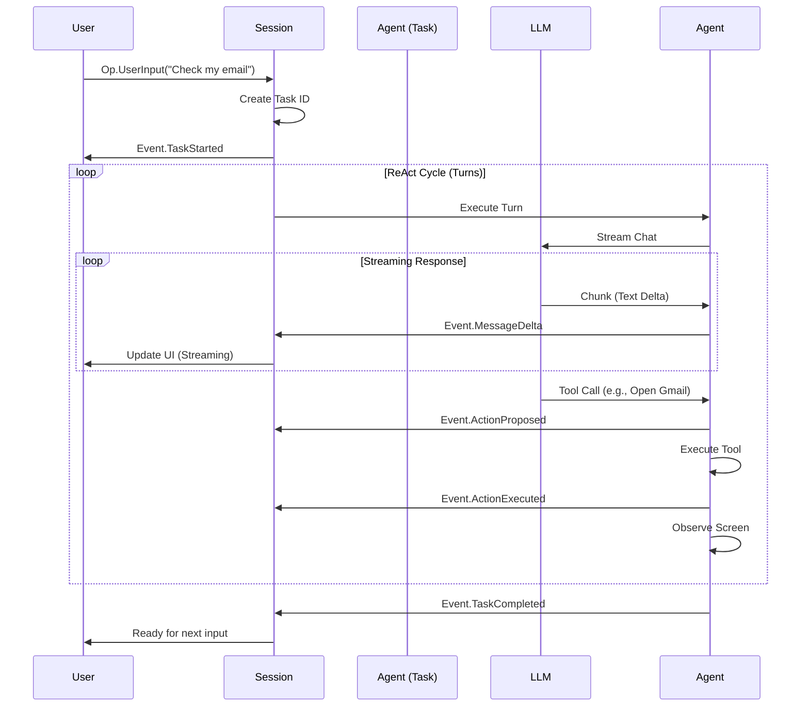

# Multi-Round Chat & Streaming UI - Final Design (v2)

> **Status**: Approved for Implementation
> **Type**: Feature (MVP)
> **Reference**: `.reference/codex/codex-rs/docs/protocol_v1.md`

## 1. Executive Summary

This design transforms the Android Agent into a **multi-round conversational agent** centered around the concept of **Tasks**.

Key changes from v1:
1.  **Task-Based Model**: Adopts the Codex `Session > Task > Turn` hierarchy. A user input starts a **Task**, which consists of multiple **Turns** (ReAct loop) until completion.
2.  **Unified Streaming Turn**: No separate "Chat Mode". All turns are streaming. The `Turn` class is updated to support streaming text and tool calls natively.
3.  **Tool-Enabled Chat**: The chat interface is not just a Q&A bot; it is the full agent interface. Tool calls occur within the chat flow.

## 2. Core Concepts

### 2.1 The Task Model

We adopt the definition from Codex Protocol v1:

*   **Session**: Long-lived configuration and state (History, Services).
*   **Task**: Work executed in response to a `Op.UserInput`.
    *   A Session runs one Task at a time.
    *   A Task consists of multiple **Turns**.
    *   A Task ends when the agent determines it is done (via `complete_task` tool or text-only response) or is interrupted.
*   **Turn**: One cycle of `Perceive -> Think (LLM) -> Act (Tool) -> Observe`.
    *   **Streaming**: The "Think" phase streams text and tool calls from the LLM.

### 2.2 Interaction Flow



## 3. Protocol Updates

### 3.1 Operations (`Op.kt`) - DONE

*   **`Op.UserInput(text: String)`**: The primary way to interact. Starts a new Task.
*   **`Op.Start(goal: String)`**: Deprecated but maintained for backward compatibility. Maps to `Op.UserInput(goal)`.
*   **`Op.Interrupt`**: Stops the current Task but keeps Session alive.

### 3.2 Events (`AgentEvent.kt`) - DONE

*   **`TaskStarted(taskId, input)`**: Emitted when a new task begins.
*   **`TaskCompleted(taskId, result)`**: Emitted when a task ends.
*   **`MessageDelta(turnId, delta)`**: Emitted for each streaming text chunk.

### 3.3 Session State (`SessionState.kt`) - DONE

*   Added **`Idle`** state: Session active but waiting for user input (no task running).

## 4. Architecture Updates

### 4.1 LLM Client Streaming (`llm/LLMClient.kt`)

Use OpenAI Java SDK's **native streaming** via the Responses API.

**Key Types from OpenAI SDK**:
- `ResponseStreamEvent` - Base event type from streaming Responses API
- `ResponseAccumulator` - Helper to accumulate streamed chunks into final `Response`
- Event accessors: `outputTextDelta()`, `outputItemDone()`, etc.

**Stream Events**:
| Event Type | Description |
|------------|-------------|
| `response.created` | Response initiated |
| `response.output_text.delta` | Text chunk via `outputTextDelta()` |
| `response.function_call_arguments.delta` | Tool call arguments streaming |
| `response.function_call_arguments.done` | Tool call complete |
| `response.output_item.done` | Output item completed (text or tool call) |
| `response.completed` | Stream finished successfully |
| `response.failed` | Error occurred |

```kotlin
// Native streaming method using OpenAI SDK
fun chatWithToolsStreaming(
    systemPrompt: String,
    inputItems: List<ResponseInputItem>,
    tools: List<FunctionTool>,
    model: ChatModel = ChatModel.GPT_4O
): Flow<ResponseStreamEvent>

// Accumulator for building final response
val accumulator = ResponseAccumulator.create()
client.responses().createStreaming(params).stream()
    .peek(accumulator::accumulate)
    .forEach { event ->
        event.outputTextDelta().ifPresent { /* handle text delta */ }
        event.outputItemDone().ifPresent { /* handle completed item */ }
    }
val finalResponse = accumulator.response()
```

**Implementation Strategy**: Use OpenAI Java SDK's native `createStreaming()` method directly.

### 4.2 Unified `Turn` with Streaming (`agent/Turn.kt`)

Add a streaming method alongside the existing `run()`.

```kotlin
// TurnStreamEvent - thin wrapper over OpenAI's ResponseStreamEvent
sealed interface TurnStreamEvent {
    data class TextDelta(val text: String) : TurnStreamEvent
    data class ToolCallReceived(val toolCall: ToolCallRequest) : TurnStreamEvent
    data class Complete(val result: TurnResult) : TurnStreamEvent
    data class Error(val error: Throwable) : TurnStreamEvent
}

// New method
fun runStreaming(...): Flow<TurnStreamEvent>
```

**Implementation**:
1. Call `llmClient.chatWithToolsStreaming()` to get `Flow<ResponseStreamEvent>`.
2. Process events:
   - `outputTextDelta()` → emit `TurnStreamEvent.TextDelta`
   - `outputItemDone()` with function call → emit `TurnStreamEvent.ToolCallReceived`
3. Use `ResponseAccumulator` to build final response.
4. When stream ends, emit `TurnStreamEvent.Complete` with `TurnResult`.

### 4.3 Agent Loop Update (`agent/Agent.kt`)

Update `executeTurn()` to use streaming and emit `MessageDelta` events.

```kotlin
// In executeTurn():
turn.runStreaming(systemPrompt, userContext, model).collect { event ->
    when (event) {
        is TurnStreamEvent.TextDelta -> {
            eventEmitter(AgentEvent.MessageDelta(
                sessionId = config.sessionId,
                timestamp = now(),
                turnId = turnId,
                delta = event.text
            ))
        }
        is TurnStreamEvent.ToolCallReceived -> {
            // Store for later execution
        }
        is TurnStreamEvent.Complete -> {
            // Process final result, execute tools
        }
        is TurnStreamEvent.Error -> {
            // Handle error
        }
    }
}
```

## 5. Implementation Plan (Detailed)

### Phase 1: LLM Streaming Infrastructure

**File**: `app/src/main/kotlin/com/moonkey/androidagent/llm/LLMClient.kt`

| Step | Description | LOC Est. |
|------|-------------|----------|
| 1.1 | Remove custom `LLMStreamChunk` sealed interface | -20 |
| 1.2 | Update `chatWithToolsStreaming()` to use native SDK streaming | ~60 |
| 1.3 | Use `ResponseAccumulator` for result aggregation | ~20 |

**Deliverable**: `LLMClient.chatWithToolsStreaming()` returns `Flow<ResponseStreamEvent>` (native OpenAI type).

### Phase 2: Turn Streaming

**File**: `app/src/main/kotlin/com/moonkey/androidagent/agent/Turn.kt`

| Step | Description | LOC Est. |
|------|-------------|----------|
| 2.1 | Add `TurnStreamEvent` sealed interface | ~15 |
| 2.2 | Add `runStreaming()` method | ~100 |
| 2.3 | Implement delta accumulation for text and tool calls | ~50 |

**Deliverable**: `Turn.runStreaming()` returns `Flow<TurnStreamEvent>`.

### Phase 3: Agent Integration

**File**: `app/src/main/kotlin/com/moonkey/androidagent/agent/Agent.kt`

| Step | Description | LOC Est. |
|------|-------------|----------|
| 3.1 | Update `executeTurn()` to use `turn.runStreaming()` | ~60 |
| 3.2 | Emit `MessageDelta` events during streaming | ~10 |
| 3.3 | Accumulate tool calls and execute after stream completes | ~30 |

**Deliverable**: Agent emits `MessageDelta` events during LLM response.

### Phase 4: Protocol & Session (Already Done)

| Item | Status |
|------|--------|
| `Op.kt` - `UserInput` as primary entry | DONE |
| `AgentEvent.kt` - `TaskStarted`, `TaskCompleted`, `MessageDelta` | DONE |
| `SessionState.kt` - `Idle` state | DONE |
| `AgentSession.kt` - Task lifecycle | DONE |

### Phase 5: UI Integration (Future)

| Step | Description |
|------|-------------|
| 5.1 | Update `AgentScreen` to handle `MessageDelta` |
| 5.2 | Implement chat bubble UI with streaming text |
| 5.3 | Add input box for multi-round interaction |

## 6. Open Questions & Risks

*   **~~OpenAI SDK Streaming~~**: ✅ Confirmed - `openai-java` SDK v4.14.0 supports native streaming via `createStreaming()`.
*   **Tool Call Streaming**: Tool calls arrive via `outputItemDone()` event after arguments are streamed.
*   **History Growth**: With multi-round tasks, history grows. `HistoryManager`'s truncation logic is critical.
*   **Concurrency**: Only one Task at a time. `AgentSession` rejects `UserInput` if busy.

## 7. File Change Summary

| File | Change Type | Description |
|------|-------------|-------------|
| `llm/LLMClient.kt` | MODIFY | Native streaming via `ResponseStreamEvent`, remove custom `LLMStreamChunk` |
| `agent/Turn.kt` | MODIFY | Process `ResponseStreamEvent`, emit `TurnStreamEvent` |
| `agent/Agent.kt` | DONE | Uses streaming turn, emits `MessageDelta` events |
| `protocol/Op.kt` | DONE | `UserInput` as primary, `Start` deprecated |
| `protocol/AgentEvent.kt` | DONE | `TaskStarted`, `TaskCompleted`, `MessageDelta` |
| `protocol/SessionState.kt` | DONE | `Idle` state |
| `session/AgentSession.kt` | DONE | Task lifecycle via `handleUserInput()` |
