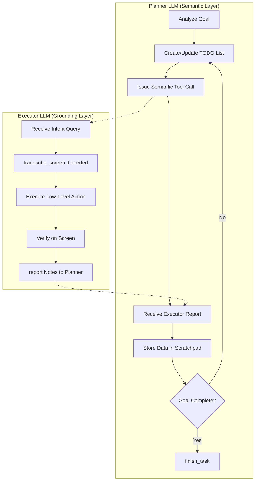
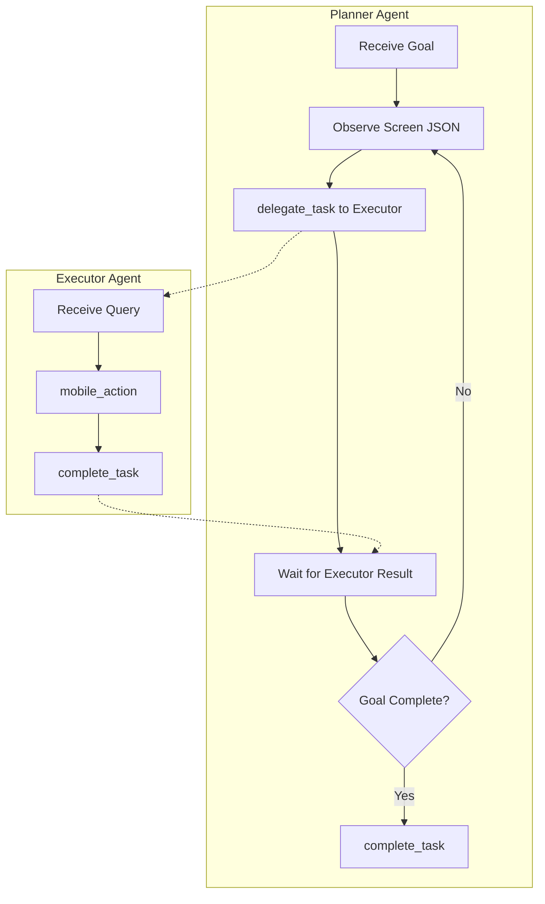

# AutoDev Agent vs AndroidAgent Cognition Comparison

> Deep analysis of Google Research's AutoDev agent cognition mechanisms compared to the current AndroidAgent implementation, with improvement proposals.

---

## Executive Summary

| Dimension | AutoDev | AndroidAgent | Gap Severity |
|-----------|---------|--------------|--------------|
| **Prompt Depth** | ~400 lines per agent prompt | ~75 lines total | 🔴 Critical |
| **Memory Structures** | TodoList + Scratchpad | None implemented | 🔴 Critical |
| **Failure Handling** | Narrative summaries + replanning | Basic retry policy | 🔴 Critical |
| **Context Injection** | Dynamic system reminders | Static template | 🟡 Moderate |
| **Task-Specific Heuristics** | Extensive domain rules | None | 🔴 Critical |
| **Loop Detection** | Screen diff + transcription | None | 🔴 Critical |
| **Screen Reading** | On-demand OCR tool | Static JSON snapshot | 🟡 Moderate |

---

## 1. Architecture Comparison

### AutoDev Architecture



### AndroidAgent Architecture



### Key Architectural Differences

| Aspect | AutoDev | AndroidAgent |
|--------|---------|--------------|
| **Executor Max Steps** | 10 steps per session (MAX_EXECUTOR_STEPS) | Unlimited (no guard) |
| **History Compression** | Removes image blocks after each turn | No compression |
| **Shared State** | Scratchpad (PAD-1, PAD-2, ...) + TodoList | Only scratchpad tool (basic) |
| **Report Mechanism** | `report(notes)` with narrative summary | `complete_task(answer=...)` |
| **Prompt Caching** | Anthropic ephemeral cache on system + text | None |

---

## 2. Prompt Engineering Gap

This is the **most significant gap**. AutoDev prompts are meticulously crafted with domain-specific heuristics.

### AutoDev Planner Prompt (~400 lines)

```markdown
Key Sections:
1. DATE RANGE INTERPRETATION (50+ lines)
   - "Next week starting Monday" calculation
   - Past vs Future filtering rules
   - CRITICAL count verification steps

2. WORKFLOW (ANALYZE → PLAN → EXECUTE → VERIFY → ANSWER)

3. PLANNING STRATEGY
   - Atomic subgoal decomposition
   - Include specific values in todos
   - Mark todos complete only AFTER verification

4. OPTIMIZATION TASKS
   - Optimistic approach: add items first, adjust later
   - Batch processing over individual checking

5. EXECUTOR INSTRUCTIONS (extensive)
   - "Executor has NO MEMORY" - every instruction self-contained
   - Multi-item extraction patterns
   - Conditional task patterns
   - TEXT OPERATIONS: type_text vs gesture clarification
   - MERGE/CONCATENATE: "\n\n" vs "\n" semantics

6. DUPLICATE DELETION (detailed workflow)
   - Open each item → read ALL fields → store in scratchpad
   - Compare with ALL previously seen items
   - Delete if exact match

7. FILES/FORMS/LISTS operations

8. SCREEN ANALYSIS
   - When to call transcribe_screen()
   - "Seen before" warning = STOP scrolling

9. NAVIGATION rules

10. SYSTEM SETTINGS (brightness/volume sliders)

11. EXECUTOR FAILURE HANDLING
    - READ the narrative summary
    - TRY ALTERNATIVE APPROACH (don't repeat)

12. COUNT/SEARCH TASKS
    - Use filters FIRST
    - Check item details when category unclear
    - Stop scrolling IMMEDIATELY when items found
    - Call answer() with exact format

13. COMPLETION RULES
    - Never finish if todos incomplete
    - Never finish count task without answer()
```

### AndroidAgent Planner Prompt (~50 lines)

```kotlin
// PlannerPromptTemplate.kt
val defaultSystemPrompt = """
You are the MAIN PLANNER agent for Android automation.
...
## Workflow
1. Observe current screen context (JSON element list)
2. Decide the next ATOMIC action
3. Call delegate_task(...)
4. Read the result, store extracted data in scratchpad if needed
5. Repeat until goal achieved
6. Call complete_task when done

## CRITICAL: Atomic Delegation
- BAD: "Search for cats" (too vague)
- GOOD: "In Chrome browser, tap the search bar..."
"""
```

### Gap Analysis: Prompt Depth

| AutoDev Feature | Lines | AndroidAgent Equivalent | Lines |
|-----------------|-------|------------------------|-------|
| Date handling | 50+ | None | 0 |
| Executor failure recovery | 30+ | None | 0 |
| Multi-item extraction pattern | 20+ | None | 0 |
| Count/search rules | 40+ | None | 0 |
| File/form operations | 30+ | None | 0 |
| Loop prevention | 20+ | None | 0 |
| Scratchpad usage examples | 15+ | Basic mention | 2 |
| TODO list guidance | 30+ | Brief mention | 1 |

> **Total Prompt Gap**: ~350+ lines of domain-specific guidance missing

---

## 3. Memory Structures

### AutoDev: TodoList

```python
# todo_list.py (236 lines)
TODO_TOOL = {
    "name": "update_todos",
    "parameters": {
        "todos": [{
            "id": str,
            "content": str,
            "priority": "high" | "medium" | "low",
            "status": "pending" | "in_progress" | "completed"
        }]
    }
}

# System reminder injection per turn
def get_system_reminder(self) -> str:
    if self.is_empty():
        return "<system_reminder>...todo list is empty..."
    else:
        return f"<system_reminder>...Continue working on: {json.dumps(self.read())}"
```

**Key Features:**
- Priority-based task ordering
- Status tracking (pending → in_progress → completed)
- System reminder injected every turn
- Pretty print for logging

### AutoDev: Scratchpad

```python
# scratchpad.py (197 lines)
class Scratchpad:
    # Keys use PAD-1, PAD-2, PAD-3 format (typo-resistant)
    
    def create_item(self, key: str, title: str, text: str) -> Dict
    def fetch_item(self, key: str) -> Dict
    
    def get_system_reminder(self) -> str:
        if not self._data:
            return "<system_reminder>...scratchpad is empty..."
        else:
            return """<system_reminder>
            **SCRATCHPAD DATA AVAILABLE** - Use fetchItem(key) to retrieve
            Available items:
              - PAD-1: Recipe Pasta Details
              - PAD-2: All Visible Items
            """
```

**Use Cases:**
- Store extracted data for later (recipe details, file contents)
- Track progress across apps (items processed)
- Share data between Planner and Executor
- Persist across Executor sessions

### AndroidAgent: Current State

```kotlin
// Only basic scratchpad tool available, no TodoList
// No system reminder injection
// No PAD-X key convention
```

**Missing:**
- [ ] TodoList tool and data structure
- [ ] Priority/status tracking
- [ ] System reminder injection per turn
- [ ] PAD-X key convention for scratchpad

---

## 4. Failure Handling & Recovery

### AutoDev: Narrative Failure Reports

```python
# Executor prompt (lines 376-394)
"""
=== MAX STEPS REACHED / LAST 10 STEPS ===
**CRITICAL**: When you have 10 or fewer steps remaining, provide a comprehensive summary:

**Summary must include:**
1. What you tried to accomplish
2. Approach taken (NOT a list of tool calls)
3. What didn't work and why
4. What you observed on screen
5. Alternative approaches suggested
"""

# Planner prompt (lines 146-164)
"""
=== EXECUTOR FAILURE HANDLING ===
1. READ the narrative summary carefully
2. ANALYZE the failure - understand what was tried
3. TRY ALTERNATIVE APPROACH - do NOT repeat failed approach
4. LEARN FROM FAILURES:
   - "scrolled 10 times, same items" → try search/filter
   - "tapping coordinates failed" → try long-press or different element
"""
```

### AndroidAgent: Current State

```kotlin
// TurnPolicyEngine.kt
data class RetryPolicy(
    val allowTransientNetworkRetry: Boolean = false
)
// Only network-level retry, no semantic failure handling
```

**Missing:**
- [ ] Executor step limit (MAX_EXECUTOR_STEPS)
- [ ] Narrative failure summarization
- [ ] Alternative approach suggestion
- [ ] Failure pattern recognition

---

## 5. Screen Reading & Loop Detection

### AutoDev: On-Demand Transcription

```python
# transcribe_screen() - explicit tool call
def transcribe_screen() -> str:
    """
    MANDATORY USE CASES:
    - Before scrolling (to detect stuck state)
    - After scrolling (to verify new content)
    - When stuck 2+ times trying same action
    """

# Loop detection logic in Executor prompt:
"""
=== SCROLLING ===
**CRITICAL - LOOP PREVENTION**:
- BEFORE scrolling: Call transcribe_screen(), note visible items
- AFTER scrolling: Call transcribe_screen(), compare
- If transcription IDENTICAL: STOP immediately, report failure
- If 3+ scrolls without new content: verify stuck, then STOP
"""
```

### AutoDev: Navigation State Detection

```python
# logging_system.py - detect_navigation_loops()
def detect_navigation_loops(history: List[Screenshot]) -> str:
    """Compare recent screenshots for repetition."""
    if current_screenshot == previous_screenshot:
        return "WARNING: Detected repeated screen..."
```

### AndroidAgent: Current State

```kotlin
// Screen snapshot provided as JSON once per turn
// No on-demand transcription tool
// No loop detection mechanism
```

**Missing:**
- [ ] `transcribe_screen()` tool for on-demand OCR
- [ ] Screenshot comparison for loop detection
- [ ] Repeat screen warning injection

---

## 6. Context Injection Pattern

### AutoDev: Dynamic System Reminders

```python
# llm.py - chat() method
def chat(...):
    parts = [{"type": "text", "text": user_message}]
    
    if transcription:
        parts.append({
            "type": "text",
            "text": f"<screen_transcription>\n{transcription}\n</screen_transcription>"
        })
    
    # Image added here
    parts.append({"type": "image_url", ...})
    
    # System reminders AFTER image (mutable state)
    if self.todo_list_enabled:
        parts.append({"type": "text", "text": self.todo_list.get_system_reminder()})
    parts.append({"type": "text", "text": self.scratchpad.get_system_reminder()})
```

**Key Pattern:**
1. User message
2. Screen transcription (if requested)
3. Screenshot
4. **Dynamic system reminders** (todo + scratchpad state)

### AndroidAgent: Current State

```kotlin
// ContextPackager.kt
fun buildTurnInput(...): PackagedTurnInput {
    return PackagedTurnInput(
        userContext = promptBuilder.buildUserContext(raw.snapshot)
    )
}
// Static context, no dynamic reminder injection
```

**Missing:**
- [ ] TodoList state injection per turn
- [ ] Scratchpad state injection per turn
- [ ] `<system_reminder>` tagged sections

---

## 7. Detailed Gap: Prompt Heuristics

### Date Handling (Missing Entirely)

```python
# AutoDev handles date arithmetic explicitly
"""
**DATE RANGE INTERPRETATION**:
- "Next week" (starting Monday): If current date is Sunday, 
  "tomorrow" (Monday) is the FIRST day of next week
- Calculate: Monday (current_date + 1 if Sunday) through Sunday
- "This week": Current week Monday through Sunday
- CRITICAL: If executor says item is "before" range, verify yourself
"""
```

### Count/Search Task Pattern (Missing Entirely)

```python
"""
1. Use filters first (funnel icon, hamburger menu)
2. Search with alternative terms if no results
3. Check item details when category unclear
4. When executor reports findings → STOP → Extract → answer()
5. Format EXACTLY as goal specifies:
   - "titles only, comma separated" → "Title1, Title2, Title3"
   - "how many" → "3"
"""
```

### Multi-Item Extraction Pattern (Missing Entirely)

```python
"""
**For multi-item tasks**: Extract ALL items FIRST.
Call transcribe_screen() → Extract items → Scroll → transcribe again
→ Extract new items → Continue until all extracted
→ Store ALL in scratchpad (JSON array)
→ Then process ALL items in target app
→ Create todos for each item
"""
```

### Duplicate Deletion Pattern (Missing Entirely)

```python
"""
1. Open first item → Read ALL fields → Store as "seen_item_1"
2. Open second item → **MUST fetchItem("seen_item_1")** → Compare ALL fields
   → If match: Delete → If different: Store as "seen_item_2"
3. Continue pattern: For EACH item → Fetch ALL seen items → Compare → Delete or Store
4. Continue until ALL items checked
"""
```

---

## 8. Improvement Proposals

### Phase 1: Critical Infrastructure (Priority 🔴)

#### 1.1 Implement TodoList Tool

```kotlin
// agent/cognition/memory/TodoList.kt
data class TodoItem(
    val id: String,
    val content: String,
    val priority: Priority,  // HIGH, MEDIUM, LOW
    val status: Status       // PENDING, IN_PROGRESS, COMPLETED
)

class TodoList {
    fun update(todos: List<TodoItem>): ToolResult
    fun getSystemReminder(): String  // Inject per turn
}
```

#### 1.2 Enhance Scratchpad with System Reminders

```kotlin
// Add to existing Scratchpad
fun getSystemReminder(): String {
    return if (isEmpty()) {
        "<system_reminder>Scratchpad empty. Use createItem() to store data.</system_reminder>"
    } else {
        """<system_reminder>
        **SCRATCHPAD DATA AVAILABLE**
        ${items.map { "- ${it.key}: ${it.title}" }.joinToString("\n")}
        Use fetchItem(key) to retrieve.
        </system_reminder>"""
    }
}
```

#### 1.3 Add Executor Step Limit

```kotlin
// agent/subagent/SubAgentConfig.kt
data class SubAgentConfig(
    val maxSteps: Int = 10,  // MAX_EXECUTOR_STEPS
    val narrativeSummaryOnLimit: Boolean = true
)
```

#### 1.4 Implement Narrative Failure Reporting

```kotlin
// When executor reaches maxSteps
fun generateNarrativeSummary(): String {
    return """
    ## Executor Summary
    **Goal**: ${originalQuery}
    **Approach**: ${summarizeApproach()}
    **Failure reason**: ${identifyBlocker()}
    **Observations**: ${describeFinalScreen()}
    **Alternatives**: ${suggestAlternatives()}
    """
}
```

### Phase 2: Context Enhancement (Priority 🟡)

#### 2.1 Dynamic System Reminder Injection

```kotlin
// agent/cognition/context/ContextPackager.kt
fun buildTurnInput(...): PackagedTurnInput {
    val parts = mutableListOf<ContentPart>()
    parts += screenContext
    parts += screenshot
    
    // Dynamic reminders
    if (profile.todoListEnabled) {
        parts += todoList.getSystemReminder()
    }
    parts += scratchpad.getSystemReminder()
    
    return PackagedTurnInput(parts)
}
```

#### 2.2 Add `transcribe_screen()` Tool

```kotlin
// tool/TranscribeScreenTool.kt
class TranscribeScreenTool : Tool {
    override suspend fun execute(args: JSONObject): ToolResult {
        // Perform comprehensive OCR on current screen
        // Return all visible text content
    }
}
```

#### 2.3 Loop Detection

```kotlin
// agent/cognition/LoopDetector.kt
class LoopDetector {
    private val recentScreenHashes = mutableListOf<String>()
    
    fun checkForLoop(currentScreen: ScreenSnapshot): LoopWarning? {
        val hash = currentScreen.computeHash()
        if (recentScreenHashes.takeLast(3).all { it == hash }) {
            return LoopWarning("Detected repeated screen. Stop scrolling.")
        }
        recentScreenHashes += hash
        return null
    }
}
```

### Phase 3: Prompt Enhancement (Priority 🔴)

#### 3.1 Date Handling Rules

Add to `PlannerPromptTemplate.kt`:

```kotlin
val dateHandlingRules = """
## DATE RANGE INTERPRETATION
- "Next week" starting Monday: If today is Sunday, tomorrow (Monday) 
  is FIRST day of next week
- Calculate ranges: Monday through Sunday
- "This week": Current week Monday through Sunday
- VERIFY actual due dates, not just section labels
- For count tasks: scroll through ALL items, verify dates carefully
"""
```

#### 3.2 Count/Search Task Rules

```kotlin
val countSearchRules = """
## COUNT/SEARCH TASKS
1. Use filters FIRST (funnel icon, hamburger menu)
2. Search alternatives if initial search fails
3. Check item details when category unclear
4. When items found → STOP → Extract → answer() immediately
5. Format EXACTLY as goal specifies:
   - "titles only, comma separated" → "Title1, Title2, Title3"
   - "how many" → "3"
   - "list all" → Format per goal
6. NEVER finish without calling answer() for count/search tasks
"""
```

#### 3.3 Executor Failure Recovery Rules

```kotlin
val failureRecoveryRules = """
## EXECUTOR FAILURE HANDLING
When executor reports failure with narrative summary:
1. READ the summary carefully (it's NOT a tool call list)
2. ANALYZE what was tried and why it failed
3. TRY ALTERNATIVE APPROACH - don't repeat failed method
4. Examples:
   - "scrolled 10 times, same items" → try search/filter
   - "tapping failed" → try long-press or different element
   - "transcription unchanged" → use transcribe_screen() to read
"""
```

#### 3.4 Multi-Item Extraction Pattern

```kotlin
val multiItemRules = """
## MULTI-ITEM TASKS
1. Extract ALL items matching criteria FIRST
2. Pattern: transcribe → extract → scroll → transcribe → extract new → repeat
3. Store ALL in scratchpad (JSON array via createItem)
4. Process ALL items in target app after extraction
5. Create todos for each item to track progress
6. NEVER stop after first match if goal implies multiple items
"""
```

### Phase 4: Prompt Structure Overhaul

#### Complete Prompt Template Restructure

```kotlin
object PlannerPromptTemplate {
    val systemPrompt = buildString {
        appendLine(roleDefinition)        // Who you are
        appendLine(workflowSection)       // ANALYZE → PLAN → EXECUTE → VERIFY
        appendLine(dateHandlingRules)     // Date arithmetic
        appendLine(planningStrategy)      // Atomic subgoals, todos
        appendLine(executorInstructions)  // Self-contained queries
        appendLine(memoryTools)           // TodoList + Scratchpad usage
        appendLine(operationsGuide)       // Files, forms, lists
        appendLine(screenAnalysis)        // When to transcribe
        appendLine(failureRecovery)       // Alternative approaches
        appendLine(countSearchRules)      // Filter → extract → answer
        appendLine(completionRules)       // When to finish
    }
}
```

---

## 9. Implementation Priority Matrix

| Item | Effort | Impact | Priority |
|------|--------|--------|----------|
| TodoList tool | Medium | High | P0 |
| Scratchpad system reminders | Low | High | P0 |
| Executor step limit (MAX_STEPS) | Low | High | P0 |
| Narrative failure reports | Medium | High | P0 |
| Prompt heuristics (date, count, etc.) | Low | Very High | P0 |
| transcribe_screen() tool | Medium | Medium | P1 |
| Loop detection | Medium | Medium | P1 |
| Dynamic context injection | Medium | Medium | P1 |
| Prompt caching (Anthropic) | Low | Low | P2 |

---

## 10. Recommended Next Steps

1. **Immediate** (Phase 1a): Add ~200 lines of domain-specific heuristics to `PlannerPromptTemplate.kt` and `ExecutorPromptTemplate.kt`. This is **zero-code-change, high-impact**.

2. **Short-term** (Phase 1b): Implement `TodoList` tool with system reminder injection. Enhance `Scratchpad` with reminders.

3. **Short-term** (Phase 1c): Add `MAX_EXECUTOR_STEPS = 10` and narrative failure summarization.

4. **Medium-term** (Phase 2): Implement `transcribe_screen()` tool and loop detection.

5. **Ongoing**: Continuously refine prompts based on task failure analysis.

---

## Appendix A: Source Files Reference

| Component | AutoDev Path | AndroidAgent Path |
|-----------|--------------|-------------------|
| Prompts | `.reference/.../autodev/prompts.py` | `agent/cognition/prompt/*.kt` |
| LLM Wrapper | `.reference/.../autodev/llm.py` | `llm/LlmClient.kt` |
| TodoList | `.reference/.../autodev/todo_list.py` | *(not implemented)* |
| Scratchpad | `.reference/.../autodev/scratchpad.py` | `tool/ScratchpadTool.kt` |
| Executor Tools | `.reference/.../autodev/executor_tools.py` | `tool/*.kt` |
| Planner Tools | `.reference/.../autodev/planner_tools.py` | `tool/DelegateTaskTool.kt` |

## Appendix B: Line Count Comparison

| File | AutoDev | AndroidAgent |
|------|---------|--------------|
| Planner System Prompt | 206 lines | 50 lines |
| Executor System Prompt | 190 lines | 73 lines |
| TodoList | 236 lines | 0 lines |
| Scratchpad | 197 lines | ~80 lines |
| LLM History Management | 180+ lines | ~50 lines |

**Total Cognition Code Gap**: ~680+ lines of specialized logic missing
