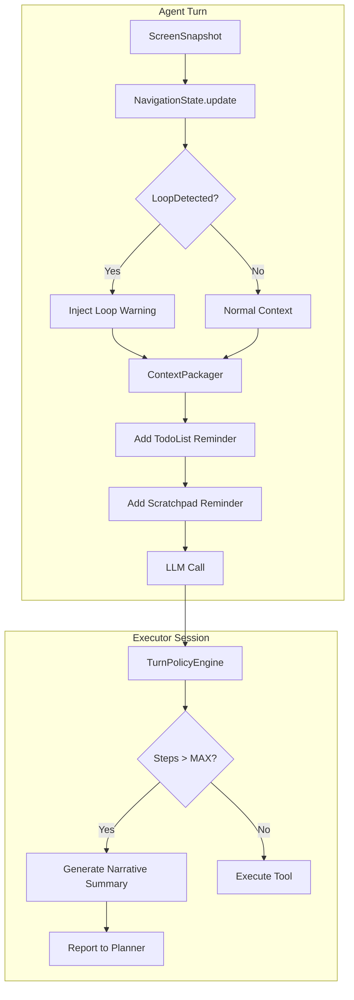

# Cognition Enhancement Design Proposal

> Synthesized from three independent AutoDev vs AndroidAgent analyses, grounded in actual codebase review.

---

## Executive Summary

**Goal**: Improve AndroidAgent's cognition capabilities to increase task success rate while preserving architectural advantages (modularity, testability, security).

**Approach**: Selective adoption of AutoDev's battle-tested patterns, implemented as modular capabilities within the existing `cognition/` architecture. **Not** blind prompt expansion.

**Core Insight**: AndroidAgent's architecture is already more maintainable than AutoDev. The gap is in tactical cognition features—loop detection, failure recovery, and structured memory usage—not in fundamental design.

---

## 1. Current State Assessment

### Existing Strengths (Preserve)

| Strength | Evidence | Action |
|----------|----------|--------|
| **Modular Architecture** | `cognition/{context,policy,profile,prompt,trace,metrics}` | Keep separation |
| **Testable Policy Layer** | `TurnPolicyEngine` + tests | Extend with new policies |
| **Profile-Based Config** | `CognitionProfileRegistry` | Add cognition features to profile |
| **Trace Redaction** | `CognitionTraceRedactor` | Maintain security |
| **Unified Tool Registry** | `ToolRegistry` + `ToolRouter` | Add tools through registry |

### Critical Gaps (Address)

| Gap | Impact | Priority |
|-----|--------|----------|
| No UI loop detection | Agent gets stuck scrolling infinitely | **P0** |
| Minimal prompt heuristics | Agent lacks domain guidance | **P0** |
| No executor step limits | Runaway execution, wasted tokens | **P0** |
| No failure narrative | Planner can't learn from failures | **P0** |
| TodoList not enforced | Agent forgets multi-step plans | **P1** |
| No on-demand OCR | Misses text-heavy screens | **P1** |

---

## 2. Architecture Overview

### Proposed Components

```
agent/cognition/
├── context/
│   ├── ContextPackager.kt          [EXTEND] Add system reminders
│   └── NavigationState.kt          [NEW] Track screen hashes, scroll counts
├── policy/
│   ├── TurnPolicyEngine.kt         [EXTEND] Add loop detection policy
│   ├── LoopDetectionPolicy.kt      [NEW] Screen/action repetition detection
│   └── ExecutorStepPolicy.kt       [NEW] MAX_STEPS enforcement
├── profile/
│   └── CognitionProfile.kt         [EXTEND] Add todoListEnabled, maxExecutorSteps
├── prompt/
│   ├── DomainHeuristics.kt         [NEW] Date, count, search rules
│   ├── FailureRecoveryRules.kt     [NEW] Alternative approach guidance
│   └── PromptAssembler.kt          [EXTEND] Inject dynamic sections
├── memory/
│   ├── TodoList.kt                 [NEW] Structured task tracking
│   └── ScratchpadReminder.kt       [NEW] System reminder generation
└── trace/
    └── ArbitrationTrace.kt         [NEW] Log dropped tool calls + reasons
```

### Data Flow



---

## 3. Detailed Design

### 3.1 Loop Detection (P0)

**Problem**: Agent scrolls indefinitely or repeats actions without progress.

**Solution**: Track screen signatures and action patterns, inject warnings.

```kotlin
// agent/cognition/context/NavigationState.kt
data class NavigationState(
    val screenHashes: ArrayDeque<String> = ArrayDeque(10),
    val scrollCount: Int = 0,
    val lastActions: ArrayDeque<String> = ArrayDeque(5)
) {
    fun update(snapshot: ScreenSnapshot, action: String?): NavigationState {
        val hash = snapshot.computeContentHash()
        val newHashes = screenHashes.toMutableList().also { 
            it.addLast(hash)
            if (it.size > 10) it.removeFirst()
        }
        return copy(
            screenHashes = ArrayDeque(newHashes),
            scrollCount = if (action?.contains("scroll") == true) scrollCount + 1 else 0,
            lastActions = lastActions.also { 
                action?.let { a -> it.addLast(a); if (it.size > 5) it.removeFirst() }
            }
        )
    }
    
    fun detectLoop(): LoopWarning? {
        // Same screen 3+ times in a row
        if (screenHashes.takeLast(3).distinct().size == 1) {
            return LoopWarning("CRITICAL: Screen unchanged for 3 turns. Try a different approach.")
        }
        // 5+ consecutive scrolls
        if (scrollCount >= 5) {
            return LoopWarning("WARNING: 5 consecutive scrolls without progress. Use search/filter instead.")
        }
        // Same action repeated 3+ times
        if (lastActions.takeLast(3).distinct().size == 1) {
            return LoopWarning("WARNING: Repeating same action. Consider alternative approaches.")
        }
        return null
    }
}

// 这里有一个问题：我的截图是没有我的overlay的，对吧？如果有overlay的话要搞个没有overlay的截图。并且这个hash要是image similarity的hash，而不是要求完全identical。过于微小的差别都会导致hash不一致。


data class LoopWarning(val message: String)
```

**Integration Point**: `ContextPackager` injects warnings into turn context.

---

### 3.2 Executor Step Limit & Narrative Failure (P0)

**Problem**: Executor runs indefinitely; Planner doesn't learn from failures.

**Solution**: Enforce MAX_STEPS, generate narrative summaries on limit.

```kotlin
// Extension to CognitionProfile
data class CognitionProfile(
    // ... existing fields
    val maxExecutorSteps: Int = 10,
    val narrativeSummaryOnLimit: Boolean = true
)

// agent/cognition/policy/ExecutorStepPolicy.kt
class ExecutorStepPolicy(private val maxSteps: Int) {
    fun evaluate(stepCount: Int): StepDecision = when {
        stepCount >= maxSteps -> StepDecision.ForceStop(generateNarrativeSummary())
        stepCount >= maxSteps - 2 -> StepDecision.WarnApproaching
        else -> StepDecision.Continue
    }
    
    private fun generateNarrativeSummary(): String = buildString {
        appendLine("## Executor Reached Step Limit")
        appendLine("**Attempted**: ${summarizeAttemptedGoal()}")
        appendLine("**Approach**: ${summarizeApproach()}")
        appendLine("**Observations**: ${summarizeCurrentScreen()}")
        appendLine("**Blockers**: ${identifyBlockers()}")
        appendLine("**Suggested Alternatives**: ${suggestAlternatives()}")
    }
}
```

---

### 3.3 Domain Heuristics (P0)
// 我不喜欢这个，这个太hacky了，跳过这个。
**Problem**: Agent lacks domain-specific guidance for common tasks.

**Solution**: Modular heuristic rules injected based on detected task type.

```kotlin
// agent/cognition/prompt/DomainHeuristics.kt
object DomainHeuristics {
    val dateHandling = """
        ## Date Handling
        - "Next week" = Monday through Sunday of the upcoming week
        - "This week" = Current Monday through Sunday
        - ALWAYS verify actual dates, not just section labels
        - For count tasks: scroll through ALL items to verify date inclusion
    """.trimIndent()
    
    val countAndSearch = """
        ## Count/Search Tasks
        1. Use filters FIRST (funnel icon, settings menu)
        2. Try alternative search terms if initial search fails
        3. Check item details when category is unclear
        4. When items found: STOP → Extract count → answer() immediately
        5. Format EXACTLY as requested:
           - "how many" → numeric answer "3"
           - "list all" → comma-separated list
        6. NEVER finish without explicit answer() for count tasks
    """.trimIndent()
    
    val multiItemExtraction = """
        ## Multi-Item Tasks
        1. Extract ALL matching items FIRST before processing
        2. Pattern: scroll → extract visible → repeat until end
        3. Store items in scratchpad (JSON array)
        4. Process items in target app AFTER extraction complete
        5. Create todo item for each to track progress
    """.trimIndent()
    
    val duplicateDeletion = """
        ## Duplicate Detection
        1. Open first item → Read ALL fields → Store in scratchpad
        2. For EACH subsequent item:
           a. Fetch ALL previously seen items from scratchpad
           b. Compare ALL fields (not just title)
           c. If match: Delete
           d. If different: Store as new item
        3. Continue until all items checked
    """.trimIndent()
}
```

**Integration**: `PromptAssembler` selectively includes heuristics based on task keywords.

---

### 3.4 Failure Recovery Rules (P0)

**Problem**: Planner repeats failed approaches instead of trying alternatives.

**Solution**: Explicit failure recovery guidance in prompts.

```kotlin
// agent/cognition/prompt/FailureRecoveryRules.kt
object FailureRecoveryRules {
    val executorFailureHandling = """
        ## Executor Failure Handling
        When executor reports failure with narrative summary:
        1. READ the summary carefully (it's a narrative, not tool call list)
        2. ANALYZE what was attempted and why it failed
        3. TRY ALTERNATIVE APPROACH - DO NOT repeat the failed method
        
        Common recovery patterns:
        - "scrolled 10 times, same content" → use search/filter instead
        - "element not found" → try long-press, different selector, or OCR
        - "tap had no effect" → element may be overlay; try different area
        - "transcription unchanged" → screen is actually static; accept and move on
    """.trimIndent()
    
    val stuckRecovery = """
        ## When Stuck
        If progress stalls for 3+ turns:
        1. Call transcribe_screen() to verify screen state
        2. Review scratchpad for any stored progress
        3. Consider: Is the task actually completable in this app state?
        4. If not: Report partial completion with explanation
    """.trimIndent()
}
```

---

### 3.5 TodoList with System Reminders (P1)

**Problem**: Agent forgets multi-step plans mid-execution.

**Solution**: Structured TodoList with per-turn reminders.

```kotlin
// agent/cognition/memory/TodoList.kt
data class TodoItem(
    val id: String,
    val content: String,
    val priority: Priority = Priority.MEDIUM,
    val status: Status = Status.PENDING
) {
    enum class Priority { HIGH, MEDIUM, LOW }
    enum class Status { PENDING, IN_PROGRESS, COMPLETED }
}

class TodoList {
    private val items = mutableListOf<TodoItem>()
    
    fun update(newItems: List<TodoItem>) {
        items.clear()
        items.addAll(newItems)
    }
    
    fun getSystemReminder(): String {
        if (items.isEmpty()) {
            return "<system_reminder>Todo list is empty. Consider creating a plan for complex tasks.</system_reminder>"
        }
        
        val pending = items.filter { it.status == TodoItem.Status.PENDING }
        val inProgress = items.filter { it.status == TodoItem.Status.IN_PROGRESS }
        
        return buildString {
            appendLine("<system_reminder>")
            appendLine("**ACTIVE TODO LIST**")
            if (inProgress.isNotEmpty()) {
                appendLine("In Progress:")
                inProgress.forEach { appendLine("  - [/] ${it.content}") }
            }
            if (pending.isNotEmpty()) {
                appendLine("Pending:")
                pending.take(3).forEach { appendLine("  - [ ] ${it.content}") }
                if (pending.size > 3) appendLine("  - ... and ${pending.size - 3} more")
            }
            appendLine("</system_reminder>")
        }
    }
}
```

---

### 3.6 Dynamic Context Injection (P1)

**Problem**: Agent doesn't see updated memory state each turn.

**Solution**: Extend `ContextPackager` to inject reminders.

```kotlin
// Extension to ContextPackager
class ContextPackager(
    private val todoList: TodoList,
    private val scratchpad: ScratchpadState,
    private val navigationState: NavigationState
) {
    fun buildTurnContext(snapshot: ScreenSnapshot): TurnContext {
        val parts = mutableListOf<ContextPart>()
        
        // 1. Screen context (existing)
        parts += ContextPart.Screen(snapshot.toContextFormat())
        
        // 2. Loop detection warnings (new)
        navigationState.detectLoop()?.let { warning ->
            parts += ContextPart.Warning(warning.message)
        }
        
        // 3. TodoList reminder (new)
        parts += ContextPart.Reminder(todoList.getSystemReminder())
        
        // 4. Scratchpad reminder (new)
        parts += ContextPart.Reminder(scratchpad.getSystemReminder())
        
        return TurnContext(parts)
    }
}
```

---

### 3.7 Arbitration Trace (P1)

**Problem**: No visibility into why tool calls were accepted/rejected.

**Solution**: Log arbitration decisions in trace.

```kotlin
// agent/cognition/trace/ArbitrationTrace.kt
data class ArbitrationDecision(
    val selectedToolCall: ToolCallTrace,
    val droppedToolCalls: List<DroppedToolCall>,
    val policyMode: PolicyMode,
    val timestamp: Instant
)

data class DroppedToolCall(
    val toolName: String,
    val reason: DropReason
)

enum class DropReason {
    COMPLETE_TASK_DEFERRED,  // complete_task present with other tools
    DUPLICATE_TOOL,          // Same tool called multiple times
    POLICY_REJECTION,        // Policy explicitly rejected
    MAX_TOOLS_EXCEEDED       // Too many simultaneous calls
}
```

---

## 4. Integration with Existing Code

### Files to Modify

| File | Changes |
|------|---------|
| `CognitionProfile.kt` | Add `maxExecutorSteps`, `todoListEnabled`, `loopDetectionEnabled` |
| `ContextPackager.kt` | Add reminder injection, loop warning injection |
| `PromptAssembler.kt` | Add selective domain heuristics inclusion |
| `AgentTurnRunner.kt` | Integrate `NavigationState`, step counting |
| `TurnPolicyEngine.kt` | Add loop detection policy evaluation |
| `AgentTrace.kt` | Add arbitration decision logging |

### New Files

| File | Purpose |
|------|---------|
| `context/NavigationState.kt` | Screen hash tracking, loop detection |
| `policy/LoopDetectionPolicy.kt` | Loop detection policy logic |
| `policy/ExecutorStepPolicy.kt` | Step limit enforcement |
| `prompt/DomainHeuristics.kt` | Modular domain rules |
| `prompt/FailureRecoveryRules.kt` | Recovery guidance |
| `memory/TodoList.kt` | Structured task tracking |
| `trace/ArbitrationTrace.kt` | Arbitration decision logging |

---

## 5. Implementation Phases

### Phase 1: Loop Detection & Failure Recovery (Week 1)

1. Implement `NavigationState` with screen hashing
2. Add loop detection policy to `TurnPolicyEngine`
3. Inject loop warnings via `ContextPackager`
4. Implement executor step limit with narrative summary
5. Add failure recovery rules to prompts

**Validation**: Agent should stop infinite scrolling within 5 attempts.

### Phase 2: Memory Enforcement (Week 2)

1. Implement `TodoList` with system reminders
2. Enhance `ScratchpadTool` with PAD-N key convention
3. Update prompts to enforce scratchpad usage
4. Add arbitration trace logging

**Validation**: Agent should maintain awareness of todos across 10+ turns.

### Phase 3: Domain Heuristics (Week 3)

1. Implement `DomainHeuristics` module
2. Add task-type detection to `PromptAssembler`
3. Selectively inject relevant heuristics
4. Port date handling, count/search, multi-item rules

**Validation**: Agent should correctly handle "count emails from next week" type tasks.

### Phase 4: On-Demand OCR (Optional)

1. Add `TranscribeScreenTool` for on-demand OCR
2. Integrate with perception layer
3. Update prompts with OCR usage guidance

**Validation**: Agent should read text from image-heavy screens.

---

## 6. Success Metrics

| Metric | Baseline | Target |
|--------|----------|--------|
| Infinite scroll rate | Unknown | < 5% of sessions |
| Multi-step task completion | Unknown | > 70% |
| Todo adherence | N/A | > 80% todos completed |
| Average turns per task | Unknown | -20% reduction |
| Failure recovery rate | Unknown | > 50% recover after failure |

---

## 7. Risks & Mitigations

| Risk | Mitigation |
|------|------------|
| Prompt bloat | Modular injection, only include relevant heuristics |
| Over-engineering | Start with P0 items only, validate before expanding |
| Breaking existing behavior | Extensive test coverage before changes |
| Performance impact | Lazy evaluation, cache screen hashes |

---

## 8. Appendix: File References

### AutoDev Reference Files
- Prompts: `.reference/mobile_agent/autodevice_android_world/android_world/agents/autodev/prompts.py`
- TodoList: `.reference/mobile_agent/autodevice_android_world/android_world/agents/autodev/todo_list.py`
- Scratchpad: `.reference/mobile_agent/autodevice_android_world/android_world/agents/autodev/scratchpad.py`
- Loop Detection: `.reference/mobile_agent/autodevice_android_world/android_world/agents/autodev/logging_system.py`

### AndroidAgent Target Files
- Profile: `agent/cognition/profile/CognitionProfile.kt`
- Context: `agent/cognition/context/ContextPackager.kt`
- Policy: `agent/cognition/policy/TurnPolicyEngine.kt`
- Prompt: `agent/cognition/prompt/PromptAssembler.kt`
- Trace: `agent/AgentTrace.kt`
