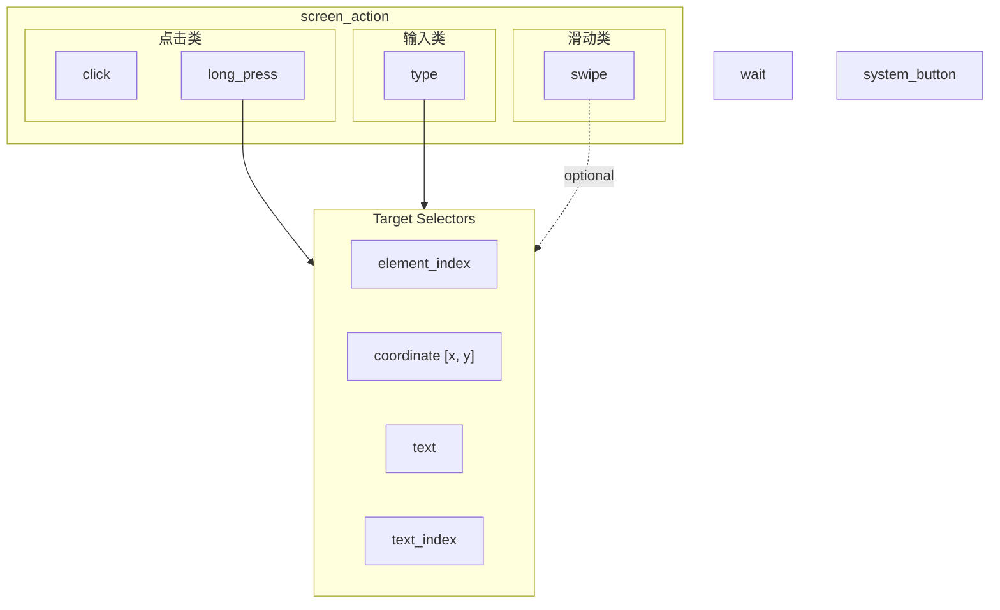

# mobile_action Tool Analysis

> Analyst: Claude (Opus)
> Date: 2026-02-06
> Goal: Maximize agent success rate while minimizing token usage cost

---

## 1. Current Implementation

### 1.1 Design Overview

Single consolidated tool `mobile_action` with 6 sub-actions dispatched via `action` enum parameter. All parameters live in a **flat union schema** — 21 optional parameters for all actions combined.

**Actions**: `click`, `long_press`, `type`, `swipe`, `system_button`, `wait`

**Multi-selector targeting**: Each targeting action supports 5 selector modes:
- `element_index` (a11y tree index)
- `resource_id` + `resource_id_index` (Android resource ID)
- `text` + `text_index` (visible text match)
- bounds (`x1,y1,x2,y2`)
- coordinates (`x,y`)

### 1.2 Tool Description (149 tokens)

```
Perform touch interactions on the mobile device screen.

Actions:
- click: Tap using one of element_index, resource_id, text, bounds (x1,y1,x2,y2), or coordinates (x,y).
- long_press: Long press using bounds, coordinates (x,y), resource_id, text, or element_index (duration_ms optional)
- type: Input into field (text required, clear optional). To focus first, use resource_id, target_text, bounds, x/y, or element_index.
- swipe: Swipe gesture using either explicit start/end coords or direction (up/down/left/right) with optional distance (short/medium/long) and target selectors.
- system_button: Press system button (button required: back/home/enter/recents)
- wait: Wait for UI updates (duration_ms optional, default 1000ms)
```

### 1.3 Schema (~450 tokens in JSON)

21 parameters: `action`, `agent_thought`, `element_index`, `resource_id`, `resource_id_index`, `text_index`, `target_text`, `target_text_index`, `x`, `y`, `x1`, `y1`, `x2`, `y2`, `text`, `clear`, `start`, `end`, `direction`, `distance`, `button`, `duration_ms`

### 1.4 Code Location

- `tool/impl/MobileActionTool.kt` — tool definition, description, schema
- `tool/impl/mobileaction/` — per-action handlers (Click, LongPress, Type, Swipe, SystemButton, Wait)

---

## 2. Reference Implementations

### 2.1 AutoDev (android_world fork)

| Aspect | Detail |
|--------|--------|
| **Architecture** | Two-agent: Planner (intent-based) + Executor (coordinate-based) |
| **Planner tools** | `tap(intent)`, `gesture(intent)`, `scroll(intent)`, `wait(seconds)`, `open_app(app_name)`, `go_back()`, `clear_text()`, `type_text(text, intent)`, `scan_for_element(intent)`, `transcribe_screen()`, `extract_data(data)`, `answer(text)`, `finish_task(success)` |
| **Executor tools** | `click(x,y)`, `tap(x,y)`, `double_tap(x,y)`, `long_press(x,y)`, `scroll(direction, x?, y?)`, `swipe(direction, x?, y?)`, `swipe_coords(start_x, start_y, end_x, end_y)`, `input_text(text, x?, y?, clear_text?)`, `type_text(text, clear_first?)`, `keyboard_enter()`, `navigate_back()`, `navigate_home()`, `open_app(app_name)`, `wait()`, `transcribe_screen()`, `report(notes)`, `extracted_data(data)` |
| **Tool format** | Separate Python functions, auto-converted via `litellm.utils.function_to_dict()` |
| **Description style** | Full docstrings with Args, Examples, and usage context (~50-100 tokens each) |
| **Targeting** | Coordinate-only for executor; intent-based for planner |
| **Evidence** | `android_world/agents/autodev/executor_tools.py`, `planner_tools.py`, `prompts.py` |

**Pros:**
- Clean separation: planner thinks semantically, executor acts precisely
- Each tool has exactly the parameters it needs (no unused params)
- Rich docstrings with examples guide correct usage
- `transcribe_screen()` gives explicit screen-reading capability
- Planner-to-executor translation layer (`tool_call_to_query()`) bridges the gap

**Cons:**
- 17 executor tools = 17 schema entries = ~1500+ tokens just for tool definitions
- Coordinate-only executor can't leverage a11y element_index
- Redundant tools (`click` vs `tap`, `swipe` vs `swipe_coords`, `input_text` vs `type_text`)
- No resource_id or element_index targeting — purely vision-dependent

### 2.2 DroidRun

| Aspect | Detail |
|--------|--------|
| **Architecture** | Multi-agent: Manager (planning) + Executor (action) + Scripter (code) |
| **Atomic actions** | `click(index)`, `long_press(index)`, `click_at(x,y)`, `click_area(x1,y1,x2,y2)`, `long_press_at(x,y)`, `type(text, index, clear)`, `system_button(button)`, `swipe(coordinate, coordinate2, duration)`, `wait(duration)` |
| **Custom tools** | `open_app(text)`, `type_secret(secret_id, index)`, `remember(info)`, `complete(success, reason)` |
| **Tool format** | Dict-based signatures rendered via Jinja2 template into prompt |
| **Description style** | One-line + JSON usage example (~30-40 tokens each) |
| **Targeting** | `index` (element index) primary; `(x,y)` and `(x1,y1,x2,y2)` as alternatives |
| **Evidence** | `droidrun/agent/utils/signatures.py`, `droidrun/config/prompts/executor/system.jinja2` |

**Pros:**
- Compact descriptions with inline JSON examples — very token-efficient
- `click_at` / `click_area` as explicit separate actions — clearer than overloaded params
- `swipe` takes coordinate pairs with duration — flexible yet simple
- Index-based primary targeting (matches a11y tree approach)
- Template-based prompt — easy to customize per agent

**Cons:**
- 9 atomic + 4 custom = 13 tools = more schema overhead than consolidated
- No resource_id targeting
- `long_press` via `swipe(x, y, x, y, 1000)` internally — leaky abstraction
- No text-based targeting (must know index or coordinates)
- `swipe` uses `coordinate`/`coordinate2` naming which is non-standard

### 2.3 Minitap (mobile-use)

| Aspect | Detail |
|--------|--------|
| **Architecture** | Multi-agent: Cortex (planning) + Executor (execution) + optional Planner |
| **Tools** | `tap(target)`, `long_press_on(target, duration_ms)`, `swipe_coordinates(start_x, start_y, end_x, end_y, duration)`, `swipe_percentages(start_x%, start_y%, end_x%, end_y%, duration)`, `focus_and_input_text(text, target)`, `focus_and_clear_text(target)`, `back()`, `press_key(key)`, `erase_one_char()`, `launch_app(app_name)`, `stop_app(package_name?)`, `open_link(url)`, `wait_for_delay(time_in_ms)` |
| **Tool format** | LangChain `@tool` decorator with Pydantic schemas |
| **Description style** | Multi-line docstrings with Args descriptions (~40-80 tokens each) |
| **Targeting** | `Target` Pydantic object with fallback: `resource_id` → `bounds` → `text` (with index variants) |
| **Evidence** | `minitap/mobile_use/tools/mobile/`, `minitap/mobile_use/tools/types.py` |

**Pros:**
- **Target object** with structured fallback strategy — closest to our multi-selector design
- `agent_thought` required on all tools (matches our approach)
- **Percentage-based swipe** — device-resolution-independent
- Separate `focus_and_input_text` / `focus_and_clear_text` — makes intent explicit
- `erase_one_char` for fine-grained text editing
- `duration_ms` guidance in `long_press_on` description (500-800ms: quick, 1000ms: standard, 1500-2000ms: extended)
- Cortex system prompt has "Swipe Physics" section explaining direction semantics

**Cons:**
- 13+ tools = significant schema overhead
- `swipe_coordinates` vs `swipe_percentages` as separate tools — could be unified
- No `element_index` in Target (no index-based shortcut)
- `stop_app` / `open_link` are niche tools bloating the action space
- Pydantic `Target` object adds nested schema complexity

### 2.4 MobileAgent V3

| Aspect | Detail |
|--------|--------|
| **Architecture** | Multi-agent: Manager + Executor + ActionReflector + Notetaker |
| **Actions** | `click(coordinate)`, `long_press(coordinate)`, `type(text)`, `system_button(button)`, `swipe(coordinate, coordinate2)`, `open_app(text)`, `answer(text)` |
| **Tool format** | Text-based JSON action format (NOT function calling) |
| **Description style** | One-line + JSON usage example (~20-30 tokens each) |
| **Targeting** | Coordinate-only `[x, y]` |
| **Evidence** | `MobileAgent/Mobile-Agent-v3/android_world_v3/agents/mobile_agent_v3_agent.py` |

**Pros:**
- **Extremely minimal**: 7 actions, each with 1-2 parameters
- **Lowest token cost** per action definition (~20-30 tokens each, ~200 total)
- Consolidated: no separate scroll/swipe distinction
- `type(text)` requires field to be focused first — simpler semantics
- Inline JSON example in description — shows exact format
- ActionReflector provides post-action evaluation (loop detection)

**Cons:**
- Coordinate-only — requires vision model for grounding
- No element_index, resource_id, or text targeting
- `type` has no targeting param — if field isn't focused, action fails
- No `wait` action
- `swipe` has no direction shorthand — must compute coordinates
- Swipe warning about keyboard area (`y1 < 1400`) is hardcoded to specific screen resolution

### 2.5 Android World (eval baseline)

| Aspect | Detail |
|--------|--------|
| **M3A Agent** | Index-based targeting from bounding-box-labeled screenshots |
| **Actions** | `click(index)`, `long_press(index)`, `input_text(text, index)`, `scroll(direction, index?)`, `navigate_back`, `navigate_home`, `keyboard_enter`, `open_app(app_name)`, `wait`, `status(goal_status)`, `answer(text)` |
| **Description style** | Inline in system prompt, one action per line with JSON format |

**Pros:**
- `scroll(direction, index?)` — can scroll a specific scrollable element by index
- Clean action descriptions with JSON example inline
- `input_text` bundles click + type + enter in one action

**Cons:**
- `input_text` auto-pressing enter is surprising and can cause issues
- `scroll` vs `swipe` distinction — scroll is higher-level

### 2.6 MobileWorld (eval)

| Aspect | Detail |
|--------|--------|
| **PlannerExecutor** | Description-based targeting ("blue circle button at top-right") |
| **GeneralE2E** | Coordinate-based targeting |
| **Extra actions** | `double_tap`, `drag`, `ask_user`, `mcp` (tool calls) |
| **Description style** | Markdown table format |

**Pros:**
- `drag(start_coordinate, end_coordinate)` as distinct from swipe
- `ask_user` for interactive clarification
- **Table format** for action descriptions — scannable

**Cons:**
- Description-based targeting ("blue circle button at top-right") is imprecise
- `mcp` action is unrelated to mobile actions

---

## 3. Comparative Analysis

### 3.1 Tool Granularity

| Approach | Repos | Tool Count | Schema Tokens (est.) | Pros | Cons |
|----------|-------|------------|---------------------|------|------|
| **Consolidated** (single tool, action param) | **Ours**, MobileAgent V3 | 1 | ~450-600 | Minimal prefill, clear "I do UI" signal | Flat union schema, param overload |
| **Separate tools** | AutoDev, DroidRun, Minitap | 9-17 | ~1200-2500 | Clean per-tool schemas, self-documenting | Schema bloat, higher prefill cost |
| **Inline JSON** (no function calling) | MobileAgent V3 (alt), Android World | 0 (text) | ~200-400 (in prompt) | Lowest overhead | No schema validation, parsing errors |

**Verdict**: Our consolidated approach is the right trade-off. Function calling with a single tool gives us schema validation without the overhead of 10+ separate tool schemas. The ~450 token schema cost is well below separate tools (~1500+).

### 3.2 Targeting Strategy

| Strategy | Repos | Pros | Cons |
|----------|-------|------|------|
| **Multi-selector flat** | **Ours** | Maximum flexibility, graceful fallback | Schema bloat (5 selector groups × avg 2 params = 10 params), confusing which to use per action |
| **Target object** | Minitap | Structured, typed fallback chain | Nested JSON schema, still complex |
| **Index-primary** | DroidRun, Android World M3A | Simple, direct reference to a11y tree | Requires index to be available and correct |
| **Coordinate-only** | AutoDev Executor, MobileAgent V3 | Minimal params, universal | Requires vision for grounding, fails without screenshot |
| **Intent-based** | AutoDev Planner | Most natural for planning | Requires separate grounding agent |

**Verdict**: Our multi-selector approach is powerful but the **flat param union creates confusion**. The `text` param is overloaded (input text for `type` AND text selector for `click`), `target_text` exists only for `type`. This is a key pain point.

### 3.3 Description Efficiency

| Style | Example Repo | Tokens/Tool | Agent Clarity |
|-------|-------------|-------------|---------------|
| **Terse bullet** | **Ours** | ~25 | Moderate — assumes LLM knows selectors |
| **One-line + JSON example** | DroidRun, MobileAgent V3 | ~30-40 | High — format is immediately clear |
| **Full docstring** | AutoDev | ~50-100 | Very high — but expensive |
| **Inline table** | MobileWorld | ~30-40 | High — scannable |

**Verdict**: Our description is efficient but **lacks usage examples**. DroidRun's approach (one-line + JSON example) adds ~10 tokens per action but significantly improves format clarity.

### 3.4 Missing / Notable Features

| Feature | Found In | Our Status | Impact |
|---------|----------|------------|--------|
| `double_tap` | AutoDev, MobileWorld | Missing | Low — rare use case |
| `drag` | MobileWorld | Missing | Medium — useful for sliders, drag-and-drop |
| `scroll(direction, target_index)` | Android World M3A | Missing (swipe covers this) | Medium — scrolling a specific scrollable container |
| `keyboard_enter` as separate action | AutoDev, Android World | Covered by `system_button(button="enter")` | OK as-is |
| Percentage-based swipe | Minitap | Missing | Low — resolution already known |
| Swipe `duration` control | DroidRun, Minitap | Missing | Low-Medium — useful for slow scrolls |
| `long_press` duration guidance | Minitap | Present but minimal | Could improve |
| Swipe direction semantics | Minitap (Cortex prompt) | In system prompt | Could add to tool description |

---

## 4. Identified Issues with Current Implementation

### Issue 1: `text` Parameter Overloading (HIGH)

The `text` param serves dual purpose:
- **For `type` action**: The text to input
- **For `click`/`long_press`/`swipe`**: A text-based element selector

This creates ambiguity. If LLM calls `click(text="Submit")`, is "Submit" the selector? Yes. But `type(text="Submit")` means input "Submit". The semantics flip based on `action`.

**DroidRun's approach**: `type(text, index, clear)` — `text` is always input; targeting is always `index`.
**Minitap's approach**: `tap(target)` vs `focus_and_input_text(text, target)` — separate tools eliminate overloading.

### Issue 2: Flat Union Schema Bloat (MEDIUM-HIGH)

21 parameters where most actions use only 2-4. The LLM sees all 21 in every call. This:
- Wastes tokens in the schema (~450 tokens)
- Creates confusion about which params apply to which action
- No schema-level enforcement of "click requires at least one selector"

**MobileAgent V3**: Only has params that each action needs.
**DroidRun**: Each action signature lists exactly its arguments.

### Issue 3: Missing Usage Examples (MEDIUM)

Current description is terse bullets. No JSON examples showing exact call format.

Every other reference repo includes usage examples. DroidRun is most efficient:
```
click(index): Click the point on the screen with specified index. Usage Example: {"action": "click", "index": element_index}
```

### Issue 4: Swipe Direction Semantics Not in Tool Description (MEDIUM)

"Swipe up" scrolls content DOWN. This is counter-intuitive. Minitap addresses this explicitly in the Cortex prompt:
```
Swipe direction "pushes" the screen: swipe RIGHT → reveals LEFT page
```

Our system prompt mentions `swipe direction="up" to scroll DOWN` but the tool description itself doesn't.

### Issue 5: Selector Priority Not in Tool Description (LOW-MEDIUM)

The system prompt says "Selection priority: text/desc > resource_id > element_index > coordinates" but this isn't in the tool description. An LLM that relies on tool descriptions alone won't know the preferred targeting approach.

### Issue 6: No `scroll` Semantic Alias (LOW)

Most reference repos have `scroll(direction)` as a higher-level concept. We only have `swipe` with `direction` param. This is semantically equivalent but less intuitive for the LLM when the system prompt says "scroll down".

---

## 5. Improvement Plan

> **User Decision (2026-02-07)**: Based on user feedback, the following changes are adopted:
> - Split non-screen operations (`wait`, `system_button`) out of `mobile_action`
> - `mobile_action` (可更名为 `screen_action`) 只包含需要 targeting/grounding 的操作
> - Rename `text` → `input_text` for type action to resolve parameter conflict
> - Defer `double-click` and `drag` implementation (low usage, easy to add later)

### 5.0 Split Actions by Targeting Requirement (HIGH priority) ✅ USER APPROVED

**Rationale**: Separate deterministic actions from screen-targeting actions.

| Category | Actions | Characteristics |
|----------|---------|-----------------|
| **Screen Actions** (`mobile_action` or `screen_action`) | `click`, `long_press`, `type`, `swipe` | Require targeting/grounding capability |
| **System Actions** (separate tools or simple functions) | `wait`, `system_button` | Deterministic, no targeting needed |

**Benefits**:
- Cleaner mental model: screen actions = need to locate element
- Simpler schema for each category
- System actions don't need selector params



> **Note**: `resource_id` and `element_index` reliability TBD — need to analyze actual a11y tree data to decide if they should be kept.

### 5.1 Restructure Description with Targeting Section (HIGH priority) ✅ USER APPROVED

**Key Changes**:
1. **Top section**: General targeting explanation (element_index, text, coordinate, etc.) — shared by all screen actions
2. **Per-action section**: Only unique parameters, minimal repetition
3. **Examples**: Mix different targeting methods across examples

**Proposed Structure**:
```
Perform a screen action on the Android device.

## Targeting (required for all screen actions)
Specify ONE of the following to identify the target element:
- element_index: Index from screen state (when a11y tree available, preferred)
- text + text_index: Match by visible text content (text_index for disambiguation)
- coordinate [x, y]: Absolute screen coordinates

Priority: element_index > text > coordinate (use highest available)

## Actions
- click: Tap target. {"action":"click","element_index":3}
- long_press: Long press target. {"action":"long_press","text":"Delete","duration_ms":1500}
- type: Input text into target field. {"action":"type","input_text":"hello","coordinate":[540,800],"clear":true}
- swipe: Scroll/swipe gesture. {"action":"swipe","direction":"up"} or {"action":"swipe","start":[270,800],"end":[270,300]}

## swipe-specific params
- direction: up/down/left/right (direction="up" scrolls content DOWN)
- distance: short/medium/long (default: medium)
- start/end: Explicit coordinates [x,y] (mutually exclusive with direction)
```

**Rationale**:
- Targeting logic explained once, then referenced by each action
- Each action shows one example with different targeting method (mixed coverage)
- Reduces repetition while ensuring coverage

### 5.2 Rename `text` → `input_text` for Type Action (HIGH priority) ✅ USER APPROVED

**Problem**: `text` parameter is overloaded:
- For `type`: the string to input
- For `click`/`long_press`: a target selector

**Solution (adopted)**: Rename the type input parameter to `input_text`
- `text` field now ONLY means targeting (consistent across all actions)
- `input_text` is the text to type

```diff
# Before (confusing)
{"action":"type", "text":"hello", "target_text":"Search"}

# After (clear)
{"action":"type", "input_text":"hello", "text":"Search"}
```

**Alternative considered but rejected**: Nested JSON `target` object
- Pro: Groups all target params together
- Con: Adds nesting complexity, unclear if LLM success rate improves
- Decision: Flat with renamed `input_text` is simpler

### 5.3 Improve Parameter Descriptions (MEDIUM priority)

Align with 5.1/5.2 changes:

| Parameter | Proposed Description |
|-----------|---------------------|
| `element_index` | "Index from screen state JSON. Preferred selector when a11y tree is available." |
| `text` | "Target element by visible text content. Use text_index if multiple matches." |
| `text_index` | "0-based index when multiple elements match the text." |
| `input_text` | "Text to type (for type action only)." |
| `coordinate` | "Target location as [x, y] array. Fallback when element_index/text unavailable." |
| `direction` | "Swipe direction. up/down scrolls content opposite direction. Mutually exclusive with start/end." |
| `distance` | "Swipe travel: short=¼, medium=½ (default), long=¾ screen." |
| `clear` | "Clear field before typing (default false)." |
| `duration_ms` | "Hold time for long_press (default 1000, 500=quick, 2000+=context menu)." |

### 5.4 Swipe Direction Clarification (MEDIUM priority)

Keep inline in section 5.1 structure — no separate section needed since targeting section format already accommodates this.

### 5.5 Do NOT Add `scroll` Alias ✅ USER CONFIRMED

Defer. Swipe with direction covers this use case.

### 5.6 Do NOT Split Screen Actions into Separate Tools ✅ USER CONFIRMED

Consolidated approach is better for token efficiency.

### 5.7 Defer `double-click` and `drag` ✅ USER DECISION

**Rationale**:
- Low usage frequency
- Easy to add later when needed
- Reduces action space complexity for now

---

## 6. Implementation Summary

### Changes to `MobileActionTool.kt` description (Priority 1)

Replace the current `description` string with the proposed version from §5.1 that includes:
- Inline JSON examples for each action
- Swipe direction semantics
- Selector priority guidance

### Changes to parameter descriptions (Priority 2)

Update `parameterSchema` descriptions per §5.3 table.

### Changes to `text` parameter description (Priority 3)

Clarify dual semantics per §5.2 Option A.

### Token Budget Impact

| Component | Current (est.) | Proposed (est.) | Delta |
|-----------|---------------|-----------------|-------|
| Tool description | ~149 tokens | ~230 tokens | +81 |
| Parameter descriptions | ~300 tokens | ~330 tokens | +30 |
| **Total tool schema** | **~600 tokens** | **~710 tokens** | **+110** |

+110 tokens (~18% increase) is a modest cost for:
- Inline examples (proven to reduce action format errors)
- Direction semantics (prevents scroll-direction confusion)
- Selector priority (guides optimal targeting)

For comparison, splitting into separate tools would cost +600-1900 tokens with no clear success-rate benefit.

---

## 7. What NOT to Change (Updated per User Decisions)

1. **Defer `double_tap`** — Rare use case, easy to add later ✅
2. **Defer `drag`** — Niche (sliders, drag-drop), easy to add later ✅
3. **Don't add percentage-based swipe** — Screen resolution is known, pixel coords are fine
4. **Don't split screen action tools** — Consolidated is the right design (see §5.6) ✅
5. **Don't add `transcribe_screen`** — We have screen state JSON which serves this purpose
6. **Don't add `scroll` alias** — Swipe with direction covers this (see §5.5) ✅
7. **Pending: Evaluate `resource_id` and `element_index`** — Analyze actual a11y tree data to determine if these selectors are useful or should be removed (see §5.0 note)

---

## 8. Reference Evidence Index

| Repo | Key Files | Action Format |
|------|-----------|---------------|
| **AutoDev** | `agents/autodev/executor_tools.py`, `planner_tools.py`, `prompts.py` | Separate functions, docstring descriptions |
| **DroidRun** | `agent/utils/signatures.py`, `config/prompts/executor/system.jinja2` | Dict signatures, Jinja2 template rendering |
| **Minitap** | `tools/mobile/*.py`, `tools/types.py`, `agents/executor/executor.md` | LangChain `@tool`, Pydantic Target object |
| **MobileAgent V3** | `agents/mobile_agent_v3_agent.py` (L189-301) | Text-based JSON, inline prompt |
| **Android World** | `agents/m3a.py`, `agents/t3a.py`, `env/json_action.py` | Inline prompt JSON examples |
| **MobileWorld** | `agents/utils/prompts.py`, `runtime/utils/models.py` | Markdown table, JSON examples |
