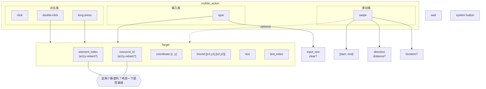

# 拆分
我想把mobile_action里的非screen operation的action拆分出来，比如wait和system button。
- 这样mobile_action里包含(或许可以改名叫screen_action)的都是需要操作屏幕的actions，这类需要targeting/grounding capability。
- 另外一边都是确定性的actions，比如wait、system button。

screen_action里
- （5.1）顶部的description可以把target的逻辑和params单独拿出来讲，做general说明（比如element_index等只有在screen state里有a11y tree info的时候才有用，还有preference order等），因为这部分是所有screen action share的。
  - 然后在讲action时，说必须要targeting。每个action给一个例子就好，混着给，比如有的给coordinate，有的给element。
  - 在顶部每个action讲自己除了targeting外的独特参数。这样底下每个参数可以尽可能简短，不用反复mention actions，避免过分重复。只有每个参数unique的东西在parameter描述里讲。
- （5.2） 关于text参数冲突，如果我的参数都是flat，那text这个field只用于targeting，type()的输入文本可以改成叫input_text，这样保持text field含义一致性。或者我把所有target相关的搞成一个nested json field。我不知道哪个成功率更高。你帮我分析分析。
- double-click， drag, 可以先不实现，因为用处比较少。以后可以再实现，难度不大。
- （5.3/5/4）跟上面的align就好。其他的你看着优化。
- （5.5）同意你说的，不加。
-（5.6）同意。

如图所示，这是我画的示意图，具体参数列表和名称以实际代码为准，这里是illustrative purpose

# targeting
现在的targeting是挺复杂，但是我也搞不清好不好用。你可以分析一下 @debug-output下面的raw a11y tree 和 processed a11y tree，然后告诉我有些field是不是可以删掉。比如 resource_id如果在a11y tree里几乎不出现，那可以删掉。