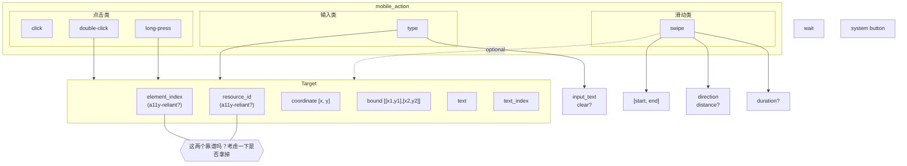

# 拆分
我想把mobile_action里的非screen operation的action拆分出来，比如wait和system button。
- 这样mobile_action里包含(或许可以改名叫screen_action)的都是需要操作屏幕的actions，这类需要targeting/grounding capability。
- 另外一边都是确定性的actions，比如wait、system button。

如图所示，这是我画的示意图，具体参数列表和名称以实际代码为准，这里是illustrative purpose

# targeting
现在的targeting是挺复杂，但是我也搞不清好不好用。你可以分析一下 @debug-output下面的raw a11y tree 和 processed a11y tree，然后告诉我有些field是不是可以删掉。比如 resource_id如果几乎不出现，那可以删掉。