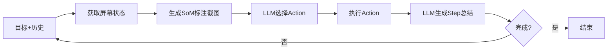
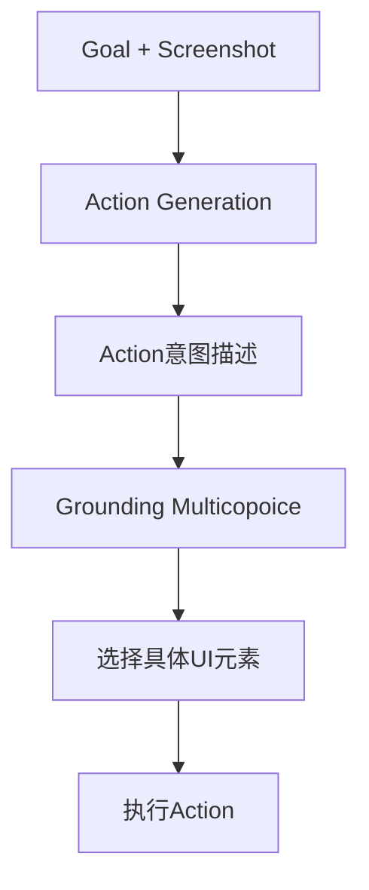
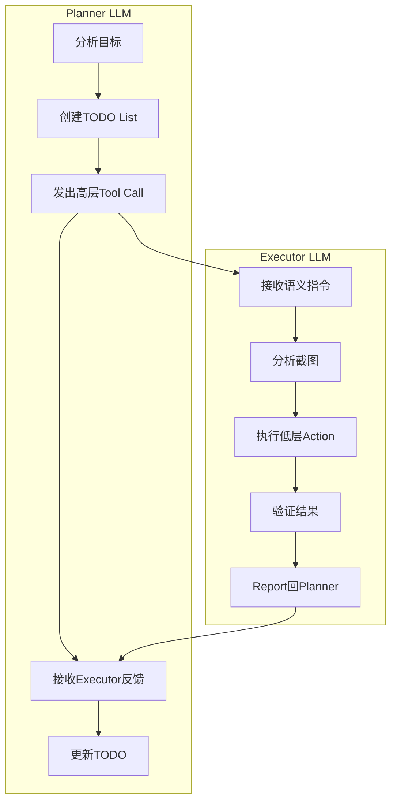

# AndroidWorld / AutoDevice Agent Reference

> Source: `.reference/mobile_agent/autodevice_android_world/`

Google Research的Android automation benchmark，包含4种agent实现。主要关注agent执行逻辑和影响success rate的关键因素。

---

## Agent架构概览

| Agent | 类型 | 描述 | 关键特点 |
|-------|------|------|----------|
| **M3A** | Multimodal | 使用screenshot + UI元素文本 | Set-of-Mark标注，单LLM |
| **T3A** | Text-only | 仅使用UI元素文本描述 | 无视觉输入，单LLM |
| **SeeAct** | Two-step | 先生成action意图，再grounding到元素 | 两步推理过程 |
| **AutoDev** | Planner-Executor | 分层架构，Planner规划+Executor执行 | 双LLM，最复杂 |

---

## 1. M3A (Multimodal Autonomous Agent for Android)

### 核心流程



### 输入

| 输入项 | 内容 | 说明 |
|--------|------|------|
| `goal` | 用户目标 | 自然语言描述的任务 |
| `screenshots` | 两张截图 | 原始截图 + Set-of-Mark标注截图 |
| `ui_elements` | UI元素列表 | 包含text, content_description, hint_text, is_clickable等属性 |
| `history` | 历史步骤摘要 | 之前每步的summary |
| `additional_guidelines` | 任务特定指南 | 可选的额外指导 |

### 输出

```python
class AgentInteractionResult:
    done: bool                    # 任务是否完成
    data: dict[str, Any]         # 包含:
        - raw_screenshot
        - before_screenshot_with_som
        - before_ui_elements
        - action_prompt
        - action_output_json      # JSONAction对象
        - action_reason
        - summary
```

### Prompt结构

**Action Selection Prompt:**
```
PROMPT_PREFIX:
- 角色定义: "You are an agent who can operate an Android phone"
- 任务说明: 回答问题或完成任务
- Action列表 (JSON格式):
  - status: {"action_type": "status", "goal_status": "complete/infeasible"}
  - answer: {"action_type": "answer", "text": "<answer>"}
  - click: {"action_type": "click", "index": <target_index>}
  - long_press: {"action_type": "long_press", "index": <target_index>}
  - input_text: {"action_type": "input_text", "text": <text>, "index": <target_index>}
  - keyboard_enter
  - navigate_home
  - navigate_back
  - scroll: {"action_type": "scroll", "direction": <up/down/left/right>, "index": <optional>}
  - open_app: {"action_type": "open_app", "app_name": <name>}
  - wait

GUIDANCE:
- 多种方法完成任务时选最简单的
- 失败后切换策略
- 使用open_app而非app drawer
- scroll方向与swipe相反
- 文本选择/复制/粘贴操作指南

输出格式:
Reason: ...
Action: {"action_type":...}
```

**Summary Prompt:**
- 输入: before/after截图、UI元素列表、执行的action、reason
- 输出: 50词以内的步骤摘要，用于历史记录

### Success Rate关键因素

1. **Set-of-Mark标注**: 在截图上为每个UI元素绘制bounding box + 数字索引
2. **元素验证**: `validate_ui_element()` 确保元素在屏幕可见区域内
3. **步骤摘要**: 每步生成summary帮助LLM理解上下文
4. **错误恢复**: 对格式错误、索引越界等做graceful处理
5. **transition_pause**: Action后等待屏幕稳定再获取状态

---

## 2. T3A (Text-only Autonomous Agent for Android)

### 与M3A的区别

| 差异点 | M3A | T3A |
|--------|-----|-----|
| 输入模态 | 截图 + 文本 | 仅文本 |
| UI元素表示 | 简化描述 + SoM标注 | 完整文本描述 |
| LLM类型 | MultimodalLlmWrapper | LlmWrapper |

### UI元素描述

T3A使用完整的`UIElement`对象转字符串:
```python
def _generate_ui_elements_description_list_full():
    for index, ui_element in enumerate(ui_elements):
        tree_info += f'UI element {index}: {str(ui_element)}\n'
```

---

## 3. SeeAct (Two-Step Visual Grounding)

### 核心架构



### 两步推理

**Step 1: Action Generation**
```
System: 模拟人类操作Android设备
Prompt: 
- Current Screen Identification
- Previous Action Analysis (特别关注上一步是否需要确认)
- Screenshot Details Analysis
- Next Action Based on Analysis

输出: 描述要操作的元素及其位置
```

**Step 2: Grounding**
```
Prompt:
- Reiteration: 重复目标元素描述
- Multichoice Question: 从UI元素列表中选择匹配的元素
  (按屏幕位置从上到下排列)

输出格式:
ELEMENT: A/B/C... (大写字母)
ACTION: CLICK/LONG PRESS/INPUT TEXT/SWIPE/...
VALUE: 文本/方向/None
```

### Action Space

```python
VALID_ACTIONS = [
    'CLICK', 'LONG PRESS', 'INPUT TEXT', 'KEYBOARD ENTER',
    'SWIPE', 'OPEN APP', 'NAVIGATE HOME', 'NAVIGATE BACK',
    'WAIT', 'ANSWER', 'TERMINATE'
]

ACTIONS_WITHOUT_ELEMENT = [
    'KEYBOARD ENTER', 'NAVIGATE HOME', 'NAVIGATE BACK',
    'WAIT', 'ANSWER', 'TERMINATE'
]
```

### Success Rate关键因素

1. **两步分离**: Action意图生成与元素定位分开，降低任务复杂度
2. **多选题格式**: 将grounding转化为选择题，避免坐标预测
3. **元素排序**: 按屏幕位置排序帮助定位

---

## 4. AutoDev (Planner-Executor Hierarchy) ⭐

这是最复杂也是效果最好的agent架构。

### 核心架构



### Planner层

**职责:**
- 分析目标，创建TODO List
- 发出语义级别的高层指令
- 跟踪任务进度
- 处理错误恢复

**输入:**
```
- goal: 用户目标 (仅第一步)
- screenshot: 当前屏幕截图 (缩放后)
- system_info: 当前设备日期
- system_warnings: 导航警告 (如检测到重复屏幕)
- transcription: (可选) 屏幕文字转录
```

**Tools:**
| Tool | 描述 | 执行方式 |
|------|------|----------|
| `tap(intent)` | 语义点击 | Executor执行 |
| `gesture(intent)` | 语义手势 | Executor执行 |
| `scroll(intent)` | 语义滚动 | Executor执行 |
| `type_text(text, intent)` | 输入文本 | Executor执行 |
| `scan_for_element(intent)` | 查找元素 | Executor执行 |
| `open_app(app_name)` | 打开应用 | 直接执行 |
| `go_back()` | 返回 | 直接执行 |
| `answer(text)` | 回答问题 | 直接执行 |
| `update_todos(todos)` | 更新TODO列表 | 直接执行 |
| `createItem/fetchItem` | Scratchpad操作 | 直接执行 |
| `transcribe_screen()` | 屏幕OCR | 直接执行 |
| `finish_task(success)` | 完成任务 | 直接执行 |

### Executor层

**职责:**
- 接收Planner的语义指令
- 分析截图确定具体坐标
- 执行低层Action序列
- 验证执行结果
- 向Planner报告

**输入:**
```
- query: Planner的语义指令 (如 "tap on the login button")
- screenshot: 当前屏幕截图 (缩放后，带尺寸信息)
- dimensions: 屏幕尺寸 (用于坐标计算)
```

**Tools (低层Action):**
| Tool | 参数 | 说明 |
|------|------|------|
| `click(x, y)` | 坐标 | 点击 |
| `double_tap(x, y)` | 坐标 | 双击 |
| `long_press(x, y)` | 坐标 | 长按 |
| `scroll(direction, x?, y?)` | 方向+可选坐标 | 滚动 |
| `swipe(direction, x?, y?)` | 方向+可选坐标 | 滑动 |
| `swipe_coords(start_x, start_y, end_x, end_y)` | 起终点坐标 | 精确滑动 |
| `input_text(text, x?, y?, clear_text?)` | 文本+可选坐标 | 输入 |
| `keyboard_enter()` | - | 回车 |
| `navigate_back()` | - | 返回 |
| `navigate_home()` | - | Home |
| `open_app(app_name)` | 应用名 | 打开应用 |
| `wait()` | - | 等待 |
| `transcribe_screen()` | - | 屏幕OCR |
| `createItem/fetchItem` | key, title, text | Scratchpad |
| `report(notes)` | 摘要 | 报告完成 |
| `extracted_data(data)` | 数据 | 返回提取的数据 |

### Prompt设计 (关键)

**Planner System Prompt 核心要点:**

```markdown
1. 日期处理:
   - 从system_info获取当前设备日期
   - 正确计算"next week", "this week"等日期范围
   - 验证item的实际日期而非仅看section标签

2. 工作流程: ANALYZE → PLAN → EXECUTE → VERIFY → ANSWER

3. 优化任务策略:
   - 乐观方法: 先添加items，再调整
   - 不要逐个检查属性

4. Executor指令要求:
   - 完整、详细的指令
   - Executor无记忆，每条指令必须自包含
   - 多item任务: 先提取所有items → 存scratchpad → 再处理

5. 特殊操作指南:
   - 文件重命名: 导航到列表 → 长按 → 查找rename选项
   - 合并操作: "new line between" = \n\n
   - 重复删除: 逐个打开检查所有字段

6. 失败恢复:
   - 读取Executor的叙述性summary
   - 不要重复失败的方法
   - 尝试完全不同的策略
```

**Executor System Prompt 核心要点:**

```markdown
1. 第一轮读取query:
   - query包含完整目标，整个session记住它

2. 强制使用transcribe_screen():
   - 滚动前后都要调用
   - 卡住时调用分析原因
   - 连续3次滚动无新内容 → 停止

3. 循环检测:
   - 对比滚动前后transcription
   - 相同 → 立即停止并报告

4. 报告格式:
   - count/search任务: 报告所有找到的items及详情
   - 失败时: 提供叙述性summary (不是tool call列表)
```

### Scratchpad机制

用于跨应用/跨步骤传递数据:

```python
# 存储
createItem(key='PAD-1', title='Task Items', text='["item1", "item2"]')

# 读取
fetchItem(key='PAD-1')  # 返回存储的内容
```

### TODO List机制

```python
update_todos([
    {"id": 1, "text": "Open Contacts app", "status": "completed"},
    {"id": 2, "text": "Find John's contact", "status": "in_progress"},
    {"id": 3, "text": "Update phone number", "status": "pending"}
])
```

### Success Rate关键因素

1. **职责分离**: Planner不关心坐标，Executor不关心全局策略
2. **语义到坐标**: Planner发语义指令，Executor转换为精确坐标
3. **Scratchpad**: 解决跨应用数据传递问题
4. **TODO跟踪**: 复杂任务的进度追踪
5. **导航状态检测**: 检测重复屏幕，防止无限滚动
6. **transcribe_screen**: 按需OCR，不自动提供
7. **MAX_EXECUTOR_STEPS**: 每个Executor session最多10步
8. **模型选择**: 根据任务难度选择Planner模型

---

## 通用Action Space

所有agent共享的JSONAction:

```python
ACTION_TYPES = [
    'click',          # 点击 (index或x,y)
    'double_tap',     # 双击
    'scroll',         # 滚动 (direction: up/down/left/right)
    'swipe',          # 滑动
    'input_text',     # 输入文本
    'navigate_home',  # Home键
    'navigate_back',  # 返回键
    'keyboard_enter', # 回车键
    'open_app',       # 打开应用
    'status',         # 任务状态 (complete/infeasible)
    'wait',           # 等待
    'long_press',     # 长按
    'answer',         # 回答问题
    'unknown'         # 未知
]
```

---

## 执行框架

### Episode Runner

```python
def run_episode(
    goal: str,
    agent: EnvironmentInteractingAgent,
    max_n_steps: int = 10,
    start_on_home_screen: bool = False,
    termination_fn: Callable | None = None,
) -> EpisodeResult:
    
    agent.reset(start_on_home_screen)
    agent.set_max_steps(max_n_steps)
    
    for step_n in range(max_n_steps):
        result = agent.step(goal)
        
        if termination_fn(agent.env):
            return EpisodeResult(done=True, ...)
        elif result.done:
            return EpisodeResult(done=result.done, ...)
    
    return EpisodeResult(done=False, ...)  # 达到max steps
```

### 关键参数

| 参数 | 默认值 | 说明 |
|------|--------|------|
| `max_n_steps` | 任务相关 | 约2x人类平均完成时间 |
| `transition_pause` | 1.0s 或 None | Action后等待时间，None表示自动等待屏幕稳定 |
| `wait_after_action_seconds` | 2.0s (M3A) | Action后额外等待 |

---

## 环境接口

### State获取

```python
state = env.get_state(wait_to_stabilize: bool = False)
# state.pixels: np.ndarray (截图)
# state.ui_elements: list[UIElement]
```

### Action执行

```python
env.execute_action(JSONAction(...))
```

### UIElement属性

```python
@dataclass
class UIElement:
    text: str
    content_description: str
    hint_text: str
    tooltip: str
    is_clickable: bool
    is_long_clickable: bool
    is_editable: bool
    is_scrollable: bool
    is_focusable: bool
    is_selected: bool
    is_checked: bool
    bbox: BoundingBox
```

---

## 影响Success Rate的核心技术总结

### 1. 视觉表示

| 技术 | Agent | 效果 |
|------|-------|------|
| Set-of-Mark标注 | M3A | 避免坐标预测，直接用索引 |
| 元素可见性验证 | All | 确保操作元素在可视区域 |
| 截图缩放 | AutoDev | 0.4x缩放平衡精度和token成本 |

### 2. 上下文管理

| 技术 | Agent | 效果 |
|------|-------|------|
| Step Summary | M3A/T3A | 压缩历史，保留关键信息 |
| TODO List | AutoDev | 追踪复杂任务进度 |
| Scratchpad | AutoDev | 跨应用数据传递 |
| Previous Actions | SeeAct | 分析上一步是否需要确认 |

### 3. 错误恢复

| 技术 | Agent | 效果 |
|------|-------|------|
| 格式错误处理 | All | 识别并反馈给下一步 |
| 索引越界检测 | M3A/T3A | 拒绝无效索引 |
| 导航循环检测 | AutoDev | 检测重复屏幕 |
| MAX_EXECUTOR_STEPS | AutoDev | 防止Executor无限循环 |
| 叙述性失败报告 | AutoDev | 帮助Planner理解失败原因 |

### 4. 任务特定指导

| 技术 | Agent | 效果 |
|------|-------|------|
| Additional Guidelines | All | 任务特定的额外指导 |
| 日期范围解释 | AutoDev | 正确处理"next week"等相对日期 |
| 优化任务策略 | AutoDev | 乐观添加后调整 |

### 5. 时序控制

| 技术 | Agent | 效果 |
|------|-------|------|
| transition_pause | All | 等待屏幕稳定 |
| wait_to_stabilize | All | 自动检测屏幕稳定 |
| wait Action | All | 显式等待 |

---

## 附录: 文件结构

```
android_world/agents/
├── base_agent.py           # 基类
├── m3a.py                  # M3A实现
├── m3a_utils.py           # SoM标注等工具
├── t3a.py                  # T3A实现
├── seeact.py              # SeeAct实现
├── seeact_utils.py        # SeeAct工具
├── autodev_agent.py       # AutoDev实现
├── autodev/
│   ├── prompts.py         # Planner/Executor Prompts
│   ├── planner_tools.py   # Planner Tools定义
│   ├── executor_tools.py  # Executor Tools定义
│   ├── llm.py            # LLM封装
│   ├── todo_list.py      # TODO List
│   ├── scratchpad.py     # Scratchpad
│   ├── transcription.py  # 屏幕OCR
│   └── logging_system.py # 日志系统
├── infer.py              # LLM Wrappers
└── agent_utils.py        # 通用工具

android_world/env/
├── interface.py          # 环境接口
├── json_action.py        # Action定义
├── representation_utils.py # UIElement定义
└── actuation.py          # Action执行
```
