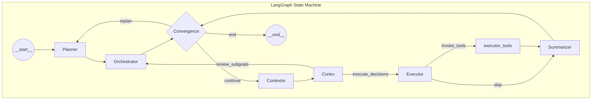

# MiniTap Mobile-Use Agent Architecture

> 参考项目：`.reference/mobile_agent/minitap-mobile-use`
> AndroidWorld Benchmark: **100% 完成率**（首个达成该成绩的框架）

---

## 整体架构概览



**核心循环**：`Convergence → Contextor → Cortex → Executor → Tools → Summarizer → Convergence`

---

## Agent 角色分工

| Agent | 职责 | 类比 |
|-------|------|------|
| **Planner** | 将用户目标分解为顺序子目标 | 战略规划者 |
| **Orchestrator** | 管理子目标进度，决定是否需要重新规划 | 项目经理 |
| **Contextor** | 获取屏幕状态，执行App Lock检查 | 感知器+守卫 |
| **Cortex** | 分析屏幕，做出结构化决策 | 🧠 大脑 |
| **Executor** | 将决策转换为工具调用 | 🖐 双手 |
| **Summarizer** | 清理历史消息，防止上下文溢出 | 记忆管理 |

---

## 1. Planner Agent

### 触发条件
- 初始任务开始时
- 子目标失败需要重新规划时（`convergence_gate` 返回 `replan`）

### 输入
| 字段 | 说明 |
|------|------|
| `initial_goal` | 用户的原始目标 |
| `previous_plan` | 之前的子目标计划（重规划时） |
| `agent_thoughts` | 所有agent的思考历史 |
| `current_foreground_app` | 当前前台应用 |
| `locked_app_package` | 锁定的应用包名 |

### 输出
```json
{
  "subgoals": [
    {"description": "第一个子目标描述"},
    {"description": "第二个子目标描述"}
  ]
}
```

### Prompt 关键规则
1. **避免重复**：如果目标应用已在前台，不要创建"打开该应用"的子目标
2. **原子性**：每个子目标是一个清晰的检查点，Cortex决定HOW，Planner定义WHAT
3. **不能有循环**：使用3个独立子目标代替"重复3次"
4. **自我纠错**：如有格式约束，添加最终验证子目标
5. **优先使用快捷方式**：`launch_app` 打开应用，`open_link` 打开URL

### 重规划策略
- 保留已完成的子目标
- 使用agent思考历史作为真相来源
- 基于观察调整策略（如滚动失败则用搜索）
- 从当前状态继续，而非从头开始

---

## 2. Orchestrator Agent

### 触发条件
- Planner完成后
- Cortex标记子目标完成后（通过 `review_subgoals` 边）

### 输入
| 字段 | 说明 |
|------|------|
| `subgoal_plan` | 当前子目标计划及状态 |
| `complete_subgoals_by_ids` | Cortex请求完成的子目标ID列表 |
| `agent_thoughts` | 执行历史 |
| `initial_goal` | 原始目标 |

### 输出
```python
class OrchestratorOutput(BaseModel):
    completed_subgoal_ids: list[str]  # 确认完成的子目标
    needs_replanning: bool            # 是否需要重新规划
    reason: str                       # 决策原因/最终答案
```

### 核心职责
1. 启动下一个子目标（`start_next_subgoal`）
2. 确认子目标完成（`complete_subgoals_by_ids`）
3. 在重复失败时触发重规划
4. 所有子目标完成时结束

---

## 3. Contextor Agent

### 触发条件
- 每次执行循环开始时（从 Convergence 进入）

### 主要功能
1. **屏幕数据采集**：
   - UI Hierarchy（可访问性树）
   - Screenshot（截图Base64）
   - 设备日期/时间
   - 当前前台应用

2. **App Lock 检查**：
   - 如果当前应用不是锁定应用，调用LLM决定是否重新启动
   - 允许偏离的条件：OAuth流程、支付、系统权限、短信验证等

### 输入
| 字段 | 说明 |
|------|------|
| `task_goal` | 任务目标 |
| `subgoal_plan` | 子目标计划 |
| `locked_app_package` | 锁定的应用 |
| `current_app_package` | 当前应用 |
| `agents_thoughts` | 思考历史（最多25条） |

### 输出
```json
{
  "should_relaunch_app": true/false,
  "reasoning": "决策原因解释"
}
```

---

## 4. Cortex Agent（核心决策者）

### 触发条件
- Contextor完成屏幕数据采集后

### 输入
| 字段 | 说明 |
|------|------|
| `initial_goal` | 用户目标 |
| `subgoal_plan` | 子目标计划 |
| `current_subgoal` | 当前执行的子目标 |
| `executor_feedback` | 上次执行的工具反馈 |
| `latest_ui_hierarchy` | UI层次结构（JSON） |
| `latest_screenshot` | 屏幕截图（压缩后） |
| `device_date` | 设备日期 |
| `focused_app_info` | 焦点应用信息 |
| `agents_thoughts` | 所有agent的思考历史 |

### 输出
```python
class CortexOutput(BaseModel):
    complete_subgoals_by_ids: list[str] | None  # 要完成的子目标ID
    decisions: str | None                        # 结构化决策JSON
    decisions_reason: str                        # 决策原因（2-4句）
    goals_completion_reason: str | None          # 目标完成原因
```

### Prompt 关键规则

#### 🚨 关键规则
1. **分析思考历史**：检测重复失败，避免盲目重试
2. **不可预测动作隔离**：`back`、`launch_app`、`stop_app`、`open_link`、导航点击必须单独执行
3. **仅基于观察完成目标**：不能提前标记完成
4. **数据保真**：准确转录内容，除非明确被告知修改

#### 感知系统
| 感知 | 用途 | 局限性 |
|------|------|--------|
| UI Hierarchy | 通过resource-id、text、bounds定位元素 | 无视觉信息 |
| Screenshot | 视觉上下文、验证元素可见性 | 无法精确提取坐标 |

**必须结合两种感知以互补局限性**

#### 元素定位（必须提供完整信息）
```json
{
  "target": {
    "resource_id": "com.app:id/button",
    "resource_id_index": 0,
    "bounds": {"x": 100, "y": 200, "width": 50, "height": 50},
    "text": "Submit",
    "text_index": 0
  }
}
```
- 启用**降级策略**：ID失败 → 尝试bounds → 尝试text
- 点击失败处理：
  - "Out of bounds" = 过期的bounds
  - "No element found" = 屏幕已变化

#### 滑动物理规则
- 滑动方向"推动"屏幕：**向右滑 → 显示左边页面**
- 默认使用百分比滑动，坐标仅用于精确控制（如滑块）

---

## 5. Executor Agent

### 触发条件
- Cortex产出 `structured_decisions` 后

### 输入
| 字段 | 说明 |
|------|------|
| `structured_decisions` | Cortex的结构化决策JSON |
| `cortex_last_thought` | Cortex的最后思考 |
| `executor_messages` | 执行历史消息 |

### 输出
- 工具调用消息（`AIMessage` with `tool_calls`）

### Prompt 关键规则
1. 解析Cortex决策并按顺序调用工具
2. 每个工具调用必须包含 `agent_thought` 说明原因
3. 不要进行策略推理，只执行决策
4. 支持并行工具调用（非Google模型）

---

## 6. Summarizer Agent

### 触发条件
- Executor完成或跳过后

### 功能
- 消息历史裁剪
- 当消息数超过 `MAX_MESSAGES_IN_HISTORY` 时，移除旧消息
- 从最旧的 `ToolMessage` 或 `HumanMessage` 开始移除

---

## 可用工具

### 移动端操作工具（15个）

| 工具 | 描述 |
|------|------|
| `tap` | 点击UI元素（支持多种定位降级） |
| `long_press_on` | 长按元素 |
| `swipe` | 滑动（支持百分比和坐标） |
| `back` | 返回键 |
| `launch_app` | 通过应用名启动应用 |
| `stop_app` | 停止应用 |
| `open_link` | 打开URL/深度链接 |
| `focus_and_input_text` | 聚焦并输入文本 |
| `focus_and_clear_text` | 聚焦并清除文本 |
| `erase_one_char` | 删除一个字符 |
| `press_key` | 按键（如回车） |
| `wait_for_delay` | 等待延迟 |
| `start_video_recording` | 开始录屏（可选） |
| `stop_video_recording` | 停止录屏（可选） |

### 持久化记忆工具（3个）

| 工具 | 描述 |
|------|------|
| `save_note` | 保存文本到持久化内存（用于跨应用数据传递） |
| `read_note` | 读取已保存的笔记 |
| `list_notes` | 列出所有笔记键 |

**跨应用数据传递示例**：
```
目标: "复制RecipeApp的食材到ShoppingApp"

子目标:
1. 打开RecipeApp并导航到食谱
2. 使用 save_note 保存食材列表
3. 打开ShoppingApp
4. 使用 read_note 读取并添加到购物清单
```

---

## 元素定位降级策略

工具如 `tap` 支持多重定位策略：

```python
# 定位顺序
1. bounds（坐标）  → 先验证是否在屏幕范围内
2. resource_id     → 使用index处理多个相同ID
3. text           → 使用index处理多个相同文本

# 每次尝试都记录
attempts = [
    {"selector": "coordinates (540, 1200)", "error": "Out of bounds"},
    {"selector": "resource_id='btn_submit'", "error": "Element not found"},
    {"selector": "text='Submit'", "error": None}  # 成功
]
```

---

## LLM 配置策略

| Agent | 推荐模型 | 说明 |
|-------|---------|------|
| **Cortex** | gemini-3-pro / gpt-5 | 最重要，需要视觉+推理能力 |
| Planner | llama-4-scout / gpt-5-nano | 文本规划，不需视觉 |
| Orchestrator | gpt-oss-120b / gpt-5-nano | 状态判断 |
| Executor | llama-3.1-70b | 工具调用转换 |
| Contextor | llama-3.1-8b | 简单决策 |
| Hopper | gpt-5-nano | 需要256k上下文 |
| Video Analyzer | gemini-3-flash | 视频处理能力 |

每个agent都有 **fallback** 模型配置。

---

## 影响成功率的关键因素

### 1. 子目标规划质量
- 原子性：每个子目标是一个清晰的milestone
- 不重叠：避免模糊的子目标导致重复操作
- 自纠错：包含验证子目标

### 2. 重规划机制
- 失败检测：通过 `SubgoalStatus.FAILURE` 触发
- 保留进度：已完成的子目标不重做
- 策略调整：基于agent思考历史改变方法

### 3. 感知质量
- **双重感知**：UI Hierarchy + Screenshot 互补
- 元素定位降级：ID → bounds → text
- App Lock：防止意外离开目标应用

### 4. 决策隔离
- 不可预测动作单独执行
- 等待屏幕稳定后再做下一步决策

### 5. 持久化记忆
- Scratchpad：跨应用数据传递
- Agent Thoughts：全程记录，用于失败分析

### 6. 错误恢复
- 工具尝试记录：便于调试分析
- 渐进降级：多种定位方式
- 人类思维：提示"人类会怎么解决"

---

## 状态定义

```python
class State(BaseModel):
    # 消息
    messages: list[AnyMessage]
    remaining_steps: int | None
    
    # Planner
    initial_goal: str
    
    # Orchestrator
    subgoal_plan: list[Subgoal]
    
    # Contextor
    latest_ui_hierarchy: list[dict] | None
    latest_screenshot: str | None
    focused_app_info: str | None
    device_date: str | None
    
    # Cortex
    structured_decisions: str | None
    complete_subgoals_by_ids: list[str]
    
    # Executor
    executor_messages: list[AnyMessage]
    cortex_last_thought: str | None
    
    # 共享
    agents_thoughts: list[str]
    scratchpad: dict[str, str]  # 持久化key-value存储
```

```python
class Subgoal(BaseModel):
    id: str
    description: str
    status: SubgoalStatus  # NOT_STARTED, PENDING, SUCCESS, FAILURE
    completion_reason: str | None
    started_at: datetime | None
    ended_at: datetime | None
```

---

## 流程条件分支

### convergence_gate
```python
if one_of_them_is_failure(subgoal_plan):
    return "replan"
if all_completed(subgoal_plan):
    return "end"
if not get_current_subgoal(subgoal_plan):
    return "end"
return "continue"
```

### post_cortex_gate
```python
if len(complete_subgoals_by_ids) > 0 or not structured_decisions:
    → "review_subgoals"  # 去Orchestrator
if structured_decisions:
    → "execute_decisions"  # 去Executor
```

### post_executor_gate
```python
if last_message has tool_calls:
    → "invoke_tools"
else:
    → "skip"  # 直接去Summarizer
```
