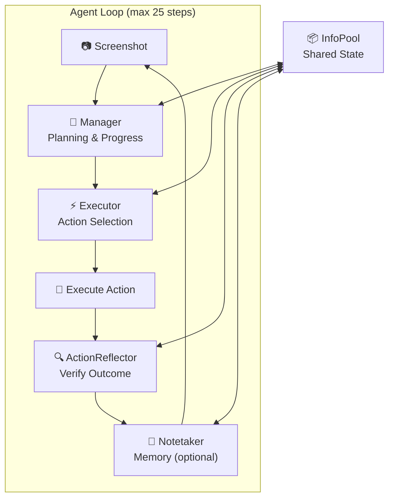

# Mobile-Agent v3 - Agent Core Architecture

> Reference: `.reference/mobile_agent/MobileAgent/Mobile-Agent-v3/`

## Overview

Mobile-Agent v3 is a **multi-agent framework** for GUI automation. It uses a single VLM (GUI-Owl) instantiated as **4 specialized agents** that collaborate through a shared **InfoPool** state.



---

## Agent Overview

| Agent | Role | Triggering Condition | Input | Output |
|-------|------|---------------------|-------|--------|
| **Manager** | High-level planning & progress tracking | Every step (unless skipped) | Screenshot + instruction + history | Plan + completed subgoals |
| **Executor** | Select & execute atomic action | After Manager (if not finished) | Screenshot + plan + action history | JSON action + description |
| **ActionReflector** | Verify action outcome | After action execution | Before/after screenshots | Outcome (A/B/C) + error description |
| **Notetaker** | Record important info for memory | After successful action (optional) | After screenshot + progress | Important notes |

---

## InfoPool: Shared State

All agents communicate through a single `InfoPool` dataclass:

```python
@dataclass
class InfoPool:
    # User Input
    instruction: str = ""                    # User's goal
    additional_knowledge_manager: str = ""   # Task-specific tips for Manager
    additional_knowledge_executor: str = ""  # Guidelines for Executor
    
    # Working Memory
    action_history: list        # All executed actions
    summary_history: list       # Action descriptions
    action_outcomes: list       # "A" (success), "B" (wrong page), "C" (no change)
    error_descriptions: list    # Error feedback
    important_notes: str = ""   # Notetaker's recorded info
    
    # Planning State
    plan: str = ""              # Current step-by-step plan
    completed_plan: str = ""    # Historical operations completed
    progress_status: str = ""   # Current progress description
    
    # Error Handling
    error_flag_plan: bool = False     # True if stuck (escalate to Manager)
    err_to_manager_thresh: int = 2    # Consecutive failures before escalation
    
    # Last Action
    last_action: str = ""
    last_summary: str = ""
    last_action_thought: str = ""
```

### Key Success Rate Factors

1. **Error Escalation**: After `err_to_manager_thresh` (default 2) consecutive failures, `error_flag_plan` is set, informing Manager to revise the plan.
2. **Invalid Action Skip**: If last action was invalid, Manager is skipped to retry immediately.
3. **Action History Window**: Executor sees last 5 actions with outcomes for context.

---

## Agent Details

### 1. Manager Agent

**Purpose**: High-level planning and progress tracking.

**Trigger**: 
- Every step, UNLESS:
  - Last action was "invalid" (retry without re-planning)
  - Already finished

**Input**:
- Current screenshot (1 image)
- User instruction
- Current plan (if exists)
- Historical operations (completed subgoals)
- Last action + description
- Important notes
- Error logs (if stuck)

**Prompt Structure**:
```
### First Planning (plan == ""):
You are an agent who can operate an Android phone...
### User Request ###
{instruction}
---
Make a high-level plan...
### Guidelines ###
{additional_knowledge_manager}

### Thought ###
### Plan ###
1. first subgoal
2. second subgoal
...
```

```
### Re-planning (plan != ""):
### User Request ###
### Historical Operations ###
### Plan ###
### Last Action ###
### Last Action Description ###
### Important Notes ###
### Guidelines ###
### Potentially Stuck! ### (if error_flag_plan)
---
Carefully assess... Check if plan needs revision...
If finished, mark plan as "Finished"

### Thought ###
### Historical Operations ###
### Plan ###
```

**Output Parsing**:
```python
{
    "thought": str,           # Rationale
    "completed_subgoal": str, # Updated historical operations
    "plan": str               # Current plan or "Finished"
}
```

**Finish Signal**: `"Finished" in plan and len(plan) < 15`

---

### 2. Executor Agent

**Purpose**: Select and execute atomic actions based on plan.

**Trigger**: After Manager, if plan is not "Finished".

**Input**:
- Current screenshot (1 image)
- User instruction
- Overall plan
- Current subgoal (first 3 items from plan)
- Progress status
- Guidelines
- Last 5 action history with outcomes

**Prompt Structure**:
```
You are an agent who can operate an Android phone...
### User Request ###
### Overall Plan ###
### Current Subgoal ###
### Progress Status ###
### Guidelines ###
---
Carefully examine... decide next action...

#### Atomic Actions ####
- answer(text): Answer user's question. {json example}
- click(coordinate): Click (x, y). {json example}
- long_press(coordinate): Long press. {json example}
- type(text): Type into input box. {json example}
- system_button(button): Back/Home/Enter. {json example}
- swipe(coordinate, coordinate2): Scroll. {json example}
- open_app(text): Open app by name. {json example}

### Latest Action History ###
Action: {...} | Description: ... | Outcome: Successful/Failed | Feedback: ...
---
IMPORTANT:
1. Do NOT repeat failed actions
2. Prioritize current subgoal

### Thought ###
### Action ###
### Description ###
```

**Output Parsing**:
```python
{
    "thought": str,      # Rationale
    "action": str,       # JSON action string
    "description": str   # Brief description
}
```

---

### 3. ActionReflector Agent

**Purpose**: Verify whether action produced expected behavior.

**Trigger**: After action execution.

**Input**:
- Before screenshot + After screenshot (2 images)
- User instruction
- Progress status (completed_plan)
- Last action + expectation (last_summary)

**Prompt Structure**:
```
You are an agent... verify whether the last action produced expected behavior...

### User Request ###
### Progress Status ###
---
The two attached images are phone screenshots before and after your last action.
---
### Latest Action ###
Action: {last_action}
Expectation: {last_summary}
---
Carefully examine... determine if successful...

Note: For swipe, if content is exactly same, it's C: Failed.

### Outcome ###
A: Successful or Partially Successful
B: Failed - wrong page, need to return
C: Failed - no changes

### Error Description ###
If failed, describe error. If success, "None".
```

**Output Parsing**:
```python
{
    "outcome": str,           # "A", "B", or "C"
    "error_description": str  # Error detail or "None"
}
```

**Outcome Impact**:
- **A**: Action successful → continue, optionally invoke Notetaker
- **B**: Wrong page → needs recovery
- **C**: No change → action had no effect

---

### 4. Notetaker Agent

**Purpose**: Record important information for cross-step memory.

**Trigger**: 
- After successful action (outcome == "A")
- Only for tasks requiring memory (answers, transactions, products)
- Controlled by `--notetaker True` flag

**Input**:
- After screenshot (1 image)
- User instruction
- Progress status
- Existing important notes

**Prompt Structure**:
```
You are a helpful AI assistant... take notes of important content...

### User Request ###
### Progress Status ###
### Existing Important Notes ###
### Guideline ### (task-specific if applicable)
---
IMPORTANT:
Do not take notes on low-level actions
Only keep significant textual/visual info
Do not repeat request or progress status
Do not make up content

### Important Notes ###
```

**Output Parsing**:
```python
{
    "important_notes": str  # Updated notes
}
```

---

## Atomic Actions (Tools)

| Action | Arguments | Description | JSON Example |
|--------|-----------|-------------|--------------|
| `click` | coordinate: [x, y] | Click at position | `{"action": "click", "coordinate": [500, 800]}` |
| `long_press` | coordinate: [x, y] | Long press | `{"action": "long_press", "coordinate": [500, 800]}` |
| `swipe` | coordinate, coordinate2 | Scroll/swipe | `{"action": "swipe", "coordinate": [500, 1000], "coordinate2": [500, 500]}` |
| `type` | text | Type into active input | `{"action": "type", "text": "hello"}` |
| `system_button` | button: Back/Home/Enter | System navigation | `{"action": "system_button", "button": "Back"}` |
| `open_app` | text | Open app by name | `{"action": "open_app", "text": "chrome"}` |
| `answer` | text | Answer user question | `{"action": "answer", "text": "42"}` |

### Coordinate Handling

- **Absolute coordinates** (GUI-Owl, Qwen-VL-2.5): Direct pixel coordinates
- **Relative coordinates** (0-1000): `--coor_type "qwen-vl"` maps to device resolution:
  ```python
  x = int(coordinate[0] / 1000 * width)
  y = int(coordinate[1] / 1000 * height)
  ```

---

## Orchestration Flow

```python
for step in range(max_step):  # max_step = 25
    # 1. Get screenshot
    screenshot = controller.get_screenshot()
    
    # 2. Error escalation check
    if last N actions failed (N = err_to_manager_thresh):
        info_pool.error_flag_plan = True
    
    # 3. Skip Manager if last action was invalid
    skip_manager = (last_action == "invalid" and not error_flag_plan)
    
    # 4. Manager: Planning
    if not skip_manager:
        output = vllm.predict_mm(manager.get_prompt(info_pool), [screenshot])
        plan, completed = manager.parse_response(output)
        
    # 5. Check finish
    if "Finished" in plan:
        break
    
    # 6. Executor: Action selection
    output = vllm.predict_mm(executor.get_prompt(info_pool), [screenshot])
    action = executor.parse_response(output)
    
    # 7. Execute action
    if action == "answer":
        # Handle answer action - task complete
        break
    controller.execute(action)
    
    # 8. Get after screenshot
    after_screenshot = controller.get_screenshot()
    
    # 9. ActionReflector: Verify outcome
    output = vllm.predict_mm(
        action_reflector.get_prompt(info_pool), 
        [screenshot, after_screenshot]
    )
    outcome, error = action_reflector.parse_response(output)
    
    # 10. Update history
    info_pool.action_outcomes.append(outcome)
    info_pool.error_descriptions.append(error)
    
    # 11. Notetaker (optional, if outcome == "A")
    if outcome == "A" and notetaker_enabled:
        output = vllm.predict_mm(notetaker.get_prompt(info_pool), [after_screenshot])
        notes = notetaker.parse_response(output)
        info_pool.important_notes = notes
```

---

## Success Rate Factors Summary

| Factor | Mechanism | Impact |
|--------|-----------|--------|
| **Error Escalation** | 2+ consecutive failures → Manager revises plan | Prevents infinite loops |
| **Invalid Action Retry** | Skip Manager, retry Executor directly | Faster recovery from parse errors |
| **Action History** | Last 5 actions shown to Executor | Prevents repeating failed actions |
| **Before/After Comparison** | Reflector sees both screenshots | Accurate outcome detection |
| **Notetaker Memory** | Records info across steps | Enables cross-app tasks |
| **Task-specific Guidelines** | Custom tips per task type | Handles edge cases |
| **Finish Detection** | Plan contains "Finished" | Clean termination |
| **Answer Action** | Special handling for Q&A tasks | Explicit task completion |
| **Wait Times** | 8s first step, 2s afterwards | Handles popups/loading |

---

## Files Reference

| File | Purpose |
|------|---------|
| `mobile_v3/run_mobileagentv3.py` | Main orchestration loop |
| `mobile_v3/utils/mobile_agent_e.py` | Agent classes (Manager, Executor, etc.) |
| `mobile_v3/utils/call_mobile_agent_e.py` | LLM wrapper (GUIOwlWrapper) |
| `mobile_v3/utils/android_controller.py` | ADB action execution |
| `mobile_v3/utils/new_json_action.py` | Action type constants |
